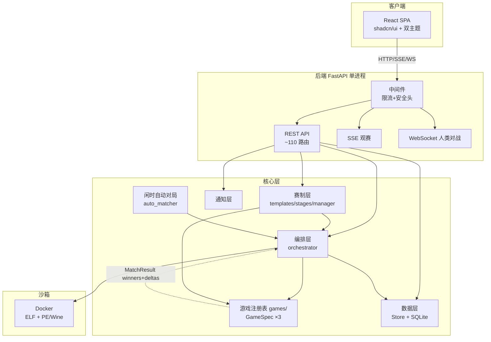
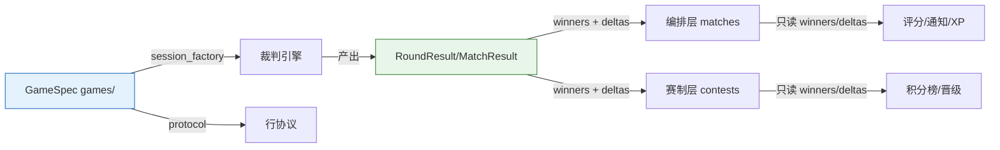

# 设计文档

> 本文档描述 botbattle 平台的系统架构、模块设计、数据库设计、接口设计与安全设计。

## 1. 系统架构

### 1.1 总体架构

平台采用**前后端分离 + 单进程**架构：后端 FastAPI 提供 REST/SSE/WebSocket 接口并托管前端构建产物，前端 React SPA 通过 HTTP 交互。

### 1.2 运行模型
- **单进程 uvicorn factory**（`main:create_app`），默认 `127.0.0.1:50380`。
- **lifespan** 启动后台 asyncio 闲时自动对局任务（AutoMatchScheduler）。
- **并发控制**：`asyncio.Semaphore(max_concurrent)` 限制 bot 对局槽；人类对战独立 `_human_sem`（默认 4）。
- **限流**：内存滑动窗口 IP 限流（单进程；多 worker 部署需换 Redis）。

## 2. 模块设计（12 层）

### 2.1 模块树与职责

| 层 | 模块 | 职责 |
|----|------|------|
| 接口 | `api_routes.py` | 主 REST（≈96 路由，含 SSE/WS）：bots/matches/users/search/leaderboard/comments/likes/notifications/contests/admin/wiki/matchpacks |
| 接口 | `auth/routes.py` | 认证 REST（13 路由，prefix `/api/auth`）：注册/登录/验证/重置/profile/avatar |
| 接口 | `main.py` | 应用工厂 + 中间件装配 + StaticFiles 挂载（dist/wiki-assets/avatars）+ lifespan |
| 游戏注册 | `games/` | **全面解耦的单一真相**：base.py（GameSpec 接口 + GameRegistry 单例 + MatchResult/RoundResult 平台契约基类[仅类型提示/测试用]）+ __init__.py（注册表单例 + run_session/normalize_game_id/tier_for/tier_dict/all_tiers/GAME_LABELS 模块级便捷函数）+ _board_protocol.py（棋类共享行协议工具）+ 每游戏完全自包含子包 games/<game>/（engine.py 裁判 + protocol.py 行协议 + result.py 独立结果 + tiers.py per-game 段位 + cards.py[holdem] + templates.py 赛事模板 + spec.py 装配）。GameSpec 集中声明全部固有属性，通用层经 `registry.get(game_id)` 取 spec 调用其能力，**禁止 if game_id 分支**。三层冗余 shim（engine/ + protocol/ + _compat/）已删——真实现全在 games/ |
| 编排 | `matches/` | orchestrator（入队/SSE/评分/人类对战）+ runner（起 Bot 进程，经 games 注册表路由协议）+ auto_matcher（闲时自动） |
| 赛制 | `contests/` | templates（**7 内置模板**，由 `games/*/templates.py` 经注册表聚合）+ stages（对阵生成）+ manager（阶段状态机）+ validation |
| 沙箱 | `runtime/` | BinaryRunner（docker/wine/local 三模式）+ limits（资源硬顶） |
| 数据 | `store/` | Store 类（SQLite，100+ 方法，含 _migrate 自愈）+ schema.py（常量唯一来源） |
| 认证 | `auth/` | routes + auth_manager + captcha + dependencies（require_user/admin/organizer） |
| 通知 | `notifications/` | NotificationManager（站内通知 + 按 prefs 复用 Mailer 发邮件） |
| 支撑 | `bots/ rating/ mail/ security.py logging_config.py crypto.py cli.py` | Bot 上传分类 / Glicko-2 / SMTP / 安全头+限流 / 日志 / 密码 hash / CLI |

### 2.2 核心解耦契约

**两层解耦**：

1. **GameSpec 注册表（`games/`，全面解耦的单一真相）**：每款游戏是一个 `GameSpec` 对象，集中声明 `game_id`/`label`/`session_factory`(裁判)/`protocol`(行协议)/`default_match_params`+`validate_match_params`(配置)/`rounds_per_match`+`normalize_earnings`+`eta_for_match`(编排特化)/`tiers`+`tier_for`(per-game 段位)/`judge_params`(裁判参数)/`templates`(赛事模板)/`code_path`+`summary`(元信息)。通用层（编排/赛制/评分/DB）经 `registry.get(game_id)` 取 spec 调用其能力，**禁止 `if game_id == ...` 分支**——所有游戏差异封装在各自 spec。

2. **结果鸭子契约（`RoundResult`/`MatchResult`，独立定义不共享基类）**：裁判产出 `winners`(座位号列表，空=平局) + `deltas`(长 2 零和数组)；`MatchResult` 含 `rounds_played` + `rounds` + `events` + `winner`。**编排层与赛制层只依赖这两个字段，绝不触碰扑克的 pot/board/holes 或棋类的棋盘**——这是赛制代码能通用于三款游戏的根本。**`winner` 在引擎内权威化**（PR4）：棋类单轮取胜者；holdem 多手按累计净筹码（`final_chips`/net）比较——编排层只读 `result.winner`（+ ea/eb 平局兜底），不再有 match_end 事件三层兜底 / holdem 特例注释。`tests/test_result_contract.py` 断言三游戏 result 都满足此契约（防 drift）。

**DRY 边界**：游戏规则（engine/result/tiers 数据/templates）各游戏独立；平台工具（`_board_protocol.py` 行协议序列化、`base.tier_for_in` 段位查表算法）共享——避免字节级重复的维护隐患。

### 2.3 新增一款游戏的成本

通用层**零改动**，仅需：
1. 建 `games/<game>/` 子包：`engine.py`(裁判) + `protocol.py`(行协议，棋类可 re-export `_board_protocol`) + `result.py`(独立结果，满足鸭子契约) + `tiers.py`(段位曲线，调 `base.tier_for_in`) + `templates.py`(赛事模板) + `spec.py`(装配 GameSpec)。
2. `schema.py`：`matches_<game>` 表（FK 用 `ON DELETE SET NULL`）+ 索引；`REGISTERED_ENGINES`/`VALID_GAME_IDS` 各加该项。
3. `games/__init__.py`：`registry.register(SPEC)` 一行（启动断言 schema 与注册表一致）。
4. 前端 `src/games/<game>/`：`index.ts`（GameViewSpec）+ `canvas.ts`（CanvasRenderer）+ `reducer.ts`（事件归约，对标后端 engine.py，自包含不依赖 components/）+ `src/games/index.ts` 注册一行。`RawEvent` 公共类型在 `src/games/base.ts`（对标后端 `_board_protocol.py`）。
5. **约束**：`games/<game>/` 不得反向 import 已删的 `engine`/`_compat`/`protocol` shim 或通用层（matches/contests/store/api_routes）——`test_import_cycles.py` 源码扫描守护（forbidden 含已删 shim 作"防回退"哨兵 + 通用层全列）。通用层不得 import 具体游戏模块（经注册表）。

**不再需要**在 `registry.run_session`/`runner._dumps`/`_loads`/`_fail_response`/orchestrator 加 `if game_id==` 分支——这是全面解耦前 6 处分散注册点的彻底消除。

## 3. 数据库设计

SQLite 单文件（默认 `botzone.db`），**28 张表**，**35** 个索引（`schema.py` 中 `CREATE TABLE` / `CREATE INDEX` 计数）。所有常量（状态码/类型/`REGISTERED_ENGINES`/配置键名）集中在 `store/schema.py`。

### 3.1 核心表（选录）

| 表 | 用途 | 关键列 |
|----|------|--------|
| `users` | 用户 | id/username/email/password_hash/role/display_name/bio/avatar/xp/level/last_active_at + **实名信息**（real_name/phone/school/student_id，可选，不公开） |
| `bots` | Bot | owner_id/name/display_name/game_id/os/arch/format/binary_path/current_version/is_public/is_active |
| `matches_holdem` / `matches_gomoku` / `matches_pencil` | 对局（**每游戏一张表**，全面解耦 PR3） | id/bot_a_id/bot_b_id/match_type/status/game_id/winner/n_dots/human_user_id/likes_count/views_count；三表结构一致，游戏专属列在其他游戏中默认 NULL/0 |
| `matches_index` | 对局定位 | id(PK)/game_id——get_match(id) 先查此表定位到哪张 matches_<game> |
| `ratings` | 评分（**per-game**，PK=bot_id+game_id） | bot_id/game_id/rating(1500)/rd(350)/vol/wins/losses/draws/last_played_at |
| `contests` | 赛事 | title/organizer_id/status(draft/open/running/rest/finished/cancelled)/game_id/stages_json/current_stage_idx |
| `contest_pairings` | 对阵 | contest_id/round_num/bot_a_id/bot_b_id/match_id(逻辑外键，无 DB FK)/stage_idx/bracket_slot |
| `contest_stage_results` | 积分 | contest_id/stage_idx/bot_id/points/wins/draws/losses/rank_in_group |

### 3.2 社交/互动表

| 表 | 用途 |
|----|------|
| `rating_history` | 评分变化时序（**per-game**，bot_id+game_id；段位趋势曲线，每 bot×game 截断保留） |
| `follows` | 关注关系（follower_id, followee_id） |
| `favorites` | 收藏 Bot（user_id, bot_id） |
| `comments` | 评论（target_type=match/bot, target_id, user_id, body） |
| `likes` | 点赞（user_id, target_type, target_id） |
| `notifications` | 通知（user_id, type, title, body, link, is_read） |
| `notification_prefs` | 通知邮件偏好（email_match_done/email_followed/email_contest/email_comment） |

### 3.3 支撑表（选录）

| 表 | 用途 |
|----|------|
| `bot_versions` | Bot 版本管理（多版本 + 切换激活） |
| `match_replays` | 对局回放事件存储（events_json） |
| `sessions` | 会话（token, user_id, expires_at，认证核心） |
| `platform_settings` | 所有热配置 KV（运行时/站点/裁判/auto-match） |
| `contest_entries` | 赛事报名（user_id, bot_id SET NULL, group_id, seed）—— **P0：排名/积分键为 entry.id（换 Bot 不丢分）**；bot FK = SET NULL（删 Bot 留报名） |
| `contest_pairings` | 赛事对阵（entry_a_id/entry_b_id 身份键 + bot_a_id/bot_b_id SET NULL）—— P0：pairing 快照 entry 身份 |
| `contest_stage_results` | 阶段成绩（entry_id 唯一键 + bot_id SET NULL）—— P0：唯一键 (contest_id, stage_idx, entry_id) |
| `pair_stats` | 对手战绩统计（a_wins/a_losses/draws） |

### 3.4 迁移机制
`Store._migrate()` 在每次建连时自愈：为旧库补新增列（game_id/xp/level/bio/avatar/likes_count 等），必要时重建表放宽 CHECK 约束（纳入 rest/ladder/human 等新状态）。**向后兼容，不破坏现有数据**（除对局数据——见下）。

**全面解耦 PR3 的迁移**（matches 拆 per-game 表 + ratings 加 game_id 维度）：
- **对局数据不保留**（用户决策）：检测旧单表 `matches` → 先清 `contest_pairings.match_id`（置 NULL），再 DROP `matches`+`match_replays`；新三表（`matches_holdem/gomoku/pencil`）+ `matches_index` 由 SCHEMA `IF NOT EXISTS` 建。对局可后续跑种子脚本（`scripts/seed_test_accounts.py`）重建。
- **用户/Bot/赛事/评论/评分保留**：`ratings`/`rating_history` 加 `game_id` 列、PK 改 `(bot_id, game_id)`、按 `bots.game_id` 回填（CREATE new→INSERT SELECT JOIN bots→DROP→RENAME）。

**第 4 游戏扩展性**（解耦深度整改 PR-1）：`schema.py` 的字面 DDL 只覆盖 holdem/gomoku/pencil 三表；新增注册游戏（如 reversi）后 SCHEMA 不会自动建 `matches_<new>` 表。`_migrate()` 末尾对 `registry.all_ids()` 里**每个**已注册游戏幂等执行 `CREATE TABLE IF NOT EXISTS matches_<game>`（用 `_CREATE_MATCHES_TABLE_SQL` 模板）+ 6 条统一索引（bot_a_id/bot_b_id/owner_id/contest_id/status/created_at）。`Store.__init__` 在建库后断言"每个注册游戏的物理表都存在"——注册了但表没建出来的 drift 在启动即报（而非 create_match 时才崩 `no such table`）。跨游戏 `UNION ALL` 聚合的 WHERE 参数数 = 子查询数（= 已注册游戏数），不得硬编码 `* 3`（否则第 4 游戏触发 `Incorrect number of bindings`）。**结论：新增一款游戏的 DB 成本 = `schema.py` 两个 frozenset 各加 id（仅做启动一致性断言）+ `games/__init__.py` 注册；无需手写 DDL。**

## 4. 接口设计

**共约 110 个 API 路由装饰器**：api_routes.py ≈96（含 1 WebSocket + 1 SSE）+ auth/routes.py 13 + main.py 1 健康端点（SPA 静态路由另计）。按权限分四类：

### 4.1 公开端点（无需登录，访客可用）
- 健康：`GET /api/health`
- Bot 浏览：`GET /api/bots/public`、`/api/bots/{id}`、`/profile`、`/matches`、`/opponents`、`/rating-history`
- 用户浏览：`GET /api/users`、`/api/users/{name}/profile`、`/bots`、`/followers`、`/following`
- 对局浏览：`GET /api/matches`、`/matches/liked-top`、`/matches/{id}`
- 排行与元数据：`GET /api/leaderboard`、`/api/tiers`、`/api/levels/info`、`/api/site/info`
- 搜索：`GET /api/search`
- 赛事浏览：`GET /api/contests`、`/api/contests/{id}`、`/bracket`、`/templates`
- Wiki：`GET /api/wiki`
- 数据集列表：`GET /api/matchpacks`

### 4.2 鉴权端点（require_user，登录玩家）
- Bot 管理：`POST /api/bots`（上传）、`/versions`、`/active`、`PATCH/DELETE /api/bots/{id}`
- 对局：`POST /api/matches/challenge`、`/api/matches/human`
- 社交：`POST/DELETE /api/users/{id}/follow`、`/api/bots/{id}/favorite`
- 互动：`POST/DELETE /api/comments`、`/api/likes`、`POST /api/matches/{id}/view`
- 通知：`GET /api/notifications`、`POST /read`、`/read-all`、`GET/PUT /api/notification-prefs`
- 赛事：`POST /api/contests/{id}/register`
- 数据下载：`GET /api/matchpacks/download`（level ≥1 gating）
- 认证：`GET /api/auth/me`、`POST /logout`、`/change-password`、`PUT /profile`、`POST /avatar`

### 4.3 组织者端点（require_organizer 或 admin）
- `POST /api/contests`（创建赛事）
- `POST /api/contests/{id}/{open,start,resume,advance}`（赛事推进，require_organizer）
- 注：`register`/`dispatch` 为 require_user（报名/换 Bot 由登录用户发起）

### 4.4 管理员端点（require_admin）
- 用户管理：`GET /api/admin/users`、`POST /role`、`PATCH/DELETE /api/admin/users/{id}`、`/sessions`
- Bot/赛事管理：`GET /api/admin/{bots,contests}`、`PATCH/DELETE`、`GET /api/admin/contests/{id}/entries`；对局列表走公开 `GET /api/matches`，管理操作为 `PATCH/DELETE /api/admin/matches/{id}`
- 配置：`GET /api/admin/settings/runtime`、`PATCH /api/admin/settings/{runtime,site}`
- 裁判：`GET /api/admin/judges`、`PATCH /api/admin/judges/params`
- 模板：`GET/POST /api/admin/templates`、`PUT/DELETE /{tid}`、`POST /preview`
- 邮件：`GET /api/admin/email/{templates,outbox}`、`PUT /templates/{key}`
- 日志：`GET /api/admin/logs`
- 认证辅助：`POST /api/auth/admin/create-reset-token`（生成密码重置 token）

### 4.5 实时端点
- **SSE** `GET /api/matches/{id}/events`：观赛事件流（先推 snapshot 再增量）。
- **WebSocket** `WS /api/matches/{id}/play`：人类对战落子回传（接收 `{move}`）。

## 5. 前端架构

### 5.1 技术栈与设计系统
- React 19 + Vite 8 + Tailwind CSS v4（CSS-first）+ shadcn/ui（new-york）+ Radix UI + lucide-react（图标，无 emoji）+ recharts（图表）+ next-themes（暗色）。
- **设计 token**：shadcn v4 OKLCH 双主题（`:root` 浅 / `.dark` 暗），emerald 品牌色系，`@theme inline` 桥接到 Tailwind utility。**刻意无紫色无米色**（规避 AI 默认审美）。
- **暗色模式**：next-themes class 策略，浅色默认 + 跟随系统，侧栏底部一键切换。
- **响应式**：sm/md/lg/xl 断点；**lg(1024)+ 桌面侧边栏，<lg 移动端顶栏 + Sheet 汉堡抽屉**；表格窄屏隐藏次要列。
- **代码分割**：React.lazy + Suspense，22 个顶层路由各自独立 chunk；主包 gzip ~115KB，recharts 隔离到 BotDetail chunk。
- **路径别名 `@/` → src/**，禁相对路径。

### 5.2 组件库与页面
- **26 个 shadcn 共享原语**（`src/components/ui/`）：Button/Input/Card/Table/Tabs/Badge/Dialog/Command/Chart/Sheet/Slider 等，是全项目唯一组件抽象层。
- **项目封装**：status.tsx（EmptyState/Loading/ErrorMsg/StatusBadge）、metric-card.tsx、tier-badge.tsx、BrandMark.tsx（平台品牌标识）、AuthShell.tsx（登录/注册/重置/验证的居中壳：品牌头部 + 居中 Card，解决空旷）、use-playback.ts（定速回放/直播缓冲 hook：buffer/stepIdx/playing/speed/定时步进/live-follow，buffer 有 MAX_BUFFER 上限防 OOM）、playback-controls.tsx（播放/暂停/步进/速度档/进度条控件）。
- **全局 Shell**：app-shell.tsx 按登录态分两套 chrome：
  - **已登录**：**lg+ 桌面左侧边栏**（Logo + compact 搜索 + 垂直导航 + 底部用户区/主题/通知）；**<lg 移动端顶栏 + Sheet 抽屉**。
  - **访客（未登录）**：**全断点顶栏**（BrandMark + 公开导航 + 主题切换 + **登录/注册**；窄屏用 Sheet 抽屉放导航与 CTA）。侧栏仅登录后出现，避免访客桌面无入口。
  - **auth 页**（登录/注册/重置/验证）：不显示侧栏，内容占满居中；顶栏保留精简条（品牌 + 主题 + 登录/注册）。
  - nav-config.ts（**7** 项主导航 + 条件显示的 Admin）。GlobalSearch 支持 `compact` 变体适配窄侧栏（铺满宽、截断、无快捷键徽章）。首页 Hero 对访客额外展示注册/登录 CTA。
  - **统一对局页** `/match/:id`（MatchViewer）：实时 SSE + 回放 DVR；座位身份经 `matches.seat_info.with_seat_info`（人类座真人用户名）；canvas 绘 BOT 名/累计/胜者；`/watch` 与 `/arena?id=` 重定向至此。人类 `/play` 复用 seats + revealMode=showdown。
- **页面壳统一**：PageStub.tsx 作为内容页标题区壳——紧凑标题 + `subtitle`（一行说明）+ `actions`（右侧操作槽：筛选/按钮）；垂直 padding 由全局 `<main>` 统一提供（PageStub 只设水平 padding，避免双倍留白）；auth 页改用 AuthShell（不套 PageStub）。表格统一视觉：表头 `bg-muted/40` + 小写弱化字色，行 hover 高亮。
- **观赛/对战页左右分栏**：MatchViewer（统一对局页）/ ArenaWatch（直播列表入口）/ HumanPlay `xl:grid-cols-[minmax(0,1fr)_22rem]`（左展示 / 右日志），`lg`(1024-1279) 因侧栏占位自动堆叠，`xl`(1280)+ 横排。MatchViewer 合并旧 MatchDetail（回放）+ ArenaWatch（直播）：按 match.status 选模式（running→SSE 直播 DVR 模型：定位最新后按回放速度推进；completed→从头播放），座位身份从 `get_match_detailed`（JOIN bots+users）取 BOT 名/@用户名。MatchBoard（canvas 棋盘渲染）经 GSAP timeline 驱动动画。
- **页面**：**22** 个 `React.lazy` 页面模块（含 admin 壳）+ admin 内多 Tab，覆盖首页/排行榜/Bot 详情/用户主页/搜索/通知/设置/赛事/统一对局页(MatchViewer)/人类对战/数据下载/账号 等。
- **三棋盘可视化**：holdem / gomoku / pencil 均**canvas + GSAP 动画渲染**（见 5.3），统一经 MatchBoard 分发（DOM 棋盘组件已删，全部走 canvas）。

### 5.3 Canvas 渲染层（canvas + GSAP 视觉重写）

为对齐 botzone.org.cn 的牌桌观感，新增一层**可选的 canvas 动画渲染层**，现已三游戏全部迁移：

- **`GameViewSpec.CanvasRenderer`**（`games/base.ts` 可选字段）：每款游戏提供一个 `GameCanvasRenderer<S>`（`games/canvas-types.ts` 定义：`toScene` events→归一化场景（复用现有 reducer）/ `diff` 两帧差分定动画 / `draw` 按 t 在 prev↔next 间逐帧绘制 / `pick` 可选 canvas 坐标→落子坐标（棋类人类对战））。`MatchBoard` 用 CanvasRenderer 绘制；DOM Board 字段保留为 stub。
- **`<GameCanvas>`**（`components/GameCanvas.tsx`）：通用 canvas 宿主组件，用 **GSAP timeline** 驱动插值动画（发牌翻面、动作浮字、棋子缩放、边连线绘制）；尺寸/DPR 适配与绘制拆为两个 effect（避免无关重渲染清空位图）；支持 `onMove`/`interactive`（经 `pick` 转换）服务人类对战。
- **per-game 实现**：`games/<game>/canvas.ts` —— holdem `PokerCanvasRenderer`（牌面矢量走 vendor **Poker.JS** `lib/pokerjs/`，来源 Tairraos/Poker.JS；发牌翻面/动作浮字/筹码插值）/ gomoku `GomokuCanvasRenderer`（棋子缩放进入、最后一手标记）/ pencil `PencilCanvasRenderer`（边沿线绘制、格归属淡入）。
- **座位身份**：`get_match_detailed`（`store/db.py`）JOIN bots+users 返回 bot_a/bot_b 名+owner 名，`_with_seat_info`（`api_routes.py`）整理成嵌套 + 标 is_human；match_detail + SSE/WS snapshot 均用之。
- **迁移进度**：三游戏 DOM 棋盘组件（PokerTable/PlayingCard/GomokuBoard/PencilBoard）已全部删除，统一走 canvas。点数 10 正确显示（修复了原 `牌 T` bug）。

### 5.4 页面宽度约定（桌面密度治理）

根因：`app-shell.tsx` 的 `<main>` 与 `PageStub` 外层 div 原本都**无 max-width**，宽屏（≥1536px）下主内容区横向拉满，单列堆叠页面右侧大片留白、内容密度过低（如旧 MyBots 上传表单 `max-w-lg` 右侧 ~844px 留白；旧 ContestDetail 全 `mt-8` 单列长流，全页高达 ~5900px）。

- **全站收口**：`PageStub` 外层 div 加 `mx-auto max-w-screen-2xl`（Tailwind v4 = 1536px 上限）。超宽屏（2K/4K）收口居中，避免内容横向拉稀；普通屏无感（侧栏后主内容区约 1300-1400px < 1536px）。移动端 `<lg` 无影响。
- **桌面双栏（按需）**：内容密集页在 children 内自行 `lg:grid lg:grid-cols-[...]` 双栏，吃满宽度提升密度；`<lg` 自动堆叠为单列（响应式不破坏）：
  - **MyBots**：`lg:grid-cols-[20rem_minmax(0,1fr)]` —— 左栏上传表单 `lg:sticky lg:top-20` 常驻，右栏筛选 + Bot 列表主区。
  - **ContestDetail**：头部信息全宽；下方 `lg:grid-cols-[minmax(0,1fr)_22rem]` —— 左主区对阵（BracketTree/PairingFoldedList 吃满宽），右边栏报名 + 积分榜（`lg:sticky` 常驻）。
- **长列表分页**：行数可能很大的列表页（如 **History** 对局历史）用**服务端分页**而非一次全量渲染——`/api/matches` 接受 `limit`+`offset` 并返回 `total`，前端按页（默认 20 条）渲染分页器（上一页/下一页 + `第 x-y 条，共 N 条`），筛选切换重置到第 1 页。避免一次性渲染几十上百行拖慢首屏、撑高页面。窄表单（如 **Settings** 资料/密码/通知）用 `mx-auto max-w-md` 居中，去除宽屏右侧留白。
- **约定**：新增内容密集页默认复用 PageStub 收口；需要双栏时用 `lg:grid` + 语义 token（`bg-card/text-foreground/bg-muted`），不裸 hex、不硬编码宽度，移动端务必回落单列；长列表用服务端分页 + 客户端分页器。

### 5.5 Worktree 隔离开发（物理隔离）

为避免开发分支污染主目录正在服务的线上环境（:50380 + 主 db），所有特性开发在 **git worktree** 内进行（见 AGENTS.md「worktree 隔离工作流」）。

- **`.worktrees/`** 目录（已 `.gitignore`）存放各特性分支的工作树，共享主仓库 `.git`（`git worktree add` 秒建零拷贝）。
- **完全独立运行时栈**：worktree 后端 `cd .worktrees/<分支> && python -m bzplat.backend.cli serve --port <非50380>`——CWD=worktree 是隔离关键：后端所有产物路径（DB `botzone.db` / `bot_uploads/` / `avatars/` / `logs/`）均相对 CWD，自动落进 worktree；`import bzplat` 经 `sys.path[0]`=CWD 加载 worktree 自己的源码副本。主目录源码、db、服务零影响。
- **前端预览**：worktree 内 `BZ_API_TARGET=http://127.0.0.1:<worktree端口> npm run dev`（`vite.config.ts` 的 proxy 目标读 `BZ_API_TARGET` 环境变量，默认 50380）；**严禁 proxy 到 50380 线上服务**（会把测试写进线上 db）。
- **硬约束**：主目录只跑 `main`；worktree 跑独立后端 + 前端，互不干扰；合并走 PR，合并后 `git worktree remove` 清理。

### 5.6 下拉框统一（shadcn Select）

全站下拉框统一用 `@/components/ui/select`（shadcn/ui Radix Select，new-york style），**禁止裸用原生 `<select>`**——原生 select 的展开层（option 列表）由 OS/浏览器渲染，跨设备/跨浏览器外观不一致，且无法自定义样式/搜索/分组；各页面若再各自定义 className（`selectCls`/`selCls`/内联）会进一步割裂。

- **统一实现**：`<Select value onValueChange>` + `<SelectTrigger><SelectValue/></SelectTrigger>` + `<SelectContent><SelectItem/></SelectContent>`。Trigger 已含语义 token（`border-input`/`bg-transparent`/聚焦环/暗色 `dark:bg-input/30`），与 Dialog/DropdownMenu 视觉一致；展开层有边框/阴影/圆角/滑入动画/滚动按钮，跨设备完全一致。
- **迁移要点**（4 个坑）：
  1. **受控 API**：`onValueChange(value: string)`，非 `onChange(e)`。
  2. **空值哨兵**：表"全部/不过滤"的原空 value `''` 不能直传（Radix `value=""` 当未选/placeholder）——用哨兵 `'all'`：`value={x || 'all'}` + `onValueChange={(v) => setX(v === 'all' ? '' : v)}`。
  3. **number value 转 string**：Radix value 只接受 string——`speedIdx`/座位号等用 `value={String(n)}` + `Number(v)`；动态实体 id（number）的 `<SelectItem value={String(id)}>`。
  4. **label 包裹**：SelectTrigger 是 `<button>` 不支持 `htmlFor`——表单内改 `
<Label>…</Label><Select>…</Select>
`；inline 行内改 `
…<Select>…</Select>
`。
- **管理端复用**：admin 页面经 `pages/admin/ui.tsx` re-export Select，保持 `from './ui'` 的统一 import 风格。
- **覆盖范围**：游戏筛选 / 状态·角色·级别筛选 / 播放速度 / 后台模板配置 / 动态实体（Bot·模板）选择，共 14 个文件 22 处。

### 5.7 表单控件统一（消除跨设备原生渲染不一致）

延续 §5.6 下拉框统一的思路——审计发现还有 4 类「依赖浏览器原生渲染、跨设备外观不一致、且已有现成 shadcn 组件却闲置」的控件，全部替换为统一组件。

| 控件 | 原生问题 | 统一方案 | 替换处 |
|---|---|---|---|
| **确认对话框** | `confirm()` 阻塞主线程 + 样式由 OS 决定 + 移动端体验差 | `hooks/use-confirm.tsx`（Radix Dialog + Promise 异步封装）：`const [confirm, dialog] = useConfirm()` → `if (!await confirm({title,desc,danger})) return` → 渲染 `{dialog}`。danger 操作用红色按钮 | 6 处（MyBots/admin Bots/Matches/Templates/Contests 删除·中止·移除） |
| **操作提示** | `alert()` 同上 | `toast.success()`（sonner，Toaster 已挂 App.tsx）——非阻塞、自动消失、带图标 | 2 处（UsersTab 强制下线 / EmailTab 保存） |
| **滑块** | `<input type="range">` 轨道/滑块外观跨浏览器各异 | `ui/slider`（Radix Slider，MatchViewer 同款）：单值 `value={[n]}` + `onValueChange={(v)=>...v[0]}` | 1 处（playback-controls 进度条） |
| **开关** | `<input type="checkbox">` 勾选样式跨浏览器不一 | `ui/switch`（Radix Switch）：`checked` + `onCheckedChange`——比 checkbox 更贴合「启用/允许」语义 | 2 处（runtime 闲时对局 / templates 换 Bot 开关） |
| **tooltip** | 原生 `title=` 触屏/移动端不可用 | `ui/tooltip`（Radix Tooltip，TooltipProvider 已挂 App.tsx 顶层）：`TooltipTrigger asChild` 包裹触发元素 | 5 处（CaptchaField 刷新 / app-shell 折叠导航+用户名截断 / BotsTab checksum / ContestDetail 刷新） |
| **number spinner** | number input 上下箭头跨浏览器不一 | `ui/input` 统一隐藏 spinner（`appearance-none` + webkit spin button 隐藏）；admin 裸 input 用 `pages/admin/ui.tsx` 共享 `inp` 常量（含隐藏） | input.tsx + admin 3 文件（Runtime/Judge/Templates） |

**关键设计**：`useConfirm` hook 把 Radix Dialog（异步声明式）包装成接近原生 `confirm()` 的同步用法——调用点仅需把 `if(!confirm(x))return` 改成 `if(!await confirm({title,desc,danger}))return`，业务流程零改动、不阻塞主线程。每个使用 confirm 的组件各自调用一次 `useConfirm()` 并在 JSX 末尾渲染返回的 `dialog`。

**规范**（AGENTS.md 硬约束）：confirm/alert/range/checkbox/title 全部禁裸用原生，指定对应组件 + hook；number input 经统一组件/共享常量隐藏 spinner。

## 6. 安全设计

| 威胁 | 防护措施 |
|------|---------|
| **恶意 Bot** | Docker 硬隔离：`--network=none --memory=512m --cpus=1 --read-only --tmpfs /tmp --cap-drop=ALL --security-opt no-new-privileges --user 65534:65534`；资源硬顶（admin 不可抬高） |
| **接口滥用** | 分级 IP 限流（auth 20/60s、challenge 8/60s、upload 6/60s、captcha 60/60s、其他 120/60s），`BZ_RATE_LIMIT` 可关；按真实公网 IP 分桶（`BZ_TRUST_PROXY=1` 解析 XFF） |
| **暴力破解** | 图形验证码（注册/登录）；登录失败不区分用户名/密码错误 |
| **密码泄露** | 密码 hash 存储（非明文）；重置链接防枚举 |
| **XSS / 点击劫持** | 安全头：X-Content-Type-Options / X-Frame-Options:DENY / Referrer-Policy / Permissions-Policy（可选 HSTS） |
| **会话劫持** | session token，cookie `bz_session`，改密码清会话 |
| **公网暴露** | nginx HTTPS + frp 反代；`BZ_TRUST_PROXY=1` 信任 XFF 取真实 IP（否则限流失效、登录 IP 错误） |

### 6.1 日志与审计（公网加固）

三套独立日志文件（详见 [wiki/SECURITY.md](../wiki/SECURITY.md)）：
- **`logs/app.log`**：业务/系统日志。
- **`logs/access.log`**：HTTP 访问日志（`AccessLogMiddleware`，含真实 IP + 方法 + 路径 + 状态 + 耗时）。
- **`logs/audit.log`**：安全审计日志（`audit_log()` 辅助，敏感操作含 actor+IP+action+result；`result=fail` 升 WARNING）。

埋点：登录成功/失败、注册、验证邮箱、改密、重置密码、登出、Bot 上传/版本、对局创建、人类对战、赛事创建、admin 删用户/bot/赛事、改角色、建重置令牌。管理员可在前端 admin「日志」Tab 切换三文件查看（`/api/admin/logs?file={app|access|audit}`，文件参数白名单防路径穿越）。验证码日志脱敏（SMTP 未配置时不打明文）。

> 返回 [doc/INDEX.md](./INDEX.md)
