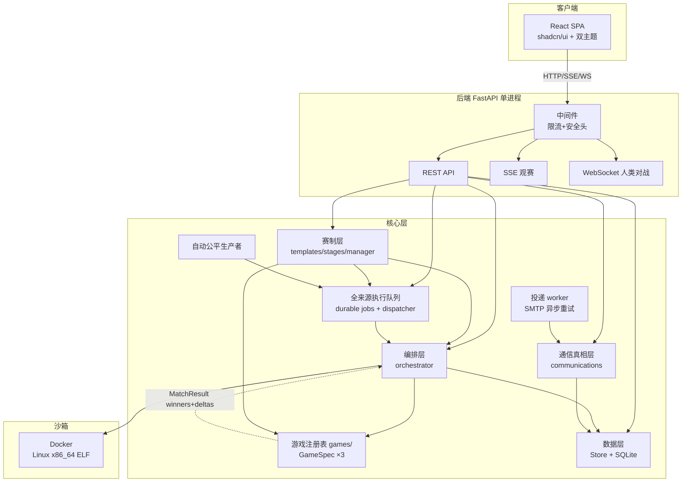
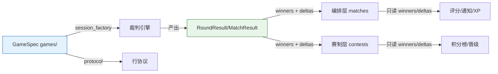

# 设计文档

> 本文档描述 botbattle 平台的系统架构、模块设计、数据库设计、接口设计与安全设计。

## 1. 系统架构

### 1.1 总体架构

平台采用**前后端分离 + 单进程**架构：后端 FastAPI 提供 REST/SSE/WebSocket 接口并托管前端构建产物，前端 React SPA 通过 HTTP 交互。

### 1.2 运行模型
- **单进程 uvicorn factory**（`main:create_app`），默认 `127.0.0.1:50380`。
- **lifespan** 启动顺序：① 获取数据库邻接 OS flock；② 由该唯一 owner 清除上个进程遗留的本地 Bot 在线态/租约；③ 以绝对 DB 路径 hash 或 `BZ_INSTANCE_KEY` 得到精确 Docker namespace，并在共享 launch flock 下删除该 namespace 全部容器、连续确认 label/name/token 为 0、闭合 `docker_launch_journal`；④ 在单事务补偿 `starting/running/settling` execution attempt；⑤ 收敛未纳入队列的历史 orphan Match；⑥ 按 `settled_order` 补算评分、对账赛事并启动唯一 `ExecutionDispatcher`、`ContestScheduler` 与 `DeliveryWorker`。未取得 flock 的第二实例不得写 volatile 状态或 execution control。execution 与上传预检的每次 create 都先持久化 token/确定性名称/host boot id，再向本机 daemon 发送请求；dispatcher 的周期性 orphan 检查也必须先取得同一 launch flock，等待正常 `creating/created -> idle` 转移完成后再判定，不能把活跃启动窗口误报为遗留意图。同 boot 的未 ACK create 不能凭瞬时双零自动放行，须保持 `manual:` 暂停，直到观察并删除精确 token 容器，或 host boot 改变后取得完整双零证明。其他 Docker 控制结果不确定时保持持久 `paused`，不执行后续补偿；可证明安全的故障有界重试，管理员恢复也必须重新清场。通信 worker 启动时恢复中断的 sending/processing claim，再按优先级处理事务邮件、普通邮件与广播批次。停服先置 `accepting=0`，再停止调度与投递 worker、取消/等待本进程 attempt、关闭本地 Bot transport 并释放租约，最后才释放 dispatcher flock；崩溃由下一任唯一 owner 统一恢复。
- **Docker 退出归因**：`docker start -a` 只有在证明非零 `StartedAt` 之前的失败才属于平台控制故障。容器一旦已启动，其后传回的任何进程退出码（包括 125）均归属 Bot，不得借此暂停平台或逃避评分。
- **并发控制**：`manual/human/contest/auto` 全部先写 `execution_jobs.queued`，没有来源可直接创建或启动 Match。按 8 vCPU / 16 GiB 基准，全局 `match_slots` 代码硬顶为 **2**、`sandbox_units` 为 **4**，每个 job 仍占 1 个 slot；显式启动参数和 CPU ceiling 只能收紧，不能放大。最重的两场赛事共冻结 8000 毫核/8192 MiB；上传预检在队列外还可短时增加 1000 毫核/512 MiB，因此双槽是饱和上限，不承诺 CPU 低延迟。claim 的 `BEGIN IMMEDIATE` 同时检查全局实际 running Match 数、活跃 match slots、sandbox units，以及由 affinity、cgroup CPU quota、cgroup memory limit 和物理内存共同收紧的主机 CPU/内存预算；资源使用取 job 创建时冻结的环境快照。赛事双 Bot 固定需要 4000 毫核/4096 MiB，主机永久不足时保持排队并公开直观原因，绝不降为节能档。`starting/running/settling` 均占容量，直到 exact job/attempt label 清零。人工/人机有 per-user 活跃/排队上限；赛事共享份额 1 只在 manual/human 与 contest 前台之间生效，不产生额外容量。manual/human/contest 在前台类内按 source priority 配合无上限 aging；auto 是严格后台类，不能靠等待时间越过前台，也不进入前台请求的 `ahead_jobs`/ETA。rated claim 另受 projection readiness 与同 Bot 未结算 rated-overlap 门禁。
- **闲时自动排位**：`auto_enabled=1` 只授予闲时生产能力，不代表立即生成或 claim。dispatcher 连续观察 manual/human/contest 的 queued/active、非 showcase 真实赛事的 `running/rest` 全程 guard、以及待开 pairing 且 `starts_at` 进入未来 5 分钟的 `published` 保护窗与自身冷却；showcase 明确排除，远期或手动开赛的 published 不会无期占用 guard。只有前台清空、两槽全空并连续 300 秒满足门禁时，才在事务内生成至多 1 个候选并 claim 至多 1 场。auto claim 除自身冻结资源外，还必须按追加式资源 registry 的逐维最高档预留一整场前台资源；当前为 1 match slot + 2 sandbox units + 4000 毫核 + 4096 MiB，未来追加更高档位会自动提高预留，收紧后的主机不足时不启动 auto。auto 结束后重新经历 300 秒冷却。producer 与 claim 都在各自 `BEGIN IMMEDIATE` 内复核持久前台真相，避免闲时快照与并发 enqueue 之间穿透。任一前台请求成功入队/重试时，在同一 `BEGIN IMMEDIATE` 中取消 queued auto，并让在途 auto 以 `auto_yield_foreground` 安全收口；真实赛事 guard 出现后由 dispatcher 下一次 reconcile 事务取消/yield，而 auto claim 自身在事务内重查 guard，不会穿透开局。只有精确清理 sandbox 后才释放容量。管理员单纯关闭开关不抢占在途 auto，仅阻止新局。`auto_match_fair_state` 以可空/带默认值的 `dispatch_policy_version/next_eligible_at/gate_reason` 持久策略与冷却；进入真实前台/赛事 guard 时只把 `gate_reason=busy` 持久一次，持续繁忙不产生每秒写放大；guard 首次解除才开始完整 300 秒空闲窗，且该边界跨重启保持。恢复时若有 auto 则推进 cooldown，不把每次进程重启等同于重置。首次 `idle-only-v1` 对账取消遗留 queued auto、让在途 auto 以 `auto_idle_policy_cutover` 收口，并从 300 秒空闲窗重新开始。启动或管理员恢复时，必须先完成 instance namespace 清场、launch journal idle 与 runtime ready，再在通用 orphan/requeue 恢复前提交策略对账；这样无事件和已有回放事件的遗留 auto 都保留专用 cutover 原因。若 Match 已先自然完成或以其他真实原因终止，则该终态优先，策略标记不得把它倒退为取消。
- **让路与物理启动线性化**：manual/human/contest 都属于会触发 auto yield 的前台来源，人类对局入队不能例外。execution 所有者写 Docker create intent 时，须在把 launch journal 从 `idle` 改为 `creating` 的同一 `BEGIN IMMEDIATE` 内，先证明 host-wide journal 已收敛，再复核 job 仍是当前 `starting/running` attempt 且 `cancel_requested=0`；`settling` 只持有收尾容量，不再拥有新物理启动权。若前台入队/yield 事务先提交，create intent 必须失败且不得调用物理 `docker create`；该确定性拒绝由 BinaryRunner 归一为普通任务取消，按既有取消路径收口，不得包装成 Docker 控制不确定或暂停 dispatcher。若 launch intent 先提交，后到的 yield 仍标记取消，但必须按已持久化的 instance/job/attempt/slot/token/name/label 完成 exact cleanup，并在物理清零后才释放容量。
- **资源档位与本地连接身份冻结**：execution job 在入队时冻结环境、`profile_version` 与资源向量，claim 创建 Match 时把同一版本复制到私有 `_execution_profile_version`。本地 Bot 的数据库 agent 行可在撤销后因同名重建而复用，因此 claim 还必须在同一事务把当时的 `public_id + connection_generation` 写入私有对局配置；runner 只使用这组冻结 transport identity，绝不按可复用行 ID 回查当前连接。旧 attempt 在撤销或同名换绑后只能命中旧连接的撤销/离线故障并技术终局，不能把裁判请求发给替代 Bot。上述私有键均由公开 Match 投影整体移除。runner 只按不可变历史 registry 解析资源版本，Traditional 每次决策、LongRunning、复式两条 leg 与人机 Bot 侧均使用同一冻结档位；未知版本或版本不支持的环境在 Match 进入 running 前按无效配置中止，不能回落到部署时当前档位。v0 仅表示迁移前的节能沙箱，v1 才包含节能与赛事沙箱；发布新规格只能追加 registry 版本，禁止改写旧映射。没有 execution job 可供恢复资源向量的历史 running Match，按该追加式 registry 中双 Bot 各维度的最大值计费；即使升为双槽，也不能借失联行低估 CPU/内存后再放入一场高规格赛事。
- **本地 Bot 回合故障闭环**：正常 `response` 与客户端 `failure` 共用 hub 的 `request_id + match_id + turn + deadline` 强绑定校验。`failure` 只接受固定六类原因和精确五字段信封，不接收路径、stderr、命令或任意详情；命令缺失/启动失败、空输出、超限、无效输出、I/O 故障与决策超时均立即令 pending Future 抛出 `LocalAITechnicalError`，按技术负收敛并释放本 job 占用的对局槽。错请求、晚到或重复 failure 只能被拒绝，不能影响其他回合；纯网络断线仍保留原 deadline 与重连重投语义。
- **重试所有权**：运行期基础设施中断在 Match 终态且 label 清零后，用户拥有的 manual/human 标为 `interrupted + retryable=1`；auto/contest 始终 `retryable=0`，但同一持久 job 以 `failure_count/next_attempt_at` 做 1、2、4…60 秒退避，contest 同步延后 pairing。通用 `/retry` 不得复活后台来源，普通无错误重启则即时恢复，以免产生重复 active job 或每秒 attempt 热循环。
- **闲时策略切换原因**：首次 `idle-only-v1` 对账的在途 auto 使用 `auto_idle_policy_cutover`（“自动排位策略升级后收口”），不得误用只表示真实前台到达的 `auto_yield_foreground`。
- **限流**：内存滑动窗口 IP 限流（单进程；多 worker 部署需换 Redis）。

## 2. 模块设计

### 2.1 模块树与职责

| 层 | 模块 | 职责 |
|----|------|------|
| 接口 | `api_routes.py` | 主 REST（含 SSE/WS）：bots/matches/users/search/leaderboard/comments/likes/notifications/contests/admin/wiki；赛事详情另有只含公开赛况的轻量 `/api/contests/{id}/live` 投影，避免赛中轮询报名与管理数据 |
| 接口 | `auth/routes.py` | 认证 REST（13 路由，prefix `/api/auth`）：注册/登录/验证/重置/profile/avatar |
| 接口 | `main.py` | 应用工厂 + 中间件装配 + StaticFiles 挂载（dist/wiki-assets/avatars）+ lifespan |
| 游戏注册 | `games/` | **赛制/编排契约解耦入口（裁判/协议分离）**：base.py（GameSpec / GameRegistry）+ 共享 Traditional / LongRunning 信封实现 + `_board_protocol.py`（棋类共享 payload 工具）+ 各 `games/<game>/` 子包。`<game>_judge.py` 是 0 平台依赖的纯规则；engine 是平台适配层；protocol 的 `validate_response_payload` 只校验 response 值，游戏内合法性仍归裁判。赛制/编排主流程经 registry/spec 调用，不按游戏名分支；这不表示整个前后端对新增游戏零接入工作。 |
| 编排 | `matches/` | `execution_queue`（唯一 dispatcher、双资源 claim、startup cleanup/补偿、公开白名单投影）+ orchestrator（只启动已 claim attempt、SSE/评分/人类对战；冻结 `rated/rating_reason`，同 Bot/同所有者/人机/赛事中性；完成冻结 `settled_order`；先持久化终态与私有 debug，再广播权威终局；Docker 不确定时只暂停恢复，不伪造平台故障局）+ runner（按 runtime_mode 传 Traditional 完整历史或 LongRunning 增量请求；严格 response/握手；首个 Bot 故障写有界 `technical_incident`；双方统一累计棋钟）+ `result_contract`（持久化结果唯一 builder） |
| 赛制 | `contests/` | templates/stages/manager/scheduler/ranking/validation + presentation/showcase/showcase_seed。状态机 `draft→open→published→running→rest→finished`；已填写时间统一满足 `registration_opens_at <= registration_closes_at <= starts_at`，`starts_at=NULL` 是发布后等待手动开始的明确闸门；手动推进按实际时刻盖戳；终态不可互转；报名、派发、完整阶段/轮次、正式榜均以锁和事务守护，aborted 无裁决对局不积分/不晋级。支持能力的游戏可在单阶段循环赛创建时把每对物理 Match 数冻结进阶段快照；每条 pairing 持久化系列序号与总数，恢复、排期和完成判定以完整系列为准。`showcase_key` 非空时整张赛事图为明确标注的合成只读快照。 |
| 沙箱/运行配置 | `runtime/` | `config.py` 是运行参数的不可变代码唯一来源；`docker_supervisor` 只连 canonical local Unix socket，构造确定性 container 名与 instance/job/attempt/slot labels，并统一施加 network/read-only/tmpfs/cap/user/cpu/memory/swap/pids/ulimit/log-driver/image 硬约束；Linux x86_64 ELF BinaryRunner 只执行 supervisor 建立的 scope。每个物理 session（包括 Traditional 每回合一次性进程）停止时按 instance/job/attempt/slot/name/launch-token 精确删除并双零确认，整局结束再按 job labels 作最终兜底，不会为清理 Traditional 误删同局 LongRunning 座位。其他格式在上传时拒绝 |
| 数据 | `store/` | Store 类（SQLite，含 `_migrate` 自愈）+ `execution.py`（通用 job/attempt/control、公平 producer、双资源容量、原子 claim 与恢复状态机）+ 自动公平 decision/fair-state/service 审计；评分 policy/settlement/终局输入不可变，投影可由离线 CLI 按 settled_order 确定性重建；schema.py 是状态/类型常量唯一来源 |
| 认证 | `auth/` | routes + auth_manager + captcha + dependencies（require_user/admin/organizer） |
| 通信 | `communications/` | conversation/message 真相、participant 权限、站内/邮件 delivery、广播快照与小白式 Bug 反馈；`worker.py` 独占 SMTP 调用边界 |
| 通知兼容 | `notifications/` | `NotificationManager` 仅作旧调用门面；新写入先落 communications，再在同事务生成 `notifications` 兼容投影 |
| 支撑 | `bots/ rating/ mail/ security.py logging_config.py crypto.py cli.py` | Bot 上传分类 / Glicko-2 / SMTP / 安全头+限流 / 日志 / 密码 hash / CLI |

邮件层以 `Botbattle` 为默认发件人名称。邮箱验证、密码重置和欢迎信是代码拥有、显式版本化的安全模板；旧 `email_templates` 行仅保留作历史审计，启动仍只 `INSERT OR IGNORE`，不覆盖旧自定义，但运行时不再读取这些正文。注册、重置与邮箱验证事务只写高优先级 delivery 并返回 `queued`，SMTP 成败不回滚用户、验证码或密码变更。验证/重置码只存于短期 `email_codes` 行，delivery 仅保存模板版本与该行引用；worker 发送时才在内存渲染，过期、已使用或已被更新的码直接 `cancelled`。

通信状态机只有以下权威转移：conversation 为 `open→closed/archived`；delivery 为 `queued→sending→sent`，可重试失败指数退避回 `queued`，达上限后 `failed`，过期/取消为 `cancelled`；broadcast 为 `draft→scheduled→running→completed`，完成前可转 `cancelled`。worker 投影单个受众时在同一 `BEGIN IMMEDIATE` 内完成 `running` CAS、创建 conversation/message、写站内投递/queued 邮件并结算 recipient，故取消不能插入“状态校验→生成消息”之间；取消先提交则投影不发生，投影先提交则已生成站内信不声称可撤回。broadcast 仅在所有 recipient 不再是 `pending/processing` 且所有 delivery 不再是 `queued/sending` 后完成；人工重试任一 recipient 或 delivery 都清除 `completed_at`，已完成广播回到 `scheduled`。

邮件的 `sending` 只表示已 claim，不等于已进入供应商。`resolve_delivery_content` 是明确的最终 SMTP 准入边界：它以 `BEGIN IMMEDIATE` 复核当前 attempt/claim，并对父 broadcast 的 `scheduled/running` 状态做 CAS；取消先提交时返回空且 worker 把 delivery 收敛为 `cancelled`，准入先提交后取消才允许本次供应商调用完成。`claim_delivery` 不领取非活动父广播的邮件；启动恢复把 cancelled/completed 等非活动父广播遗留的 `sending` 直接收敛为 `cancelled`，绝不重新排入 queued。真正调用供应商后仍存在“供应商已接收、DB 尚未写 sent”的崩溃窗口，因此语义是有界的 **at-least-once**，不声称 exactly-once；唯一 idempotency key 与确定性 `Message-ID` 用于支持合作供应商去重。

### 2.2 核心解耦契约

**两层解耦**：

1. **GameSpec 注册表（`games/`，契约入口）**：每款游戏声明 `game_id`/`label`/`ruleset_id`/`protocol_version`/`rating_pool_id`/`session_factory`/`protocol`（含 `validate_response_payload`）/配置校验/`normalize_delta`/`progress_from_events`/ETA/模板/源码元信息/预检/多 leg 计划/累计棋钟，以及可选的单场公开记录能力 `record_exporter` 和赛事每对实际对局上限 `contest_games_per_pair_max`，所有字段均有生产消费者；`normalize_delta` 把座位 0 原始分差换成本游戏单位，`progress_from_events` 在技术终局无引擎结果时统计已完成轮数。`record_exporter=None` 表示该游戏没有稳定导出格式，`contest_games_per_pair_max=None` 表示不开放模板系列配置；通用层只做能力发现，不按 `game_id` 分支。`rounds_per_match`、`num_seats` 与 judge 参数描述等无消费者元数据已删除。游戏规则直接由每游戏代码常量定义，不存在 admin 裁判参数或对局级规则覆盖。`run_session` 只接受内部复现参数（Holdem 的 `rng`/`deal_sequence`，棋类的 `rng`），其他键立即报错。通用赛制与编排路径经 `registry.get(game_id)` 取 spec，禁止增加游戏名分支；已存实体缺失/未知 `game_id` 必须失败，产品默认仅在创建边界明确赋值。

   **阶段系列、公平计分与赛事实况**：单阶段普通/复式循环沿用创建字段 `games_per_pair`，由模板元数据 `games_per_pair_config` 开放 1–10 场。多阶段德州预赛/决赛改用 `stage_series_configs` 正向声明每个可配置阶段的 `games_per_pair` 安全档位及瑞士阶段可选的 `swiss_extra_rounds`；客户端以 `stage_series_settings[stage_key]` 提交，禁止与旧标量同传、禁止自定义阶段夹带。预赛默认 K=2、附加 2 轮，决赛全员循环默认 K=2、Top 8 默认 K=4；仅 draft/open 且 pairing 图为空时可由赛事 owner/admin 经 `BEGIN IMMEDIATE + status/stages_json CAS` 修改。发布路径在同一生命周期事务中给缺字段的旧 draft/open 快照补模板默认，并按报名人数冻结 `effective_rounds`；published/running/rest/终态快照永不回读或改写当前默认。

   所有系列行持久化 `series_index=1..K`、`series_size=K` 与确定性 `pairing_seed`，交替物理座位；Swiss 的 K 条实际对局保持同一 `round_num` 并按系列坐标跨对手交错派发，下一轮必须等待本轮全部系列落稳。瑞士有效轮数为基础 `ceil(log2(n))`（或模板显式轮数）加附加轮数，再受无重复对手图上限约束：偶数 n 至多 n−1，奇数 n 至多 n；轮空只产生一条 +3 占位，不扩成 K 条 Match。预赛/决赛阶段的 `series_scoring=aggregate_match_points_v1` 先把每场胜/平/负记为 1/0.5/0 小分，K 场全部完成且坐标完整后才通过阶段 scoring 结算一次大分（德州为 3/1/0）；未结算系列不进入主榜 points/W/D/L/delta。原始 delta 逐场累计供直播和结算后破同分，技术终局按一场真实结果计入，不补造 Match。Buchholz、SB、直接交手与晋级/正式榜按概念对手交锋计一次，聚合阶段的直接交手率按 `胜+0.5×平` 计算；系列坐标缺行、重复或未完成时阶段不得结束。旧普通/复式单阶段循环仍保持逐条计分、旧直接交手公式及 Cut1 删除一条最高对手分记录的历史语义，不能被新聚合规则追溯改写。

   估算响应在兼容顶层总数之外返回逐阶段的参赛规模、概念交锋数、有效瑞士轮、K、实际 Match、计划 leg 与 ETA；详情只读投影返回冻结的 `stage_series_settings`。公开 `/api/contests/{id}/live` 只返回生命周期、当前阶段、计数、正在进行/下一批/最近完成的公开 pairing、前列积分及可选系列小结；隐藏赛事沿用详情 ACL，响应不含报名实名、版本快照、execution 标识或其他内部字段。独立 `/contests/{id}/live` 页面可见且 running 时短轮询该投影，published/rest 以及已结束但正式成绩尚未就绪时降频；成绩就绪、取消、不可变展示快照或 404 不可见赛事停止自动轮询。普通赛事详情只提供稳定入口，不高频读取完整详情。单桌的逐事件直播仍复用 `/match/{id}` SSE，不再造第二套赛事事件总线。

   **传输唯一性**：上传预检与正式首回合共用 runner 的信封构造、响应解析和所选 runtime_mode；Holdem 两条路径的首请求都声明固定 `max_hand=70`。Traditional 每次完整历史；LongRunning 首回合完整历史、精确握手后才允许单 request。响应对象必须包含 `response`，单行 stdout 硬顶 64 KiB；平台只把 `response` 提交到历史和裁判。可选 `debug` 在正式 Bot-vs-Bot 中作为独立 sidecar 收集，预检丢弃，其他额外字段忽略；顶层整数、裸坐标、缺少 `response` 的 `{a}`、超长行及缺失/错误握手仍直接拒绝；游戏 payload 的类型与形状继续由各 GameSpec 严格校验。
   **私有 debug 边界**：`matches/bot_debug.py` 先做 NFC、ANSI/control/bidi 清理、敏感 key/token/private-key 脱敏及深度/节点/条数/字节硬顶；复合 Cookie/Set-Cookie 从字段起整段遮蔽，容量饱和时在 sanitizer 前 O(1) 短路。orchestrator 于终态广播前一次性写 `match_debug_sessions/entries`。授权规则只在 Store 的单一事务 helper 中定义：普通对局双方 Bot owner 对称读双方；赛事 organizer/admin 单场终态可读，Bot owner 延迟到赛事 finished/cancelled；赛事类型/外键/实体不一致时非 admin fail-closed；human 非 admin 不可读。读取使用 `no-store` 并记 actor/match/count 审计，不记录内容；未授权响应不暴露记录存在性。sidecar 不进入 `responses[]`、任何游戏请求、result、公开 REST replay、SSE/WS、通知或日志。

2. **结果契约**：裁判鸭子类型（各游戏 `RoundResult`/`MatchResult` 独立定义）产出 `winners`、零和 `deltas`、`rounds_played`、`rounds`、`events` 与 `winner`；赛制代码不读取扑克 pot/board/holes。平台持久化与 REST 的公共结果只有 `rounds_played`、`deltas`、`normalized_delta`，统一由 `matches/result_contract.py` 校验和构造；正常完成、零轮技术判负、人机和赛事 Bot 缺失都走同一 builder。复式可追加 `legs`，但公共轮数必须累加所有 leg（Holdem 两条 70 手为 140）。Holdem 的 `normalized_delta` 仅是整场筹码分差换算成大盲注，并非每 100 手指标。Holdem 权威胜者是 `result.winner`（按累计 `final_chips`），原始 engine `match_end.winner=null` 不得覆盖它。`tests/test_result_contract.py` 与 runtime/迁移回归覆盖此约束。

   **实时终态屏障**：游戏 engine 的 `match_end` / `error` 发生在 `run_binaries` / `run_bot_vs_human` 返回或抛错之前，只是编排器内部信号，不是第二套公开事件。运行中的 SSE/WS 不广播它们，运行中 replay snapshot 也不持久化它们；复式赛每个 leg 的 engine `match_end` 同样保持内部，逐 leg 结果只落 `result.legs`。编排器先提交 match 的终态，再移除全部 engine 终态并向公开 replay 追加唯一终局，最后广播同一对象。正常完成唯一使用 `match_end {winner, reason, deltas}`，原因只允许 `schema.PUBLIC_MATCH_COMPLETED_REASONS`；中止唯一使用 `error {reason}`，原因只允许 `schema.PUBLIC_MATCH_ERROR_REASONS`。两者都不含自由文本、路径或异常详情，未知完成原因归一为 `completed`，未知中止原因归一为 `platform_error`，诊断详情只进日志。故 replay/live 的终态数量与 schema 完全一致；SSE/WS 收到它后关闭，此时同一时刻的 `GET /api/matches/{id}` 已返回终态。管理员只能请求中止，后端固定写 `admin_aborted`，客户端不能注入自由原因。

   **事件投影与真人可见性**：所有非终态事件也必须经过 `store.public_contract` 的事件类型与字段白名单；未知诊断事件整条丢弃，已知事件附加的 `message/path/stderr/debug` 不进入 REST/SSE/WS。运行中对局由 orchestrator 保存一份追加式内存事件前缀，SSE 重连 snapshot 从该前缀生成，不能退回到每 5 条节流落库的旧画面；内存前缀与持久化 replay 共用 `sanitize_public_event_prefix`，因此字段白名单、技术故障样本上限与真人可见性不会形成两套实现。活跃真人德扑的公开详情与 SSE 隐藏双方底牌并移除决策请求；本人鉴权 `/play` WebSocket 只获得自己座位的底牌和请求，对局结束后才公开完整回放。终态 match 行一旦提交，即使 runner 尚未释放内存前缀，snapshot 也必须改从 Store 合成唯一权威终局。订阅先完整构造快照与可见性元数据，成功后才注册队列；构造失败不留孤儿订阅，元数据缺失时必须 fail-closed 隐藏底牌和决策请求。管理员中止一旦提交 aborted，即使 replay 瞬时读取失败也保留既有历史，并保证完成 SSE 与赛事回调 handoff。

3. **对局配置/结果双 JSON 通路（matches 表收敛）**：对局结果详情走 `result` JSON 列（`{"rounds_played":N,"deltas":[ea,eb],"normalized_delta":float}`）；`match_config` JSON 列只承载版本快照、duplicate 等内部编排键。**全部游戏规则已钉死代码常量**：Holdem=70 手/20000 筹码/50-100 盲注，Gomoku=15×15 + 26 种指定开局 + 三手交换 + 五手二打 + 黑方禁手/每方 900 秒，Pencil=N=6/每方 900 秒。规则不走 match_config、platform_settings 或 runner 参数；`session_factory` 直接使用模块常量构造 Session。普通挑战、自动排位和人类对局即使未显式选择版本，也会在 execution job 创建时冻结各实际 Bot 的当前激活 `bot_versions.id`；原子 claim 创建 Match 时才把冻结值写入 `match_config._bot_a/b_version_id`，排队期间上传或回滚不改变 runner 路径/runtime_mode。冻结 ID 是权威引用：版本行缺失、跨 Bot、路径为空、元数据/运行模式不符合现行契约，或版本记录中的非空 SHA-256/正 `size_bytes` 与磁盘文件不一致时，统一抛出 `version_unavailable`。同一完整性校验在挑战/人机 job 与赛事 pairing 快照写入前执行，已知损坏不产生 job/Match/task；即使是 checksum/size 尚未落库的旧版本，也必须先确认文件存在且为普通文件。排队后冻结版本失效会在 claim 建 Match 前再次 fail closed：manual/human 进入 `interrupted + retryable`，auto/contest 进入 `cancelled + non-retryable`，auto decision 同事务同步 `cancelled/version_unavailable`；contest pairing 复位为 `pending + match_id=NULL` 并至少退避 30 秒，避免 scheduler 热循环。四类都不产生 Match/runner/评分副作用。已经 claim 后才发生的文件变化仍在运行边界复核并把 Match 以无胜者 `aborted` 收敛。完整性缓存的 key 含 device/inode/size/mtime/ctime，文件变化（包括同尺寸覆盖后恢复 mtime）会强制重算 SHA-256。赛事运行时失效仍触发统一完成回调，将 pairing 安全复位并退避等待人工修复。仅当 Bot 的 `current_version=0` 且完全没有版本行时，才视为真正的 pre-version legacy Bot，且 `bots` 镜像通过同一 Linux x86_64 ELF/runtime 校验后方可执行；checksum/size 尚未落库的旧版本不会仅因字段为空而被阻断。赛事排名经 `store.db.match_deltas(m)` 从 `result.deltas` 取原始分差。`test_pinned_game_config.py`、`test_execution_queue.py::test_claim_version_loss_has_truthful_retry_and_auto_lifecycle` 与 `test_claim_version_loss_backs_off_contest_pairing` 守护上述边界。

   Holdem 的 `hand_start.chips` 是扣除盲注后的余额，前端据固定 20000 筹码恢复本街下注与初始底池；`action.amount` 对 raise/all-in 统一表示本街累计投入（raise-to），避免把剩余筹码误当累计下注。现行规则代际为 `holdem_hu_nlhe_allin_v2 / holdem_action_v1 / holdem_allin_rating_v2`：all-in 的 raise-to 必须冻结为“本街既有投入 + 剩余筹码”，不能在写入 all-in 哨兵后丢失盲注/此前下注；精确耗尽筹码的 call 同样进入 all-in 状态。下注匹配后若只剩 0/1 名未弃牌且未 all-in 的玩家，不再向单人索要无意义的 check，直接发完公共牌；覆盖短码全压的一方只需跟到匹配额，允许保留未投入筹码。旧 `holdem_hu_nlhe_v1 / holdem_rating_v1` Match、回放与结算只读保留，不重写也不进入新评分池。

   同协议 `game-rule-cutover` 可在产品方逐 ID 授权时保留尚未开赛的 `open` 赛事及其报名，并把赛事冻结三元组随评分池在同一写事务推进。该例外不是宽泛状态迁移：授权集合须覆盖该游戏全部 live 非 showcase 赛事，赛事必须零开始/结束时间、零派发、零 pairing/execution job/任一游戏 Match/阶段结果，且赛事完整行与有序报名完整行摘要进入审核 `plan_digest`。事务只 CAS 三元组，阶段、模板、状态、时间、名册和实名快照不变；finished/cancelled 历史赛事保持旧规则，链尾 marker 后置条件要求所有 live 赛事等于 target contract。

4. **累计棋钟契约**：Gomoku/Pencil 在 spec 中固定 `time_budget_per_side=900.0`，Holdem 为 `None`。orchestrator 对 Bot-vs-Bot 和人类对局都把该值传给 runner；runner 分座位累计 Bot subprocess 或人类 Future 的决策耗时，每次成功决策发 `time_used {seat,used,remaining,budget}`，耗尽时发 `time_out {seat,used,budget}`。Bot 耗尽转为 `BotDecisionTimeoutError` 统一技术判负；人类 Future 耗尽仍交裁判判负，不会伪装成 Bot 故障。事件随 SSE/回放持久化，Gomoku/Pencil reducer 用首条事件的 `budget` 初始化未行动方，MatchViewer 玩家卡显示双方剩余时间和超时徽章。人类 `/play` 页仍显示 `human_action_timeout` 默认 120s 的逐回合倒计时；后端同时累计 900s 总棋钟，两层限制中较早触发者生效。

5. **Gomoku 规则代际**：现行新局冻结 `gomoku_ccgc_2013_five_move_two_v2 + gomoku_action_v2 + gomoku_ccgc_2013_five_move_two_rating_v2`；开局 wire 继续发送单值 `n_range=[2,2]`，响应 `n` 与黑 5 候选数固定为 2。上一竞赛代 `gomoku_ccgc_2013_v1 + gomoku_action_v2 + gomoku_ccgc_2013_rating_v1` 与更早的 `gomoku_freestyle_v1` 只作历史契约保留，回放仍由其真实事件恢复候选数，不把旧三打/四打改写为二打。首次从 freestyle 到竞赛 v1 的不兼容协议 hard cutover 会保留旧 version 并建立标准 v2 版本；本次同 wire 规则升级只推进 ruleset/评分池并保留既有 current version，不会替它们重跑预检。新上传预检和每场新局裁判都拒绝非 2；既有硬编码旧 ruleset 或 `n=3/4` 的版本必须由用户更新，否则虽然仍可入队，实际新局会以 `illegal_opening` / `illegal_candidates` 判负。各代评分隔离，切换时正在排队/可重试的旧契约 job 原子取消且不可重试。

**DRY 边界**：游戏规则（engine/result/templates）各游戏独立；只在字节协议真正同构时共享平台工具。Pencil 通过 `GameSpec.shared_source_files` 公开 `_board_protocol.py`；Gomoku v2 是分阶段判别联合，使用自身 `protocol.py`，不伪装成单纯 x/y 协议。

### 2.3 新增一款游戏的成本

赛制/编排主流程不增加游戏名分支，但仍需完成以下接入：
1. 建 `games/<game>/` 子包：`<game>_judge.py`（纯规则、零平台依赖）+ `engine.py`（裁判与平台协议的适配层，可依赖 runtime 的统一故障类型）+ `protocol.py`（只导出本游戏行协议 API）+ `result.py`（独立结果，满足鸭子契约）+ `templates.py`（赛事模板）+ `spec.py`（装配 GameSpec，明确 `time_budget_per_side`）。若提供稳定的单场公开记录，在游戏包内实现只消费公开投影的 exporter 并赋给 `record_exporter`；否则保持 `None`，不得由通用层猜格式。`GameSpec.source_files` 默认公开前四个文件；显式覆写时仍必须包含 `<game>_judge.py`。统一 Botzone 信封可引用 schema 的运行模式常量；若协议调用 games 包共享实现，必须通过 `shared_source_files` 一并公开。零平台依赖保证只适用于权威纯裁判，不扩张到整个游戏适配包。
2. `schema.py` 的 `REGISTERED_ENGINES`/`VALID_GAME_IDS` 各加该项；`Store._migrate()` 根据注册 ID 用模板自动创建同构 `matches_<game>` 表与索引。
3. `games/__init__.py`：`registry.register(SPEC)` 一行（启动断言 schema 与注册表一致）。
4. 前端 `src/games/<game>/`：`index.ts`（GameViewSpec）+ `canvas.ts`（CanvasRenderer）+ `reducer.ts`（事件归约，对标后端 engine.py，自包含不依赖 components/）+ `src/games/index.ts` 注册一行。`RawEvent` 公共类型在 `src/games/base.ts`（对标后端 `_board_protocol.py`）。
5. **约束**：`games/<game>/` 不得反向 import 已删的 `engine`/`_compat`/`protocol` shim 或通用层（matches/contests/store/api_routes）——`test_import_cycles.py` 源码扫描守护（forbidden 含已删 shim 作"防回退"哨兵 + 通用层全列）。通用层不得 import 具体游戏模块（经注册表）。
6. **验证**：运行完整 `pytest`（至少覆盖 registry/result/import/通用层无游戏分支、预检与 runner 行为）+ `npm run build` + Playwright。若 `time_budget_per_side` 为正数，还须覆盖 Bot-vs-Bot 与人类双方累计/耗尽事件，并让前端 reducer 与 UI 回归验证 `time_used/time_out`；不需要累计棋钟时显式使用 `None`。

**不再需要**在 `registry.run_session`/`runner._dumps`/`_loads`/`_fail_response`/orchestrator 加 `if game_id==` 分支；这些调用点已收敛到注册表契约。

## 3. 数据库设计

SQLite 单文件（默认 `botzone.db`）；fresh schema 同时包含全局执行队列、通信/广播/Bug 反馈、私有调试与既有业务表，per-game 表与索引由 `_migrate` 按注册表模板补齐。状态码、类型、`REGISTERED_ENGINES` 与历史配置键名集中在 `store/schema.py`，生产运行参数及时区集中在 `runtime/config.py`，资源硬顶集中在 `runtime/limits.py`。

### 3.1 核心表（选录）

| 表 | 用途 | 关键列 |
|----|------|--------|
| `users` | 用户 | id/username/email/password_hash/role/display_name/bio/avatar/xp/level/last_active_at + **实名信息**（real_name/phone/school/student_id，可选，不公开） |
| `bots` | Bot | owner_id/name/display_name/game_id/os/arch/format/binary_path/current_version/is_active/is_ranked/owner_deleted_at；partial unique index 保证每个 `(owner_id,game_id)` 至多一个排位代表；`UNIQUE(owner_id,name)` 继续覆盖墓碑行，名称暂不可复用 |
| `matches_holdem` / `matches_gomoku` / `matches_pencil` | 对局（**每游戏一张表**） | id/bot_a_id/bot_b_id/owner_id/contest_id/winner/reason/match_type/status/game_id/**`match_config`(JSON 配置)**/**`result`(JSON 结果)**/human_user_id/human_seat/match_seed/technical_loss/likes_count/views_count；三表结构一致，配置/结果走游戏无关的双 JSON 列，不保留游戏专属结果列 |
| `matches_index` | 对局定位 | id(PK)/game_id——get_match(id) 先查此表定位到哪张 matches_<game> |
| `match_debug_sessions` | 私有调试批次 | match_id(PK/FK→matches_index CASCADE)/entry_count/total_bytes/dropped_count/created_at/updated_at；只允许终态 Bot-vs-Bot 批量写 |
| `match_debug_entries` | 私有调试条目 | match_id(FK CASCADE)/bot_id(FK SET NULL)/seat/turn/leg/debug_json/size_bytes；唯一键 `(match_id,seat,turn,leg)`，删除 match/bot/user 不留孤儿 |
| `ratings` | 评分（**per-game**，PK=bot_id+game_id） | bot_id/game_id/rating(1500)/rd(350)/vol/wins/losses/draws/delta_total/matches_played/last_played_at |
| `contests` | 赛事 | title/organizer_id/status(draft/open/published/running/rest/finished/cancelled)/game_id/stages_json/current_stage_idx/registration_opens_at/closes_at/starts_at/rest_ends_at；nullable unique `showcase_key` 非空表示长期只读的合成演示快照；fresh schema 不含 `hands_per_match`/`match_config_json`，旧库同名列仅忽略不返回 |
| `contest_pairings` | 对阵 | contest_id/round_num/bot_a_id/bot_b_id/match_id（逻辑外键、非空时全局唯一，无 DB FK）/stage_idx/bracket_slot/status；状态逐场跟随绑定 Match 终态 |
| `contest_stage_results` | 积分 | contest_id/stage_idx/entry_id/bot_id/points/wins/draws/losses/delta_total/rank_in_group |

所有 fresh schema 的实体 `game_id` 均为 `NOT NULL` 且无数据库默认值；产品入口需要默认游戏时由创建函数显式选择，运行时和持久化读取不得把缺失/未知值猜成 Holdem。

赛事模板可以用 `creation_enabled=false` 保留历史可读元数据：`get_template`
仍为旧赛事/演示快照解析名称与冻结阶段，但 `list_templates` 默认过滤，
`resolve_template` / `resolve_stages` 与 Manager 新建入口统一拒绝。Gomoku 两个含
`single_elimination` 的旧模板属于此类；当前只向新建五子棋赛事暴露
2 / 1 / 0 的双循环模板。创建入口另由模板元数据 `recommended=true` 选取每游戏公平默认，
通用 `default_template_id(game_id)` 只按注册表过滤，不含游戏名分支；没有推荐标记时保持该游戏
代码模板顺序。调用方连 `game_id` 也省略时，先由首个可新建模板锁定兼容默认游戏，再只在该游戏
内选择推荐，因此其他游戏未来新增推荐标记不会改变默认。Holdem 推荐 `holdem_dup_rr`（≤12 人，同副牌换座复式单循环），两个 Swiss 模板
继续作为大规模快速选项并明确样本较少；既有赛事只读冻结的 `template_id/stages_json`，不会因
默认顺序变化而重写赛制或赛果。Swiss 轮空仍按该模板的一场胜场分进入 `points`，但不增加
`wins/draws/losses`；公开阶段摘要的 `byes` 从已持久化 pairing 图派生，因此既有赛事无需数据迁移。
轮空/直接晋级只认统一的权威 no-opponent 契约：阶段类型必须为 Swiss 或单败，且
`entry_b_id/bot_b_id/match_id` 均为 `NULL`、pairing 状态为 completed；真实对手 Bot 被删除后仅
`bot_b_id` 因外键变空，不能被猜成轮空。阶段完成、Swiss 全历史配对/轮空轮转、单败推进、强制完赛、
公开投影和未开赛批次重建均复用该判断；任一历史 pairing 未绑定已完成 Match 且又不满足权威轮空时
fail closed，不生成下一轮、不覆盖批次。阶段摘要同样只把权威 no-opponent 或实际 JOIN 到 completed
Match 的行计作完成；内部 `match_status` 不进入公开 pairing 白名单。自动终局、强制完赛和 finished
缺榜恢复共用全阶段裁决门禁：已到达阶段的空批次、缺失/中止 Match 或删除真实对手均不得固化部分榜；
仅首阶段总报名不超过 1 人，或正常推进到下一阶段时仅剩 1 名未淘汰者，才允许无对阵终局。
分组循环的有效组数由生成与估算共用同一规则，在至少 2 人时自动收缩到每组不少于 2 人，不能漏掉
小名册参赛者；`advance_per_group` 优先于全局 `advance_count`，且两者都不能把后续人数放大。
复式模板的 `estimated_matches` 仍表示持久对阵 job 数，
`eta_seconds` 则按 `GameSpec.build_match_plan` 的实际 leg 数估算；两局换座不能按单局时长误报。
赛事积分与赛果不进入平台 Glicko Rating。通用单败推进不再用 bool 同时表示“冠军已产生”与
“无晋级者”；`_maybe_next_elim_round` 显式返回 `created/champion/blocked`。任一
completed 对局的 `winner` 为空时返回 `blocked`，赛事保持 running，不会擅定
晋级者、生成部分下轮、固化阶段快照或提前完赛。

### 3.1.1 客户演示快照契约

- 六个持久键分别表示 `draft/open/published/running/rest/finished`。生命周期状态只负责展示；`showcase_key IS NOT NULL` 才是不可变边界。
- `GET /api/contests` 是真实赛事发现列表，四种身份都在 SQL 分页与 `COUNT` 前排除 `showcase_key IS NOT NULL`；快照及其对局不删除，已知详情链接仍按原生命周期可见性只读访问，供专项演示与验收。
- 普通用户、组织者和管理员的生命周期、报名/退赛/换 Bot、名册、时间与删除写入口都先经过同一 Manager 守卫，返回 HTTP 409；前端同时隐藏控件并显示“合成演示 · 只读”，但后端守卫才是权威边界。
- scheduler、启动 reconcile、孤儿对局恢复和未就绪正式榜扫描均排除快照；管理员仪表盘的赛事、对局、用户、Bot、活跃会话、最近用户与趋势聚合也通过快照的 organizer/entry/pairing 关系排除整套合成数据。冻结前 Store 原子确认该赛事没有 pending/running Match，避免留下一张恢复流程故意忽略的活跃图。
- `presentation.py` 按 `stage_idx` 投影持久化阶段结果或当前实时积分，并与该阶段 pairing 中真实出现的 `entry_id` 求交；因此 Top 8 淘汰阶段不会混入四个未晋级者。持久化阶段行按自身 `bot_id` 读取历史 Bot 名，休息期换 Bot 不会篡改旧阶段身份；历史 Bot 已删除时显示明确占位。阶段榜/晋级与 `contest_official_results` 正式总榜是两个独立读模型；正式榜 JSON 把库内 `tiebreaks_json` 投影为结构化 `tiebreaks`，页面只展示这条权威破同分链。
- seed 对已停用的 Gomoku KO 模板只有一个私有例外：`_create_historical_showcase_contest` 通过 Store 落入经同一 stage schema 校验的历史赛事壳，随后立即交还 Manager 生命周期并最终冻结；产品 API、`resolve_*` 与 `ContestManager.create` 都不能调用或借此绕过停用门禁。Bot 上传、版本冻结、名册、对阵、结果和回放仍只通过正式 Manager、Orchestrator 与 GameSpec 裁判生成，禁止直接拼接 terminal result/events。运行中快照只在少量真实对局完成、其余 pairing 为 pending 且进程内任务归零后冻结。生成期 Bot 可临时激活，成功或异常退出都会统一停用，故不会进入公开排名或自动排位候选；公开历史 Bot ID 仍可直接查看。
- 演示棋力是明确合成的三档确定性矩阵：四组各复用 tactical/steady/foundation 一名，双循环固定形成 8/4/0 分；不使用时间/随机数，也不把它描述为 12 种自然棋力。严格验收逐局检查真实回放、同一有序 Bot 对跨快照轨迹一致和 Top 8 七场均决胜。策略 manifest 单独版本化，partial 旧图禁止原地换策略。
- 专用 Bot 文件只允许落在固定名 `bot_uploads_showcase/` 的 namespace marker 目录；严格 seed/verify 要求目录树与 `bot_versions` 的 `<bot_id>/vN/bot.bin` 精确相等且每级均非符号链接，并逐 pairing 核对实际冻结版本的 manifest checksum/size/path/磁盘 hash。rollback 使用更窄且可重入的删除归属门禁并在写前冻结删除计划：允许预期文件/回放/已删 match 或 version 缺失、坏积分、partial key 和 Bot active 位，但拒绝 active Match、未知文件、符号链接、演示用户的外部对局身份引用、外部来源赛事引用和越界路径；展示质量验证永不参与破坏性清理。seed 中断恢复只删除已证明属于该合成赛事的 aborted 行，并经正常 `starts_at/scheduled_at` 闸门重派，不提前启动未来排期。

### 3.1.2 Bot owner 逻辑删除契约

- **不可逆身份墓碑**：owner 的 `DELETE /api/bots/{id}` 不再等价于普通停用，也不硬删实体，而是首次写入非空 `owner_deleted_at`，并强制 `is_active=0/is_ranked=0`。墓碑不可清空、改写或重新激活；重复 DELETE 是幂等成功并返回 `changed=false`。Bot 行继续占用 `(owner_id,name)` 唯一键，因此本轮不允许复用已删 Bot 的名称。
- **单事务收敛**：`BotManager` 的 per-Bot 版本锁与 Store 的 `BEGIN IMMEDIATE` 共同包住最终检查和写入。成功删除在同一事务内停用、退排，取消涉及该 Bot 且未被 live 赛事屏障阻断的全部 queued execution job（`terminal_reason=bot_owner_deleted`）及其 queued auto decision，清除 interrupted job 的通用重试资格与 `next_attempt_at`，撤销 active Local AI agent、递增连接代次并释放 active lease；事务提交后 API 再按持久 `public_id` 关闭进程内连接。首版二进制/版本先隐藏提交，再由一个 `BEGIN IMMEDIATE` 事务原子激活并填补空排位席位；若 owner 删除先提交，发布返回 `bot_deleted`，异常清理不得硬删墓碑或清理已提交二进制。Bot/version commit、队列 claim 或赛事写入与删除竞态时，只允许完整落在墓碑之前或之后，不存在部分删除。
- **在途与赛事屏障**：任一 `starting/running/settling` execution job、任一游戏表中的 pending/running Match、rated completed 但尚未 settlement 的 Match，或 `open/published/running/rest` 赛事的名册/对阵引用都会返回 HTTP 409（`bot_busy` 或 `ranking_busy`），且墓碑、排位、队列、Local AI/lease 均零写。`draft` 赛事引用允许 owner 删除，以保留组织者尚未发布的编排工作；但包含墓碑 Bot 的 draft 不得再进入 `open/published/running/rest`。
- **SQLite 最终防线**：fresh schema 的 CHECK 与 fresh/migrated 库共同安装的 canonical triggers 保证墓碑只能与 inactive+unranked 共存且一经写入不可变；赛事报名 insert/update 必须引用 active 且未删除 Bot；赛事状态 trigger 禁止带墓碑名册/对阵引用的 draft 转为 live，live 赛事的 pairing insert/update 也拒绝墓碑座位。Store 的报名、批量名册、换 Bot、对阵与状态转换同时使用 `BEGIN IMMEDIATE` 复核，应用门禁与直接 SQL 门禁保持同一语义。
- **读模型与资产保留**：`GET /api/bots/mine` 完全隐藏 owner 墓碑；公开详情、历史对局、排行榜/评分历史与赛事历史仍保留原 Bot 身份，只投影 `is_deleted=true`，不得泄漏精确删除时间。admin Bot 投影额外返回精确 `owner_deleted_at`，但也不能重新启用墓碑。Bot 行、全部 `bot_versions` 与二进制、Match/Replay、评分/历史、赛事引用、私有调试及规则 cutover 审计资产都不因 owner 删除而清理。
- **后续写入与审计**：owner 的资料修改、启停、排位选择/退出、版本上传/回滚/删除以及 Local AI 创建统一以 HTTP 409 `bot_deleted` 拒绝；不能把墓碑当 inactive Bot 恢复。DELETE 的持久事务、进程内 Local AI transport 撤销与审计属于同一可排空协程，客户端在 worker 启动后断开也必须完成三者再传播取消。每次 DELETE 的成功、幂等重试和失败都写 `bot_owner_delete` 安全审计，记录 actor/target/result 与有界状态码/计数，不记录版本路径、令牌等敏感内容。

### 3.2 社交/互动表

| 表 | 用途 |
|----|------|
| `rating_history` | 评分变化时序（**per-game**，bot_id+game_id；数值趋势曲线，每 bot×game 截断保留） |
| `follows` | 关注关系（follower_id, followee_id）；写入/删除在同一 `BEGIN IMMEDIATE` 事务内复核 actor 与 target，竞态删除统一 404 |
| `favorites` | 收藏 Bot（user_id, bot_id）；写入/删除在同一 `BEGIN IMMEDIATE` 事务内复核用户与 Bot，竞态删除统一 404 |
| `comments` | 评论（target_type=match/bot, target_id, user_id, body）；`BEGIN IMMEDIATE` 后同时验证 actor 与多态 target，删目标级联清理 |
| `likes` | 点赞（user_id, target_type=match/bot/comment, target_id）；点赞/取消点赞均在 `BEGIN IMMEDIATE` 后验证 actor 与多态 target，删目标/评论级联清理并同步缓存 |
| `notifications` | 旧通知读兼容投影（新行带 `communication_message_public_id`，旧行保持 NULL） |
| `notification_prefs` | 通知邮件偏好（email_match_done/email_followed/email_contest/email_comment）；DB 保持 0/1，公开 GET/PUT 请求与响应只使用 boolean |

### 3.2.1 通信与 Bug 反馈表

| 表 | 用途 / 关键约束 |
|----|------|
| `conversations` | 平台/admin↔user 线程，以不可枚举 `public_id` 对外；首期无用户任意私信创建入口 |
| `conversation_participants` | 参与者与已读水位；用户 thread API 必须命中自己的 participant |
| `messages` | 纯文本真相、服务端生成的转义 HTML、`reply_to` 与公开 ID；认证码永不进入正文 |
| `deliveries` | `in_app/email` 渠道副作用；唯一 `idempotency_key`、地址快照、优先级、尝试次数/下次时间/脱敏错误码/供应商 Message-ID |
| `broadcasts` / `broadcast_recipients` | 受众过滤条件、去重用户快照、内容绑定 hash、短期批准令牌、调度/取消与固定批处理状态 |
| `bug_reports` / `bug_report_events` | 反馈主体与追加式状态/回复/附件事件；每条反馈唯一绑定 conversation |
| `diagnostic_bundles` | 严格白名单诊断 JSON，每条反馈最多一份 |
| `bug_attachments` | 图片元数据与 SHA-256；内部隔离路径不进入对外读模型 |

### 3.3 支撑表（选录）

| 表 | 用途 |
|----|------|
| `bot_versions` | Bot 版本管理（多版本 + 切换激活 + runtime_mode per-version；单进程 per-Bot 锁覆盖版本号分配、隐藏临时文件严格预检、原子替换与 DB 写入；预检按所选模式复用正式首回合信封/响应/握手规则，只有成功才发布/激活新版本，故障时旧版本始终未改；新 Bot 预检期间为 inactive。上传管理与专用 BinaryRunner 在 worker thread 执行，不阻塞 REST/SSE/WS 事件循环；赛事快照读取当前激活版，历史 `MAX(version)` 仅用于分配下一个版本号。旧库中的 PE 等历史版本仅向 owner/admin 返回 `runnable=false` 供审计，公开对手/搜索/报名候选会过滤，owner 与 admin 均不能重新激活） |
| `match_replays` | 对局回放事件存储（events_json） |
| `sessions` | 会话（token, user_id, expires_at，认证核心） |
| `platform_settings` | 站点文案等仍允许网页维护的 KV；历史 runtime/模板/auto/daily-cap 键不参与运行并在迁移中删除 |
| `contest_templates` | 历史只读表；不再 seed/对账，现行模板只从 `games/<game>/templates.py` 经注册表聚合 |
| `contest_entries` | 赛事报名（user_id, bot_id SET NULL, group_id, seed）—— **P0：排名/积分键为 entry.id（换 Bot 不丢分）**；三个 entry 写入口都在任何赛事/重复/资料读取前取得 `BEGIN IMMEDIATE`，拿锁后才生成 `registered_at`，实名赛新报名由同一线性点冻结 `real_name/phone/school/student_id` 四项快照与 `identity_captured_at/identity_source=registration_profile`，非实名赛六列恒为 NULL；`contests.require_real_name` 仅零报名时可变，有 entry 后不可翻转；bot FK = SET NULL（删 Bot 留报名） |
| `contest_pairings` | 赛事对阵（entry_a_id/entry_b_id 身份键 + bot_a_id/bot_b_id SET NULL）—— P0：pairing 快照 entry 身份 |
| `contest_stage_results` | 阶段成绩（entry_id 唯一键 + bot_id SET NULL + 原始分差累计 `delta_total`）——唯一键 (contest_id, stage_idx, entry_id) |
| `pair_stats` | 对手战绩统计（a_wins/a_losses/draws/samples）；`samples` 的权威值恒等于胜+负+平 |
| `match_rating_policies` / `match_rating_settlements` | 创建时冻结评分资格与双方/游戏身份；完成时冻结全局单调 settled_order，marker 与评分副作用 exactly-once。已结算源不可改写/删除 |
| `rating_projection_state` / `rating_settlement_sequence` | 记录当前投影策略、覆盖水位及 `mutation_revision/trusted_mutation_revision`，分配新结算序号；未验证、摘要落后或 mutation 链不可信时自动排位 fail closed |
| `execution_jobs` / `execution_job_attempts` | `manual/human/contest/auto` 通用持久请求及不可复活 attempt；job 冻结双方环境、本地连接引用、sandbox/CPU/内存向量与 `profile_version`，只在原子 claim 时创建/绑定 Match，`starting/running/settling` 共同持有容量 |
| `local_ai_agents` | 用户端本地 Bot 的连接身份；绑定 owner/Bot/game、不可枚举 public_id、令牌哈希/提示、撤销状态、连接代次与有界在线时间，原始 token 只在创建或轮换响应中出现一次 |
| `local_ai_leases` | 本地 Bot 与 execution attempt/位置的占用凭据；active 唯一索引阻止同一连接并发服务两场，终局、撤销或服务重启时留下 released 审计；短暂断线期间保留租约和原 deadline 供同一身份重连 |
| `execution_control` | dispatcher `stopped/starting/running/paused/stopping`、accepting、唯一 auto boolean、暂停原因及有界重试时间；不保存 PID/token/lease/daemon incarnation |
| `auto_match_decisions` / `auto_match_fair_state` | 自动选择的永久审计、游戏与 `bootstrap/established` lane 游标；生命周期映射到通用 job，不充当第二套活跃队列 |
| `auto_match_*_service` | 每游戏 auto 专属 owner/Bot/owner-pair/Bot-pair/座位服务计数，不受前台挑战操纵 |

### 3.4 迁移机制
`Store._migrate()` 在每次建连时自愈：为旧库补新增列（game_id/xp/level/bio/avatar/likes_count 等），必要时重建表放宽 CHECK 约束（纳入 rest/ladder/human 等新状态）。**向后兼容，不破坏现有数据**（除对局数据——见下）。

**Bot owner 墓碑增量迁移**：旧库只为 `bots` 增加 nullable `owner_deleted_at`，不回填或猜测历史停用行。fresh 与 migrated 库均通过同一 canonical trigger 安装器守护墓碑不可逆、inactive+unranked、赛事报名活 Bot、draft→live 门禁以及 live pairing 墓碑座位门禁；定义校验与二次打开遵循既有 trigger schema-idempotency 机制，不重写 Bot、版本、赛事或历史对局资产。

**赛事实名快照增量迁移**：`contest_entries` 幂等增加四项 nullable 快照列及采集时间、来源列；新库 DDL 与所有历史表重建模板保持同构。迁移不读取 `users` 当前资料、不回填旧报名，因此旧实名赛 entry 六列仍为 NULL。只有实名赛的组织者/admin 私有读模型可回退该用户的当前资料，并明确返回 `identity_source=current_profile_legacy`、`identity_captured_at=NULL`；这是“历史报名的当前资料回退”，不是认证结果或报名时快照。非实名赛事即使调用方请求私有投影，也不读取或返回用户实名字段。

**communications 增量迁移**：只新建上述 10 张表，并为 `notifications` 补一个可空投影列/部分唯一索引。不回填、不改写、不删除任何旧 `notifications`、`email_templates`、`email_outbox` 或其他业务行，也不把旧通知伪造为新 conversation。旧模板自定义正文原样保留；官方 verify/reset/welcome 的新执行路径固定使用代码版本。迁移必须以二次打开、`integrity_check`、`foreign_key_check` 和旧表全行哈希/行数不变作为验收边界。
迁移还会删除多态社交表中已失去用户或目标的孤儿行、按真实 likes 重算每场对局的
`likes_count` 缓存，并把历史 `pair_stats.samples` 修正为胜负平之和。新建
pending/running 对局的 `reason` 固定为空；迁移清空活跃旧行的任何非空 reason，并把
aborted 的自由文本/旧管理员码归一到稳定原因码，避免运行中页面预称“正常结束”或公开内部异常。

**本次主库数据影响不是零**：2026-08-09 首次只读审计显示该修复会更新 147 条
`pair_stats`，`samples` 合计从 0 回填为 918；线上继续产生对局后，23:39 再次只读复核为
152 条、合计 0→933。发布前必须再次以主库只读查询复核并在 PR/发布记录写入最终数字，迁移
只更新 `samples != a_wins+a_losses+draws` 的行，不应宣称“无数据库影响”。

**matches 拆 per-game 表 + ratings 加 game_id 维度的迁移**：
- **对局数据不保留**（用户决策）：检测旧单表 `matches` → 先清 `contest_pairings.match_id`（置 NULL），再 DROP `matches`+`match_replays`；新三表（`matches_holdem/gomoku/pencil`）+ `matches_index` 由 SCHEMA `IF NOT EXISTS` 建。对局可后续跑种子脚本（`scripts/seed_test_accounts.py`）重建。
- **用户/Bot/赛事/评论/评分保留**：`ratings`/`rating_history` 加 `game_id` 列、PK 改 `(bot_id, game_id)`、按 `bots.game_id` 回填（CREATE new→INSERT SELECT JOIN bots→DROP→RENAME）。

**中性结果契约迁移**：三张 `matches_<game>.result` 在同一 Store 启动事务内收敛为三个公共字段，并由各 GameSpec 重新计算 `normalized_delta`；正式榜只替换破同分字段名，不重算既有 `rank`。`ratings` 与阶段成绩使用 `delta_total`，`pair_stats` 只保留胜负平/场次，`match_replays` 只保留事件 JSON。涉及删列的 SQLite 表均采用新表全量复制后换名；任一步失败时 schema 与 JSON 更新整体回滚。迁移测试覆盖新旧键冲突、新键优先、二次打开幂等、行数/PK/FK/UNIQUE/索引/正式名次不变与强制故障回滚。

**全局执行队列/评分迁移**：迁移幂等创建 `execution_jobs/execution_job_attempts/execution_control`。
旧 auto queued 行保留 public decision 审计并转为 `source=auto,status=queued`；旧 dispatched 若无法证明
遗留容器已不存在，则转为持有容量的 `settling` 并写 `manual:` pause，普通重启不会凭新 namespace 的
零容器结论自动放行，必须由管理员确认旧 worker 已停后触发精确清场。旧 `placement/formal` lane 仅在
审计迁移时映射为 `bootstrap/established`。随后删除 `auto_match_queue/control/dispatcher`、daily claims、
物理 fence/daemon incarnation/circuit-breaker 字段以及旧 auto/runtime KV；管理员开关迁入
`execution_control.auto_enabled`。业务 `matches_*`、ratings、rating_history、pair_stats 与 settlement 行不改写，
迁移二次打开不重复 job/decision/attempt。

**三环境与本地 Bot 增量迁移**：幂等创建 `local_ai_agents/local_ai_leases`，并重建带耦合 CHECK 的
`execution_jobs`，新增双方环境、本地 agent 引用、`sandbox_units/host_cpu_millis/host_memory_mb` 与
`profile_version` 快照，同时保留原 job/attempt 主键和生命周期。既有平台任务按历史 v0 迁为节能沙箱；
人机的真人位置保持 0 sandbox unit。新建任务使用 v1 白名单，赛事固定双高性能沙箱，自动排位固定双节能沙箱，
日常挑战允许节能与本地 Bot 混合。启动时仅取得 dispatcher flock 的实例重置遗留在线态并释放旧租约；
不回填原始令牌，也不把历史任务猜成用户端本地 Bot。

**trigger schema-idempotency**：当前 46 个现行 trigger（新增 Bot 墓碑 insert/update、赛事报名 live-Bot insert/update、赛事 draft→live 墓碑引用门禁、live pairing 墓碑座位 insert/update 门禁）统一经 `_ensure_trigger` 安装。helper 先校验
identifier 与 `sqlite_master.type`，再以规范化 SQL 比较定义；同定义时零 `DROP/CREATE`、
`schema_version` 不变，缺失或过期定义只修复一次，创建后再读回复核。与表/索引同名或创建后定义
不吻合会抛错，由 Store 外层迁移事务整体回滚。仅已退役的 advance trigger 保留一次性 `DROP`。
这里保证的是 trigger 定义与业务数据的**逻辑幂等**；Store 打开仍有其他迁移 DML，不能承诺整个 DB
文件的 SHA-256、mtime 或字节完全不变，也不能把“46 个 trigger 零 DDL”等同于整次打开 zero-write。

迁移按终局时间与 match ID 为旧 settlement 固化连续序号，分类每局评分资格但绝不自动重放；任何已存在的 schema
升级后都保持 `legacy-unverified`。只有连接前完全没有业务表的真正新建库，才会在同一初始化事务内
认证空 source / 空 Bot universe / 空投影，使新部署可以直接 claim 第一场 rated 对局；既有空库重开也不会被重新认证。
长期 `rating-rebuild` 按 immutable policy + settled_order 离线 dry-run/apply/verify；
`store.rating_projection_digests` 与 `rating_source_input_issues` 是线上门禁/离线重建共享的 canonical 语义。
单一只读快照生成 source、Bot universe plan、rebuilt projection 三摘要。apply 在独占事务内复核三者，
要求 dispatcher 已停止且无 `starting/running/settling` execution attempt，并要求冷备/目标完整性、外键、
完整业务与文件摘要一致。语义一致的二次 apply 不执行 DML。
只有全部门禁满足时才替换派生投影。具体 No-Go
流程见 [RUNTIME.md](./RUNTIME.md#排行榜重建与上线-no-go)。

在线写入不凭 `policy_version` 单独推进摘要。SQLite 对 rating 投影、Bot universe、结算 marker/order
等输入持久递增 mutation revision；`BEGIN IMMEDIATE` 内的显式 guard 只有在写前“已落 marker 的
canonical 前缀 + 当前 projection/plan + trusted revision”全部吻合时，才在写后同步 trusted revision
与五项摘要。合法 completed-unsettled 只能作为连续尾部跨重启延续；通用硬删、`game_id` 变更或
无 marker 的低层评分写会永久保持 stale，直至离线 rebuild。新 Bot 与默认 Rating 原子创建，正常
`is_active`/`is_ranked` 开关及严格无引用的失败上传 staging 回滚走可信 guard。mutation lineage 从
`owner-ranked-bot-v4` 才完整覆盖排位代表；旧 `owner-neutral-v3` 及更早标记即使摘要表面吻合，升级后也一律保持
fail closed，必须由离线 rebuild 重新认证。

**第 4 游戏扩展性**：`schema.py` 的字面 DDL 只覆盖 holdem/gomoku/pencil 三表；新增注册游戏（如 reversi）后 SCHEMA 不会自动建 `matches_<new>` 表。`_migrate()` 末尾对 `registry.all_ids()` 里**每个**已注册游戏幂等执行 `CREATE TABLE IF NOT EXISTS matches_<game>`（用 `_CREATE_MATCHES_TABLE_SQL` 模板）+ 6 条统一索引（bot_a_id/bot_b_id/owner_id/contest_id/status/created_at）。`Store.__init__` 在建库后断言"每个注册游戏的物理表都存在"——注册了但表没建出来的 drift 在启动即报（而非 create_match 时才崩 `no such table`）。跨游戏 `UNION ALL` 聚合的 WHERE 参数数 = 子查询数（= 已注册游戏数），不得硬编码 `* 3`（否则第 4 游戏触发 `Incorrect number of bindings`）。**结论：新增一款游戏的 DB 成本 = `schema.py` 两个 frozenset 各加 id（仅做启动一致性断言）+ `games/__init__.py` 注册；无需手写 DDL。**

## 4. 接口设计

API 按权限分为以下四类；具体路由数以目标提交的代码与自动化盘点为准，SPA 静态路由另计。

### 4.1 公开端点（无需登录，访客可用）
- 健康：`GET /api/health`
- **API 404 兜底**：`@app.api_route("/api/{rest:path}")`（main.py，catch-all 之前注册）——未匹配的 `/api/*` 一律 `raise HTTPException(404)` 返 JSON，**绝不走下方 SPA catch-all 返 HTML**（否则前端 `api.ts` 把 HTML 当返回值解析成静默错误数据）。非 `/api` 的未知路径仍走 SPA fallback 返 `index.html`。
- Bot 浏览：`GET /api/bots/public`、`/api/bots/{id}`、`/profile`、`/matches`、`/opponents`、`/rating-history`。`/opponents` 只读当前评分池的计分对手聚合；`page` 模式返回完整 `total`，不把历史归档评分池混入当前战绩
- 用户浏览：`GET /api/users`、`/api/users/{name}/profile`、`/bots`、`/followers`、`/following`
- 对局浏览：`GET /api/matches`（`status` / `game_id` / `has_technical_incidents` 过滤；默认全状态）、`/matches/liked-top`、`/matches/{id}`。详情只返回顶层 `match` 元数据；事件由 `GET /api/matches/{id}/replay` 按 `match_id/events/event_count/updated_at` 四字段返回结构化数组，不再把 `events_json` 字符串二次包入详情 JSON。详情仍只返回当前身份的 `can_view_debug` 授权布尔值，不返回私有记录存在性/数量/内容，并按 Authorization/Cookie 设置 `Vary`。索引存在但物理 match 缺失时两个端点都返回 404；无 replay 的活动对局返回空事件，畸形历史 JSON fail closed，终态仍由权威 match 行合成唯一公开终局。活动人类对局的公共 replay 采用访客视角，隐藏双方底牌与 `your_turn` 请求。新写回放、实时 SSE 与历史公开回放的唯一故障事件名为 `technical_incident`；列表、详情只暴露 `technical_incident_count`、`technical_incidents_by_seat` 与最多 3 条脱敏 `technical_incident_samples`。历史库中的 `bot_decide_error` / `bot_technical_error` 仅在 Store 读取边界归一化；为兼容这些摘要，列表/详情只通过 SQLite JSON1 投影 incident 对象，不再把整段回放读入 Python。中止终局唯一为 `error {reason}` 两字段；REST replay、SSE 与人类 WS 共用同一公共投影，任意 message/路径/未知码或 Bot debug 都不会越过边界
- 单场公开日志：`GET /api/matches/{id}/log` 是三游戏共用的公开、只读终态能力，不经 GameSpec `record_exporter`，通用层也不按 `game_id` 分支。Store 在一个 SQLite 快照内读取 Match、原始 replay 终态标志和 canonical public replay；只有 `completed/aborted` 且原始持久化数组最后一项分别为匹配的 `match_end/error` 时返回 200，活动局、未知游戏、冻结规则/协议契约损坏、畸形或尚未落稳的 replay 返回 409，对局不存在返回 404。顶层严格为 `format="botbattle.match.log"`、`format_version=1`、`match`、`replay`；`replay` 固定为 `match_id/events/event_count/updated_at`，座位公开身份仍在 `match.bot_a/bot_b`。`match` 由正向白名单生成，`events` 与终态 `/replay` 使用同一 canonical 公共投影，禁止读取或拼入 Bot 二进制/版本路径、执行配置、令牌、原始 stdout/stderr、私有 debug 或服务器日志。附件名为 `botbattle-{game}-{safe_match}-log.json`，动态部分先清洗为有界 ASCII；响应固定 `application/json`、`Cache-Control: no-store` 与 `X-Content-Type-Options: nosniff`，序列化稳定排序、两空格缩进、单尾换行且不含 `exported_at`，同一持久状态得到确定性字节。该接口严格一场一文件；已下线的 `/api/matchpacks`、`/api/matchpacks/download`、按月列表与 `/data` 页面继续不存在。实现只读既有 Match/replay，不新增表、列或数据库迁移
- 单场记录：`GET /api/matches/{id}/record` 是公开、只读的 GameSpec 能力端点，只接受 `completed/aborted`；对局不存在返回 404，活动对局、未知/不支持游戏、冻结规则/协议契约损坏，或终态 replay 最后一项尚未持久化为匹配的 `match_end/error` 时返回 409，不暴露部分记录或用某游戏兜底。Store 在同一 SQLite 快照内读取详细 Match、原始 replay 终态标志和 canonical public replay，避免先提交终态行、后 best-effort 刷 replay 的窗口被误认作完整棋谱。通用层再以正向白名单提取公开 match/seat/result 字段，把 canonical public replay 及其 `updated_at` 交给游戏 exporter；响应为 `application/json` attachment，并固定 `Cache-Control: no-store` 与 `X-Content-Type-Options: nosniff`。ASCII 文件名先清洗并限制长度再进入 `Content-Disposition`。序列化按键稳定排序、两空格缩进、单尾换行、不写 BOM、`exported_at` 等逐次变化字段或服务端路径，因此同一持久状态可生成确定性字节。Gomoku 记录格式 v1 只接受明确的现行固定二打、上一竞赛代或更早自由棋规则/协议配对，且已有的 `match_start` 不得与冻结契约冲突；顶层为 `format="botbattle.gomoku.record"`、`format_version=1`、`match/seats/coordinate_system/updated_at/event_count/events`。原公开事件无损保留并加 1-based `event_seq`，真实落子另用 `stone_no`；五手候选按每场事件中的真实数量保留（历史三打、四打不得改写成二打），`black5_selected` 只记录保留点，实际黑5由随后 `move + stone_no` 记录。`seat/player/winner` 保留内部 0/1，并以 `seat_no/winner_seat_no` 派生页面 1/2；`color` 独立保持黑 0/白 1。代数坐标固定初始黑方视角 `A–O/1–15`（`x→A+x,y→15-y`），交换不翻转。现行记录完整表达专项事件；两类历史记录保留原公开字段。开局、落子编号、候选/选择和禁手关联只有在坐标、连续编号与上下文完整一致时才添加派生字段；任何畸形或断档都保留原公共事件但停止猜补
- 排行与元数据：`GET /api/leaderboard`、`/api/levels/info`、`/api/site/info`。排行榜 `game_id` 必填且未知值 fail closed，不跨游戏混排；公开排名资格唯一读取 `runtime/config.py::RANKING_MIN_RATED_MATCHES`，与 auto bootstrap lane 解耦。`rating_delta` 只等于同 Bot、同游戏当前 rating 与上一条历史快照之差；最近对局须同时通过 history reason、matches_index 游戏、物理表 completed 行及 Bot 座位四项校验
- 执行队列：`GET /api/execution-queue` 返回 dispatcher 状态、match slots/sandbox units、active/queued 白名单，以及顶层 `auto_scheduler`。`auto_scheduler` 严格只含 `mode/state/reason/idle_required_seconds/cooldown_seconds/max_active/queued_target/next_eligible_at` 8 个字段；不得泄漏 auto 内部 active/queued/owner/pair/service 计数、公平游标、decision id 或 `dispatch_policy_version`。其余投影仍不返回内部 DB id、version id、path/checksum/token/match_config/decision id。公开暂停原因是有界安全诊断。主机 CPU/内存余量只进入管理员 runtime 诊断；永久资源不足的排队项返回稳定 code 与用户可读原因，界面显示原因并隐藏不成立的有限 ETA，不能暗示会自动降档或很快开赛
- 搜索：`GET /api/search`
- 赛事浏览：`GET /api/contests`、`/api/contests/{id}`、`/bracket`、`/templates`。详情的 `entries` 与 `my_entry` 均使用正向字段白名单；访客/参赛者永不取得实名或内部快照列。只有 `require_real_name=true` 且当前用户是赛事组织者/admin 时，详情才附加四项私有实名、`identity_source/identity_captured_at/identity_complete`，并固定 `private, no-store, max-age=0`、`Pragma: no-cache`、`Vary: Authorization, Cookie`、`Referrer-Policy: no-referrer` 与 `nosniff`。非实名赛事不因组织者/admin 身份投影当前用户 PII
- 公开正式成绩：`GET /api/contests/{id}/official-results?format=json|csv` 永远只消费公开结果白名单，不包含实名、联系方式、学校、学号、快照或来源字段；CSV 继续使用 `contest-{id}-results.csv` 与既有 10 列，并对用户控制的名称/奖项做公式注入防护
- Wiki：`GET /api/wiki`
- Bug 反馈：`POST /api/feedback/bugs`；访客必须通过图形验证码与独立 IP 限流，成功响应含追踪令牌并固定 `no-store/no-referrer`。请求是严格 JSON，附件不得 base64 混入，只能在创建后用独立 multipart 端点上传
- **裁判公开**：`GET /api/judges`（裁判列表）、`GET /api/judges/{game_id}/source`（裁判源码全文）——裁判是公开可审计的规则定义（区别于 Bot 私有黑盒），源码对全体玩家透明

### 4.2 鉴权端点（require_user，登录玩家）
- Bot 管理：`GET /api/bots/mine` 是 owner 的未删除库存视图，同时返回 active 与普通 inactive Bot，使停用后仍可查看和重新启用；owner 墓碑完全隐藏。公开 `/api/bots/public` 仍只返回 active 且可执行的 Bot，历史详情以 `is_deleted` 表示墓碑而不返回 `owner_deleted_at`。写入端点为 `POST /api/bots`（上传）、`/versions`、`/active`、`PATCH/DELETE /api/bots/{id}`；其中 Bot DELETE 使用 §3.1.2 的不可逆、原子、幂等契约，不能作为停用/恢复开关。每个 `(owner_id,game_id)` 另有至多一个 `is_ranked=true` 排位代表：该游戏首个通过预检并激活的 Bot 在空席时自动派遣，owner 可用 `PUT /api/bots/{id}/ranking` 原子切换、用 `DELETE /api/bots/{id}/ranking` 退出；停用和版本更新不隐式释放席位，切换不复制或重置任何历史评分。切换事务会拒绝涉及原代表的 starting/running/settling 或 completed-unsettled 计分生命周期，并原子取消其尚未 claim 的旧计分请求及 auto decision；partial unique index 是跨进程最终防线。新建与版本上传共享 `runtime/limits.py::MAX_BOT_UPLOAD_BYTES=100 MiB`，ASGI 请求体硬顶额外保留 1 MiB multipart 信封；两条前端写入口都以 XHR 报告真实传输进度，并在 request body 传完后切换到独立“服务端预检”阶段，不能把等待 ELF/协议预检伪装成仍在上传。上传冻结发送时的账号与 Bearer；账号、Bot 或弹窗变化会终止旧 XHR，迟到成功/失败不得刷新新账号、弹提示或用旧 401 清除新会话。
- 本地 Bot：`GET /api/local-ai/agents` 列出本人连接，`POST /api/local-ai/agents` 创建并仅一次返回 token，`POST /api/local-ai/agents/{public_id}/rotate` 轮换，`DELETE` 撤销；`GET /api/local-ai/client` 下载不含凭据的参考连接器。所有响应私有且 `no-store`，连接令牌只通过环境变量和 Authorization header 使用，不进入 URL。
- 对局请求：`POST /api/matches/challenge` 与 `/api/matches/human` 均返回 HTTP 202 的持久 request，而不是立即返回 Match。响应给 `public_id`、真实 `ahead_jobs/ahead_sandbox_units`、双容量向量和注明动态的 ETA 区间；Match 只在 claim 时出现。Bot-vs-Bot 的 `my_bot_id/my_bot_version_id/my_environment/my_local_agent_id` 始终描述发起方语义 Bot，普通用户必须拥有该 Bot；`my_seat=0` 保持旧映射，`my_seat=1` 时与 `opponent_*` 四元组整体交换后再落到物理 `bot_a/b`，不能只交换 Bot id。默认 0 不进入幂等 fingerprint，以兼容升级前已受理请求；1 必须入 fingerprint。管理员可从公开的全站 active+runnable Bot 中选择，但显式版本仍须属于所选 Bot，且活跃性、二进制完整性与游戏一致性继续 fail closed。挑战允许所有 active+runnable Bot 练习，同 bot、同 owner、自博弈、人机、赛事以及任一方不是该 owner/game 当前排位代表时均冻结为中性；只有不同 owner 的两个当前代表可计分。创建时冻结资格，claim 前还会复核代表身份，切换后遗留请求以 `ranking_entry_changed` 收敛而不启动 Match；`ranked_bot_not_selected` 是未派遣练习 Bot 的统一公开原因。人机公开契约固定 `human_seat=1`，不接受 `my_seat`。挑战页按游戏显示双方：德州“玩家 1/2”、五子棋“开局提案方/交换决策方”、点格棋“红方/蓝方”；五子棋黑白归属只按权威 `seat_colors` 展示，不能从座位推断
- 请求管理：`GET /api/execution-requests/{public_id}` 查询；`DELETE` 取消本人 manual/human；管理员可取消更广来源，其中 queued contest 取消会把 pairing 保持为 `pending + match_id=NULL` 并将 `scheduled_at` 至少后移 30 秒，避免 scheduler 立即重建同一请求；`POST /retry` 仅重试可重试的 interrupted request。终态旧 Match 是不可变审计，新 attempt 使用同一 public request 但新 Match id
- 私有调试：`GET /api/matches/{id}/debug`；必须登录且通过 Store 终态/owner/赛事角色授权，成功与拒绝均 `Cache-Control: private, no-store`，读取记审计但不记录内容。它与公开 `/log`、`/replay`、游戏专项 `/record` 分库存储、分接口投影，任何公开导出都不消费 sidecar
- 社交：`POST/DELETE /api/users/{id}/follow`、`/api/bots/{id}/favorite`；API 预检用于友好提示，Store 的关注、收藏、评论、点赞与取消点赞仍在 `BEGIN IMMEDIATE` 写事务内复核 actor/target，竞态删除或不存在统一 404；删除实体使用同级写锁清理多态关系与缓存，避免检查后删除造成孤儿或 500
- 互动：`POST/DELETE /api/comments`、`/api/likes`、`POST /api/matches/{id}/view`；评论/点赞请求使用严格 target 枚举且必须引用当前存在的实体，通知排除行为发起者本人
- 通信：`GET /api/communications/{inbox,sent}`、`GET /api/communications/threads/{public_id}`、`POST .../{read,reply}`；只允许已登录用户读取/回复自己的 participant thread，无用户任意私信创建 API。用户与管理员的私有 thread 详情响应统一固定 `no-store/no-referrer`。旧 `GET /api/notifications`、`POST /read`、`/read-all` 继续读兼容投影；`GET/PUT /api/notification-prefs` 四字段唯一类型为 boolean
- Bug 追踪：`GET /api/feedback/bugs`、`GET /api/feedback/bugs/{public_id}`；登录用户只能读自己提交的反馈，认证列表与详情同样固定 `no-store/no-referrer`。访客以创建时一次性返回的追踪令牌访问 `GET /api/feedback/bugs/{public_id}/track` 并在同一线程 `POST .../track/reply`；创建/追踪/回复响应均 `no-store/no-referrer`，未授权、错误/缺失 token 与不存在统一 404。附件上传为独立 multipart 路由，下载为 `GET .../attachments/{attachment_public_id}`；登录 owner/admin 或持令牌访客才可读写，服务端二次校验路径、大小与 SHA-256。访客 token 授权只在请求没有认证用户时成立；即使同一请求误带另一账号的 Authorization 也统一 404，绝不把访客附件归到该账号。当前附件契约保留原始图片字节以便完整性复查，本轮不做 EXIF 重编码/剥离；界面继续提示不要上传含隐私的截图，EXIF 清理留作独立安全增强
- 赛事：`POST /api/contests/{id}/register` 只允许本人报名。实名赛在 Manager 做完整性提示后，Store 仍先取得 SQLite 写锁，再读取赛事门禁与四项资料、生成时间并提交 entry 快照；并发资料修改只能完整落在线性点之前或报名 commit 之后，不能留下“旧资料快照 + 新资料先提交”的中间状态。`require_real_name` 的变化使用同一写锁且有任何 entry 时拒绝；考虑到删掉最后 entry 后仍存在合法改旗窗口，`contest_entries_named` 与私有导出不依赖前置门禁 SELECT，而在投影 entry 的同一 SQL 快照内 JOIN contest，并对四项身份、来源、采集时间与完整性逐列 `CASE require_real_name`。报名后修改个人资料不改变既有 entry。`register`/`dispatch` 返回的 `entry` 与详情 `my_entry` 共用公开正向白名单，不能因底层 `SELECT *` 新增快照列而泄漏
- 认证：`GET /api/auth/me`、`POST /logout`、`/change-password`、`PUT /profile`、`POST /avatar`。前端 AuthProvider 以单调代次串行化 `/me`、登录与退出的共享状态投影；初始 `/me` 的迟到 200/401 都不能覆盖或清除其后建立的新账号会话。

### 4.3 组织者端点（require_organizer 或 admin）
- `POST /api/contests`（创建赛事）
- `POST /api/contests/{id}/{open,start,resume,advance}`（赛事推进，require_organizer）
- `POST /api/contests/{id}/entries`、`/entries/bulk` 与 admin 批量入口是唯一代报名路径。非实名赛维持组织者现场补录语义；实名赛必须由参赛者本人走 `/register` 表达同意，普通 organizer 的单条与批量（含 `assign_all`）在 API、Manager、Store 三层 fail closed 为 403，写入前拒绝且零 entry/零快照。admin 可在通用两路或专用 admin 批量路由显式 override，仍须逐项满足资料完整、Bot 归属/游戏/可用性与名册状态；管理端以精确“用户 → Bot”映射为主操作，用户搜索只取 active，选定用户后按 `owner_id + active + runnable + game_id` 在分页前筛出其 Bot，可暂存、换 Bot、移除后一次提交。`assign_all` 保留为再次确认的次要快捷操作，不得成为唯一入口。筛选不是授权边界：Manager 拒绝停用用户，Store 在同一 `BEGIN IMMEDIATE` 内重验用户 active、Bot owner 与目标用户一致、Bot game 与赛事一致，以及 Bot 的 owner tombstone/active/binary/current version/runtime/protocol/平台元数据，堵住停用、归属/游戏漂移、版本退役与协议切换竞态；低层历史 fixture 入口不因此改写旧数据。批量缺资料或其他无效项不静默消失，响应给出 `identity_incomplete_count`、`identity_incomplete_users` 与逐项 `skipped` 原因，前端部分成功时保留未加入映射和原因供修正。admin override 的成功审计使用 Store 在 `BEGIN IMMEDIATE` 后读取、与实际快照同一线性点的实名门禁，不使用 API 的前置赛事视图；同一事务内的实名校验失败通过无 PII 专用异常携带该门禁，确保并发 0→1 后回滚也记录 `result=fail + real_name_override=1`。业务失败、缺字段、非法 ID、非法/不匹配游戏同样审计 actor、contest、entry/user/Bot ID 或计数与 reason code，普通 organizer 拒绝也审计。所有审计绝不写姓名、电话、学校、学号或快照值。精确选择器核对全名册时使用 `identity=false` 的无 PII 投影，仍固定 admin private/no-store 响应头
- `GET /api/contests/{id}/export?format=csv` 是组织者/admin 私有名单导出。省略 `schema`（或 `schema=1`）保留 16 列 v1 与 `contest-{id}-export.csv`；`schema=2` 使用 `contest-{id}-participants-v2.csv`，以中英双语表头给出稳定 entry/user/Bot ID、账号/显示名、报名实名与来源、阶段/成绩/中文状态。v2 的空 seed 留空，手机号/学号前置 ASCII apostrophe 以保留前导零并避免科学计数，所有用户控制字符串统一防表格公式注入。成功及 400/401/403/404 错误均使用详情同款私有禁止缓存/引用/嗅探头；错误响应没有下载文件名。审计仅记录 actor、contest、schema、行数、是否排除实名与 legacy 行数，绝不记录 PII
- 注：`register`/`dispatch` 为 require_user（报名/换 Bot 由登录用户发起）

### 4.4 管理员端点（require_admin）
- 用户管理：`GET /api/admin/users`、`POST /role`、`PATCH/DELETE /api/admin/users/{id}`、`/sessions`
- Bot/赛事管理：`GET /api/admin/{bots,contests}`、`PATCH/DELETE`、`GET /api/admin/contests/{id}/entries`；admin Bot 列表/修改响应对墓碑明确返回 `is_deleted=true` 与精确 `owner_deleted_at`，但 PATCH 仍不得重新激活 owner 墓碑；对局列表走公开 `GET /api/matches`，管理操作为 `PATCH/DELETE /api/admin/matches/{id}`
- 本地 Bot 连接：`GET /api/admin/local-ai/agents` 分页查看 owner/Bot/游戏/在线状态，`DELETE /api/admin/local-ai/agents/{public_id}` 撤销异常连接；管理员不读取 token/hash，也不能代用户创建或轮换凭据。
- **一致性闸门**：活跃对局的状态只能经 orchestrator 安全中止为 `aborted`，后台不能手工伪造 `pending/running/completed`；赛事 match 中止后保留 aborted 历史，原 pairing 原子复位 pending 供安全重派，无 winner 不得推进阶段。管理员赛事时间按状态收口：`draft` 可改开放/截止/开赛时间，`open` 只能改未来的截止/开赛时间，`published` 只能改开赛时间，其余状态只读；所有 PATCH 与旧值合并后整体验证，非法请求零部分写。`published` 改开赛时间时，只有尚未有任何 `match_id` 才可在同一事务中按发布时的轮次错峰规则重排当前阶段 pending pairing；显式 `starts_at:null` 同步清空逐场排期，一旦有对局绑定即拒绝整次修改。管理端排期表不为缺失字段生成当前时间等假默认值，空报名时间显式保存为 `NULL`；“按时间自动开赛”关闭时必须提交 `starts_at: null`，与未提交该字段（保留旧值）严格区分。已被任何对局、报名或对阵引用的用户/Bot 只能停用、不能由管理员硬删，避免 `SET NULL/CASCADE` 永久抹掉历史参赛身份；只有从未参赛且无引用的实体允许硬删。`published` 赛事删除表示先取消尚未开打排期再删除，`running/rest`、`finished`、已有正式榜或仍有 active match 时拒绝删除。
- **赛事删除与持久队列**：`published` 即使尚未绑定 Match，只要仍有 `queued/starting/running/settling` execution request 也必须拒绝删除；不能让 pairing 的级联删除留下仍可被 dispatcher claim 的孤儿 job。
- 配置：`GET /api/admin/settings/runtime` 仅返回 `source=code, mutable=false` 的只读诊断；`PUT /api/admin/auto-match` 只改 `execution_control.auto_enabled`，从而控制 auto job 的生成与 claim eligibility，不能影响 manual/human/contest 或在途局；`POST /api/admin/execution-queue/resume` 触发实际 namespace 清场与恢复，不能凭标志跳过。两者均写审计，QA 开启 auto 返回 409；站点文案仍由 `PATCH /api/admin/settings/site` 管理。不存在 runtime PATCH。
- **部署排空**：`GET/POST/DELETE /api/admin/execution-queue/maintenance` 分别读取、开始和结束计划部署排空。开始操作以单个 `BEGIN IMMEDIATE` 同时持久化独立 drain 位、关闭 admission 与自动排位；已有活动任务继续 finalize/cleanup，queued job 与赛事 pairing 原样保留。新 challenge/human/retry/赛事派发以及 Bot 新建/版本上传在同一线性化边界后拒绝；已有 queued request 的公开投影统一给出 `blocked_code=deployment_maintenance` 与“恢复调度后继续排队”，不再展示误导性的有限等待时间。`ready` 由 active/settling job、未被 execution job 跟踪的 legacy running Match、上传、Docker launch journal、本地 Bot lease、本进程 execution task 与应用恢复回调实时派生，任一探针不可用即 fail closed。启动、运行环境恢复和关闭都不清 drain；只有 ready 时显式 DELETE 才恢复接单，且自动排位保持关闭。三个端点仅超级管理员可用并记录 actor、前后状态和冲突码。
- 模板：只保留公开 `GET /api/contests/templates`，响应来自游戏注册表并标记 `source=code, mutable=false`；不存在 `/api/admin/templates*` CRUD/预览路由。
- 平台通信：`GET /api/admin/communications/{inbox,sent,drafts,failed}`、`GET /api/admin/communications/threads/{public_id}`、`POST .../reply`。失败投递读模型只返回 public ID、公开用户名和脱敏错误码，不返回收件地址或内部主键
- 广播：`POST /api/admin/communications/broadcasts/preview`、`POST /create`、`POST /{public_id}/cancel`、`GET /api/admin/communications/broadcasts[/{public_id}]`、`GET /{public_id}/deliveries`与 `POST /{public_id}/retry-failed`。preview 先去重解析 active users / role / game Bot owners / contest entrants / selected public usernames，并把用户快照、subject/body/channels 绑定到短期 token/hash；approve 重新执行 admin 权限校验，但不重算或暗改受众。手动重试只对显式选中的 failed recipient/delivery 追加一次有界机会，已发送、已取消或已达管理上限的项不会被重置
- Bug 处理：`GET /api/admin/bug-reports[/{public_id}]`、`PATCH /api/admin/bug-reports/{public_id}/status`；管理员回复使用同一 communication thread。状态机为 `new→acknowledged/needs_info/in_progress→resolved/duplicate/wont_fix`，终态不可回退
- 邮件：`GET /api/admin/email/{templates,outbox}`；官方模板返回 `source=code, mutable=false, version`。旧 `PUT /templates/{key}` 为明确的兼容拒绝入口（409 + audit），不再改变运行时模板
- 日志：`GET /api/admin/logs`
- 密码重置：管理员不生成、不接收可改密 credential；旧
  `POST /api/auth/admin/create-reset-token` 已下架并返回 404。用户只能通过公开
  `POST /api/auth/request-reset` 请求邮件验证码，再调用
  `POST /api/auth/reset-password` 完成自助重置

### 4.5 实时端点
- **SSE** `GET /api/matches/{id}/events`：观赛事件流（先推 snapshot 再增量）。snapshot 已是 `completed/aborted` 或收到 `match_end/error` 时由服务端结束生成器并退订；前端同步切换到终态回放且不重连。
- **WebSocket** `WS /api/matches/{id}/play`：人类对战落子回传。发送与接收为两个受控任务；终态 snapshot、`match_end` 或 `error` 会由服务端主动关闭连接，finally 取消另一侧任务并退订，不能依赖浏览器自觉 close。
- **本地 Bot WSS** `WS /api/local-ai/connect`：用户端连接器主动向平台建立长连接，以 Authorization Bearer 认证；拒绝浏览器 Origin 与 query token。裁判按 `request_id/match_id/turn/deadline` 下发请求，客户端只回固定 `response` 或有界 `failure` 信封；成功通过四项绑定的单次裁判响应属于服务端请求流量，不消耗防主动滥用的入站桶，心跳、无效、重复与错绑定帧仍计入并可被 1008 断开。断线重连不延长原 deadline，撤销/轮换立即使旧身份失效。

## 5. 前端架构

### 5.1 技术栈与设计系统
- React 19 + Vite 8 + Tailwind CSS v4（CSS-first）+ shadcn/ui（new-york）+ Radix UI + lucide-react（图标，无 emoji）+ recharts（图表）+ next-themes（暗色）。
- **设计 token**：shadcn v4 OKLCH 双主题（`:root` 浅 / `.dark` 暗），emerald 品牌色系，`@theme inline` 桥接到 Tailwind utility。双方对局固定使用 `seat-1` 红与 `seat-2` 蓝语义 token，使 DOM 概览与 canvas 座位色一致，不借用 `destructive` 或图表色表达玩家身份。**刻意无紫色无米色**（规避 AI 默认审美）。
- **暗色模式**：next-themes class 策略，浅色默认 + 跟随系统，侧栏底部一键切换。
- **响应式**：sm/md/lg/xl 断点；**lg(1024)+ 桌面侧边栏，<lg 移动端顶栏 + Sheet 汉堡抽屉**；表格窄屏隐藏次要列。
- **代码分割**：React.lazy + Suspense，顶层业务路由各自独立 chunk；recharts 隔离到 BotDetail chunk。
- **路径别名 `@/` → src/**，禁相对路径。

### 5.2 组件库与页面
- **26 个 shadcn 共享原语**（`src/components/ui/`）：Button/Input/Card/Table/Tabs/Badge/Dialog/Command/Chart/Sheet/Slider 等，是全项目唯一组件抽象层。
- **项目封装**：status.tsx（EmptyState/Loading/ErrorMsg/StatusBadge）、metric-card.tsx、BrandMark.tsx（平台品牌标识）、AuthShell.tsx（登录/注册/重置/验证共用的 `PageFrame width="readable"` 紧凑壳；品牌只在全局顶栏出现，正文沿单一中轴排列标题、说明和表单）、use-playback.ts（仅导出 SPEEDS 速度档常量；MatchViewer 内联实现事件 buffer/数值 cursor/playing/speed/稳定 interval 节拍的回放与直播 DVR 逻辑；节拍只依赖播放态和速度，通过 ref 读取最新事件长度，持续高频 SSE 不会反复重置 timer 而饿死游标）。通用 `SummaryStrip/SummaryMetric` 已删除，避免后续页面重新堆出与正文重复的装饰性概览带。
- **全局 Shell**：app-shell.tsx 按登录态分两套 chrome：
  - **已登录**：**lg+ 桌面左侧边栏**（Logo + compact 搜索 + 垂直导航 + 底部用户区/主题/通知）；**<lg 移动端顶栏 + Sheet 抽屉**。
  - **访客（未登录）**：**全断点顶栏**（BrandMark + 公开导航 + 主题切换 + **登录/注册**；窄屏用 Sheet 抽屉放导航与 CTA）。侧栏仅登录后出现，避免访客桌面无入口。
  - **auth 页**（登录/注册/重置/验证）：不显示侧栏，内容占满居中；顶栏保留精简条（品牌 + 主题 + 登录/注册）。
  - nav-config.ts（**7** 项主导航 + 条件显示的 Admin）。GlobalSearch 支持 `compact` 变体适配窄侧栏（铺满宽、截断、无快捷键徽章）。首页以 `PageHeader + 筛选 + 最新对局` 直接进入任务，访客注册/登录 CTA 保留在标题操作区；不再用 Hero、步骤卡或装饰性概览挤占首屏。
  - **统一对局页** `/match/:id`（MatchViewer）：实时 SSE + 回放 DVR；先取轻量 metadata 决定模式，活动对局只开 SSE、绝不下载 replay，终态才请求结构化 `/replay`。路由 id 切换会同步清空旧 match/events 并 Abort 在途 metadata/replay；未知游戏只显示 fail-closed 元数据错误，不下载无法解释的事件；SSE 首帧失败会退出全页 loading、保留 metadata 并继续原生重连。座位身份经 `matches.seat_info.with_seat_info`（人类座真人用户名），再由 `games/seat-display.ts` 统一转换成展示语言：Bot 名或真人公开姓名是主语，owner、先后手/颜色及 1-based 座位只作次级信息，内部 0/1 编号不变；canvas、HUD、事件行与 `/play` 共用该契约。直播与已结束回放都从事件 1 自动顺播，游标始终是具体数值；新批次先扩大事件总数，再由稳定节拍逐条推进。重连 snapshot 保留完整前缀，不做后缀裁剪；本地较长时拒绝旧短快照，服务端前缀增长时整体替换，因此超过 4000 条也不会丢事件 1 或新增尾部。终局到达只追加权威事件并关闭 SSE，不改变暂停/播放态、不强制跳到最后一手；页面用“返回实时画面 / 直接查看最终结果”表达用户任务，事件差仅保留在无障碍说明；主按钮按状态明确写“暂停回放 / 继续回放 / 继续跟播 / 从头重播”。德州在实际出现 `hand_start` 后才由当前可见 reducer 状态显示“第 X/70 手”；动作区只显示当前事件及之前最多 6 条上下文，完整历史仍由进度条与分段导航定位。开局前被管理员中止或平台故障不伪报第 1 手。0 完成手/步的技术判负直接定位终局，展示脱敏 `technical_incident_samples` 的参与者主语、次级座位、code、turn 与 error，并隐藏无意义的进度、分段导航和播放控制。三游戏终态统一显示“导出对局日志（JSON）”，直播、未知游戏和未落稳终局不显示或不预取日志；五子棋同时保留独立“导出棋谱（JSON）”。两个下载动作均键盘可达、移动端触控高度至少 44px，且分别访问 `/log` 与 `/record`。获得私有 debug 权限且 `entry_count>0` 时才显示默认折叠卡，按参与者/turn/leg 分组，内容只以 React 文本或格式化 JSON 渲染，长文本可换行/内部滚动且不产生 HTML、Markdown 或可点击链接；无权限不请求接口，有权限但无内容也不显示空区域。访客、用户、组织者和管理员共用同一页面骨架，权限只增加该私有卡。
  - **终局记录下载**：前端游戏注册表以可选 `ReplayViewSpec.recordDownload` 声明能力和动作标签；通用 MatchViewer 仅在 metadata 属于当前路由且状态为 `completed/aborted` 时，以原生下载链接显示“导出棋谱（JSON）”。直播隐藏按钮且零 `/record` 请求，未声明能力的游戏不显示占位操作；链接可键盘聚焦，320/390px 触控高度不小于 44px。
- **前端游戏契约**：`games/base.ts` 的 `GameViewSpec` 除 canvas/reducer 外，还统一声明 `winner`、`describeEvent`、`terminalReason`、`humanPlay`、`replay` 与可选 `canvasAspectRatio/canvasFit`。`terminalReason(reason,status)` 是单一 `{label,tone}` 展示契约：游戏包声明正常/异常裁判原因，平台协议错误、超时和平台故障在共享层集中；未知 completed 原因中性归纳且不裸显内部码。MatchViewer、HumanPlay、admin 对局表共用它，通用时间线不得覆盖游戏 `describeEvent`。德州牌桌声明 16:9、五子棋沿用 3:2、点格棋声明 1:1；方形大棋盘另声明 `canvasFit='viewport'`，通用画布同时受内容宽度与动态视口高度约束：中等横屏使用 `100dvh-6rem`，桌面使用 `100dvh-16rem`，最高 52rem，竖屏手机保持可用宽度。`humanPlay.serializeBoardPick` 把画布坐标封装为该游戏唯一的 WebSocket `response` 信封，`humanPlay.invalidBoardPickMessage` 提供无效画布点击的非阻塞提示，`humanPlay.canPickBoard(request)` 控制协议特殊回合是否允许画布动作，`humanPlay.turnLabelForRequest(request)` 提供对应行动语义，`humanPlay.ActionPanel` 承载非画布动作控件及序列化。Pencil 在 `pass=1` 时据此禁用 canvas，并由游戏包按钮唯一提交 `{"response":{"x":-1,"y":-1}}`；通用页面不判断游戏名。`replay.Hud/Summary/progress/navigation` 承载比分、棋钟、筹码摘要和逐段导航。`HumanPlay`/`MatchViewer` 只挂载这些能力，不 import 或断言具体游戏 ViewModel。依赖方向固定为“页面/通用组件 → 注册表契约 → 游戏包”；游戏动作/HUD 组件仅依赖 `games/base.ts` 类型与共享 UI，不反向 import 页面，避免循环依赖。
- **德州回放 HUD 契约**：`replay.navigation.label` 由游戏包为分段提供语义标签。德州 HUD 只从当前可见公开事件前缀归约手数、阶段、底池、行动方、双方本街投入/剩余/累计及最近六手，不读取或复制底牌，也不跨手/跨 leg 沿用后续动作。复式德州以两局各 70 手展示“第 X/2 局·当前手 Y/70”和 140 手总进度；第二局按物理 Bot 座位反转事件座位，`result.legs` 表示分局独立计分时不用合并 delta 伪造整场胜者。
- **未知游戏 fail-closed**：`normalizeGameId` 只做字符串规整；`findGame` 对未注册 id 返回 `undefined`，`getGame` 明确抛错。详情、回放、人类对战与列表展示统一显示“不支持的游戏/规则不可用”，不得把缺失或未来 `game_id` 静默渲染成德州扑克。
- **页面壳与信息层级统一**：公共与账户页统一用 `PageFrame + PageHeader`，水平与垂直 gutter 只由全局 `<main>` 提供，不再叠加 PageStub 的第二层标题/gutter；`StickyToolbar` 只承载当前任务的筛选或分区，`DataRegion` 直接承载结果、表单或规则正文。页面不默认插入独立“数据概览”：真正影响选择的数量、名次、战绩和账号状态就近并入区域标题或实体资料的紧凑 `dl`，装饰性计数直接删除。Auth 页面经 AuthShell 复用同一 PageFrame 契约。PageStub 仅作为尚未迁移的旧工作台兼容层，不得用于新增公共页。表格统一视觉：表头 `bg-muted/40` + 小写弱化字色，行 hover 高亮。
- **四类用户连续性**：访客、普通玩家/参赛者、赛事组织者和管理员共用同一页面骨架、实体命名、赛事/对局状态与响应式断点；权限只改变可执行操作与可选数据范围，不另造一套版式。访客优先看到公开对局、排行、赛事和规则；玩家优先看到 Bot、挑战与本人报名；组织者在同一赛事工作台完成排期和阶段推进；管理员在相同实体语义上获得全局选择与治理操作。文案从用户当前要做的事出发，避免“工作台、能力、数据规模”等模板化说明。
- **排行榜密度与响应式**：排行榜用共享 Radix Tabs 实现三游戏 sticky tabs（含标准键盘/ARIA 语义），不提供“全部”入口；关键资格数量并入排名区域，不再独占概览带。全来源执行队列是唯一首屏运行概览，`lg+` 以“正在执行 / 等待执行”紧凑左右两栏展示，窄屏回落为单列；页面按 API 的 `match_slots.capacity` 动态显示代码槽上限（最多两场），CPU/内存资源门仍可使实际能同时运行的任务更少并保留其排队。切换游戏时同步清空旧列表与计数，再等待新维度响应，禁止慢网下把上一游戏数据短暂标成新游戏。`md+` 使用普通七列表头（1-based 名次、Bot/所有者、Rating+95% 区间、名次+百分位、场次+对手+战绩、评分变化、最近对局），不得在横向滚动容器内启用 page-sticky 让表头覆盖首排行；`<md` 改为无横向页面溢出的列表卡。公开排名与无名次计分样本独立分区，长 Bot/用户名按词内换行。Bot 详情公开投影同时保留 `wins/losses/draws/matches_played` 原始计分统计和数值排名使用的 `rated_matches`，两个场次字段由同一条 ratings JOIN 导出且数值一致。公开排行、Bot 详情和对手选择不重复展示恒定 Linux/ELF/amd64 三元组，owner/admin 管理面仅为 `runnable=false` 历史记录显示诊断。
- **排名百分位文案**：后端 percentile 是“超过多少比例的公开候选”，第一名接近 100、末名接近 0；前端统一写“超过 X%”，不得写成含义相反的“前 X%”。
- **赛事正式榜分段**：多阶段 `replace_top` 正式榜的 API 读模型依据冻结赛制、持久阶段结果成员关系与名次边界派生 `source_stage/ranking_cohort`；只有同一 cohort 且同积分的选手才展示彼此可比较的破同分链。跨阶段恰好同分不再误标为同分竞争者，也不为展示修复另改赛事快照 schema。
- **观赛/对战页响应式仪表盘**：普通 MatchViewer 在 `xl` 使用 `minmax(0,1fr) + 17–19rem` 紧凑动作栏。声明 viewport-fit 且提供 HUD 的游戏使用按比例重排的仪表盘：`2xl` 为 13–15rem 局面概览 + 高宽双约束棋盘 + 17–19rem 动作栏三列；`xl` 为横向概览/棋盘主列 + sticky 动作栏；`md` 横屏把概览和棋盘并排、动作栏置于下一行；手机竖向堆叠。Pencil 概览只从当前 ViewModel 推导已连/剩余边、实际已占/未决格、裁判比分、棋钟、行动方、最近连边、5×5 格子归属、红蓝连边构成与过半门槛，不复制 Bot 身份或捏造策略指标；技术终局的裁判比分与实际棋盘占格分开表达。行动方仅由当前可见的权威 `turn` 事件高亮；`move`/`pass` 与下一条 `turn` 之间显示“等待裁判”，强制让行单独标注，不能从上一帧猜测。三栏顶部对齐，概览和有限动作上下文都按内容自然收口且不得高于当前棋盘；棋盘同时受剩余宽度与 `dvh` 约束，不用固定高度制造空白或裁掉详情。`2xl` 到 `3xl` 之间使用 96px 格子归属图和紧凑段距，避免 1600×900 一类中宽短视口中概览越过 644px 棋盘；`3xl` 以上恢复 128px 缩略图。页面 main 是唯一纵向滚动 owner，1280px、1560px 和移动视口均不得给动作栏再建内部纵滚。较窄断点自动折叠动作栏并回收空右轨。HumanPlay 复用相同 HUD 与断点结构，并用紧凑参与者对阵卡替代低价值 SummaryStrip；普通画布仍延续 `xl:grid-cols-[minmax(0,1fr)_22rem]`。MatchViewer 合并旧 MatchDetail（回放）逻辑，直播 DVR 模型按 match.status 选入口，但两种模式都从事件 1 顺播；座位身份从 `get_match_detailed`（LEFT JOIN bots+users，孤儿对局容错 NULL）取 Bot 名/@用户名。牌桌维持 16:9、扩大绿色桌面在画布中的占比并把状态文字收回桌内；MatchBoard（canvas 棋盘渲染）经 GSAP timeline 驱动动画。
- **德州牌桌响应式**：普通 HUD 牌桌在 1280–1759px 把 HUD 横排在主画面上方并让动作栏跨两行，自定义 `3xl=110rem` 断点（1760px）起才变为 `15rem HUD + 主画面 + 17–19rem 动作栏` 三列，防止 1536/1600px 视口越宽牌桌反而越小。折叠动作栏后，宽屏保留 HUD/主画面两列并把动作标题移到下一行，避免空右轨；`<xl` 依次堆叠。动作栏固定为最多 7 条当前上下文且 sticky，完整事件由回放进度控制，不以长列表或内部滚动制造牌桌下方留白。HumanPlay 使用同一能力规则：`3xl` 三列、`xl` HUD 在画面上方且动作栏在右、窄屏单列。
- **页面**：**21** 个 `React.lazy` 页面模块（含 admin 壳）+ admin 内多 Tab，覆盖首页/排行榜/Bot 详情/用户主页/搜索/通知/设置/锦标赛/统一对局页(MatchViewer)/人类对战/账号 等。
- **三棋盘可视化**：holdem / gomoku / pencil 均**canvas + GSAP 动画渲染**（见 5.3），统一经 MatchBoard 分发（DOM 棋盘组件已删，全部走 canvas）。

### 5.3 Canvas 渲染层（canvas + GSAP 视觉重写）

平台新增一层**可选的 canvas 动画渲染层**，现已三游戏全部迁移：

- **`GameViewSpec.CanvasRenderer`**（`games/base.ts` 可选字段）：每款游戏提供一个 `GameCanvasRenderer<S>`（`games/canvas-types.ts` 定义：`toScene` events→归一化场景（复用现有 reducer）/ `diff` 两帧差分定动画 / `draw` 按 t 在 prev↔next 间逐帧绘制 / `pick` 可选 canvas 坐标→落子坐标（棋类人类对战））。`pick` 返回 `null` 表示该位置不产生动作；需要键盘等价操作的 renderer 可用 `keyboardPicks(scene)` 暴露同一批合法动作供方向键/读屏选择；`DrawOpts.hoverPick` 只供合法 hover/键盘预览，不能修改权威场景。`MatchBoard` 用 CanvasRenderer 绘制；DOM Board 字段保留为 stub。
- **`<GameCanvas>`**（`components/GameCanvas.tsx`）：通用 canvas 宿主组件，用 **GSAP timeline** 驱动插值动画（发牌翻面、动作浮字、棋子缩放、边连线绘制）；按 `GameViewSpec.canvasAspectRatio` 计算响应式位图尺寸并适配 DPR（窗口跨 DPR 显示器时重新采样），尺寸与绘制拆为两个 effect（避免无关重渲染清空位图）；同一 SPA 实例切换 `game_id` 时先清空旧 renderer 的 Scene/timeline，禁止把不同游戏场景交叉传给新 renderer；同长度权威 snapshot 通过逐项事件对象身份识别任意位置的替换，父级座位/倒计时重渲染只按当前进度重绘、不 cleanup 动画。支持 `onMove`/`interactive`（经 `pick` 转换为游戏坐标，再由 `GameViewSpec.humanPlay.serializeBoardPick` 生成唯一 WS 信封）服务人类对战；若 renderer 提供 `keyboardPicks`，canvas 切为可聚焦 button 语义，方向键循环合法动作、Enter/空格提交并播报当前坐标。pointer move 只静态重绘当前帧，不重启 GSAP；合法目标使用 crosshair 与 hover 预览，无效目标使用 not-allowed 并经去重 Sonner 提示，绝不调用 `onMove`。德州 renderer 在小于 340px 的实际 canvas 中把牌宽下限降为 36px，并在小于 360px 时省略已由 DOM HUD 展示的重复状态行，防止五张公共牌、终局文字与座位信息重叠。
- **per-game 实现**：`games/<game>/canvas.ts` —— holdem `PokerCanvasRenderer`（牌面矢量走 vendor **Poker.JS** `lib/pokerjs/`，来源 Tairraos/Poker.JS；发牌翻面/动作浮字/筹码插值）/ gomoku `GomokuCanvasRenderer`（棋子缩放进入、最后一手标记）/ pencil `PencilCanvasRenderer`（1:1 方形点阵；奇 x/偶 y 水平、偶 x/奇 y 垂直，线段连接相邻两点；格填充为 `2×cell`；未占边/红蓝归属/最近边/合法 hover 分层绘制，格内固定标座位 1/2）。Pencil 的 draw 与 pick 共用 `pencilCanvasLayout`/`pencilEdgeSegment`，hit test 只遍历 reducer 中仍为 `GRID_EDGE` 的边，并为点、格心、已占边、歧义交点及棋盘外 fail-closed；紧凑比分卡只保留座位/颜色/分数，Bot/真人完整身份由上方座位结果卡唯一展示，避免移动端截断与重复。
- **座位身份**：`get_match_detailed`（`store/db.py`）JOIN bots+users 返回 bot_a/bot_b 名+owner 名，`_with_seat_info`（`api_routes.py`）整理成嵌套 + 标 is_human；match_detail + SSE/WS snapshot 均用之。
- **迁移进度**：三游戏 DOM 棋盘组件（PokerTable/PlayingCard/GomokuBoard/PencilBoard）已全部删除，统一走 canvas。点数 10 正确显示（修复了原 `牌 T` bug）。

### 5.4 页面宽度约定（桌面密度治理）

历史根因：`app-shell.tsx` 的 `<main>` 与旧 `PageStub` 外层 div 原本都**无 max-width**，宽屏（≥1536px）下主内容区横向拉满，单列堆叠页面右侧大片留白、内容密度过低（如旧 MyBots 上传表单 `max-w-lg` 右侧 ~844px 留白；旧 ContestDetail 全 `mt-8` 单列长流，全页高达 ~5900px）。

- **全站收口**：`PageFrame` 统一提供 `wide/default/narrow/readable` 宽度档与 `mx-auto min-w-0`；公共/账户页按内容选择宽度档，超宽屏收口居中，移动端仍使用全局响应式 gutter。旧 PageStub 的 1536px 收口只用于兼容尚未迁移页面。
- **桌面双栏（按需）**：内容密集页在 children 内自行 `lg:grid lg:grid-cols-[...]` 双栏，吃满宽度提升密度；`<lg` 自动堆叠为单列（响应式不破坏）：
  - **MyBots**：移除与列表重复的 SummaryStrip；`xl:grid-cols-[22rem_minmax(0,1fr)]` —— 左栏上传表单按内容自然收口，右栏筛选 + Bot 列表主区；不创建嵌套纵向滚动或长驻表单，页面全程由全局 main 滚动。行内编辑字段使用 `minmax(0,…)`，窄屏不会被固定宽度撑出横向滚动。
  - **Admin Dashboard**：执行队列复用同一紧凑左右布局；队列头部把部署状态、运行/等待数量、自动排位开关与单一主操作收在同一行，窄屏回落为全宽纵排。管理员选择“准备维护”后，后端在同一事务持久化排空标志、停止接单并关闭自动排位；当前局继续自然结束，等待任务原样保留。界面按顶层 `maintenance` 投影区分“排空中 / 可安全停服”，并优先显示仍在运行的对局、上传检查、本地 Bot 租约、遗留 running Match、沙箱启动、执行任务或 `readiness_unavailable` 探针/应用恢复等实际阻塞项；从 begin 成功到显式 DELETE 的整个排空期（包括 `ready=true`）只短轮询 `GET /api/admin/execution-queue/maintenance`，不重复提交写请求或刷新无关统计，并持续守护 ready 是否回退。显式恢复调度后自动排位仍保持关闭，须由管理员另行开启。部署排空与 Docker 故障暂停分开显示，后者继续使用“清场并恢复”，避免把正常部署动作包装成故障处置。最近用户的名称/角色/时间以及状态分布的长计数均置于 `minmax(0,…)` 容器并允许安全折行或截断，维护确认框与主操作在 390px 触控视口提供至少 44px 命中区，320/390px 不产生根级横向溢出。
  - **ContestDetail**：头部仅保留赛事说明、必要规则/阶段元数据与时间；主内容用生命周期 Tab 切换。对阵 Tab 在 `xl` 使用 `minmax(0,1fr)+22rem` 的对阵/阶段排名等高双栏，页面承担唯一纵向滚动，右栏不再创建内部纵滚或 sticky 错位；所有 completed pairing 在表格、折叠组和淘汰树中都显示明确座位胜负/平局/轮空结果。
- **长列表分页（统一约定）**：行数可能很大的列表页一律用**服务端分页**而非一次全量渲染。统一契约：
  - 后端：`store/db.py` 的 `_paginate(c, base_query, params, page, per_page)` helper（返回 `(rows, total)`，page 从 1 起，per_page clamp `max(1,min(200))`）。列表 store 方法加 `page: int | None = None, per_page: int = 50`——`page is None` 时返回旧的全量 list（向后兼容，内部调用如赛事 manager 需全量）；`page` 传入时返回分页。
  - 端点：加 `page: int | None = None, per_page: int = 50` 查询参数，分页时返回 `{<key>:[...], page, per_page, total}`。已分页端点：`/api/contests`、`/api/leaderboard`、`/api/bots/public`、`/api/bots/{id}/{matches,opponents}`、`/api/contests/{id}`(entries)、`/api/users/{name}/bots`、`/api/bots/mine`、`/api/comments`、`/api/notifications`、`/api/admin/{users,bots,contests,matches}`。其中 Bot 对手战绩沿用历史默认每页 20 位；不传 `page` 时继续接受旧 `limit` 并保持旧响应形状。赛事发现端点的演示快照过滤同样位于分页 SQL 内，禁止前端收到一页后再裁剪。
  - 前端：`@/components/Pagination`（页码 + 上一页/下一页 + 共 N 条），各列表页加 `page`/`total` state + fetch 带 `page`/`per_page`，筛选或实体路由切换重置到第 1 页。Bot 详情的对局历史与对手战绩各自持有 loading/error/page/total，请求失败不得清空资料或另一 Tab，迟到响应不得覆盖新页或新 Bot。默认每页 20-50 条。
  - **避免**：OpponentPickerModal 等搜索弹窗不再前端全量过滤——走服务端 `q` 搜索 + debounce。
- **约定**：新增内容密集页默认复用 PageFrame 组合件；需要双栏时用 `lg/xl:grid` + `minmax(0,…)` + 语义 token（`bg-card/text-foreground/bg-muted`），不裸 hex、不硬编码颜色，移动端务必回落单列；长列表用服务端分页 + 客户端分页器。

### 5.5 Worktree 隔离开发（物理隔离）

为避免开发分支污染主目录正在服务的线上环境（:50380 + 主 db），所有特性开发在 **git worktree** 内进行（见 AGENTS.md「worktree 隔离工作流」）。

- **`.worktrees/`** 目录（已 `.gitignore`）存放各特性分支的工作树，共享主仓库 `.git`（`git worktree add` 秒建零拷贝）。
- **完全独立运行时栈**：先用 `cp`（不得软链接）把主库复制到 linked worktree，再从 worktree CWD 用 `BZ_DB_PATH=$PWD/botzone.db BZ_INSTANCE_KEY=qa-mybranch BZ_QA_INSTANCE=1 python -m bzplat.backend.cli serve --port <非50380>` 启动（每个 worktree 把示例 key 换成自己的稳定唯一小写名）。QA 启动门会在日志、SQLite 或产物目录被创建前，拒绝主库同路径/同 inode、主 checkout 写目标及 50380。`bot_uploads/avatars/logs` 在 QA 模式下默认从隔离 DB 父目录派生，不仅依赖 CWD。隔离 QA 的代码能力门强制禁用自动排位，复制库中的生产开关不能绕过；生产也只有 `execution_control.auto_enabled` 这一自动 producer 开关，其余公平策略均为代码/DB 状态机契约。
- **前端预览**：worktree 内 `BZ_API_TARGET=http://127.0.0.1:<worktree端口> npm run dev`（`vite.config.ts` 默认指向安全的 50381，并对 REST/SSE/WebSocket 开启代理）；配置或运行时指向 50380 会立即失败。Playwright 还要求 `/api/health` 明确返回 `qa_instance=true`。
- **硬约束**：主目录只跑 `main`；worktree 跑独立后端 + 前端，互不干扰；合并走 PR，合并后 `git worktree remove` 清理。

### 5.6 下拉框统一（shadcn Select）

全站下拉框统一用 `@/components/ui/select`（shadcn/ui Radix Select，new-york style），**禁止裸用原生 `<select>`**——原生 select 的展开层（option 列表）由 OS/浏览器渲染，跨设备/跨浏览器外观不一致，且无法自定义样式/搜索/分组；各页面若再各自定义 className（`selectCls`/`selCls`/内联）会进一步割裂。

- **统一实现**：`<Select value onValueChange>` + `<SelectTrigger><SelectValue/></SelectTrigger>` + `<SelectContent><SelectItem/></SelectContent>`。Trigger 已含语义 token（`border-input`/`bg-transparent`/聚焦环/暗色 `dark:bg-input/30`），与 Dialog/DropdownMenu 视觉一致；展开层有边框/阴影/圆角/滑入动画/滚动按钮，跨设备完全一致。
- **迁移要点**（4 个坑）：
  1. **受控 API**：`onValueChange(value: string)`，非 `onChange(e)`。
  2. **空值哨兵**：表"全部/不过滤"的原空 value `''` 不能直传（Radix `value=""` 当未选/placeholder）——用哨兵 `'all'`：`value={x || 'all'}` + `onValueChange={(v) => setX(v === 'all' ? '' : v)}`。
  3. **number value 转 string**：Radix value 只接受 string——`speedIdx`/座位号等用 `value={String(n)}` + `Number(v)`；动态实体 id（number）的 `<SelectItem value={String(id)}>`。
  4. **label 包裹**：SelectTrigger 是 `<button>` 不支持 `htmlFor`——表单内改 `
<Label>…</Label><Select>…</Select>
`；inline 行内改 `
…<Select>…</Select>
`。
- **管理端复用**：admin 页面经 `pages/admin/ui.tsx` re-export Select，保持 `from './ui'` 的统一 import 风格。
- **覆盖范围**：游戏筛选 / 状态·角色·级别筛选 / 播放速度 / 动态实体选择；管理端不再含运行时或赛制模板编辑表单。

### 5.7 表单控件统一（消除跨设备原生渲染不一致）

延续 §5.6 下拉框统一的思路——审计发现还有 4 类「依赖浏览器原生渲染、跨设备外观不一致、且已有现成 shadcn 组件却闲置」的控件，全部替换为统一组件。

| 控件 | 原生问题 | 统一方案 | 替换处 |
|---|---|---|---|
| **确认对话框** | `confirm()` 阻塞主线程 + 样式由 OS 决定 + 移动端体验差 | `hooks/use-confirm.tsx`（Radix Dialog + Promise 异步封装）：`const [confirm, dialog] = useConfirm()` → `if (!await confirm({title,desc,danger})) return` → 渲染 `{dialog}`。danger 操作用红色按钮 | MyBots 与 admin Bot/对局/赛事删除·中止·移除 |
| **操作提示** | `alert()` 同上 | `toast.success()`（sonner，Toaster 已挂 App.tsx）——非阻塞、自动消失、带图标 | 2 处（UsersTab 强制下线 / EmailTab 保存） |
| **滑块** | `<input type="range">` 轨道/滑块外观跨浏览器各异 | `ui/slider`（Radix Slider，MatchViewer 同款）：单值 `value={[n]}` + `onValueChange={(v)=>...v[0]}` | 1 处（MatchViewer 进度条） |
| **开关** | `<input type="checkbox">` 勾选样式跨浏览器不一 | `ui/switch`（Radix Switch）：`checked` + `onCheckedChange`——比 checkbox 更贴合布尔语义 | 业务布尔表单（不用于运行配置/模板编辑） |
| **tooltip** | 原生 `title=` 触屏/移动端不可用 | `ui/tooltip`（Radix Tooltip，TooltipProvider 已挂 App.tsx 顶层）：`TooltipTrigger asChild` 包裹触发元素 | 5 处（CaptchaField 刷新 / app-shell 折叠导航+用户名截断 / BotsTab checksum / ContestDetail 刷新） |
| **number spinner** | number input 上下箭头跨浏览器不一 | `ui/input` 统一隐藏 spinner（`appearance-none` + webkit spin button 隐藏）；admin 裸 input 用 `pages/admin/ui.tsx` 共享 `inp` 常量（含隐藏） | 仍存在的业务数字表单 |

**关键设计**：`useConfirm` hook 把 Radix Dialog（异步声明式）包装成接近原生 `confirm()` 的同步用法——调用点仅需把 `if(!confirm(x))return` 改成 `if(!await confirm({title,desc,danger}))return`，业务流程零改动、不阻塞主线程。每个使用 confirm 的组件各自调用一次 `useConfirm()` 并在 JSX 末尾渲染返回的 `dialog`。

**规范**（AGENTS.md 硬约束）：confirm/alert/range/checkbox/title 全部禁裸用原生，指定对应组件 + hook；number input 经统一组件/共享常量隐藏 spinner。

### 5.8 Data-Dense Dashboard 共享基础层契约

本节是全站共享 UI 基础层的新入口；公共与账户页已整体迁移，游戏工作台与管理端按各自交互密度继续分阶段接入，既有组件导出与 props 保持兼容。

- **密度与字体**：`index.css` 统一定义 12/16/20px 响应式 page gutter、桌面 32px/触屏 40px 标准控件、36px 表头与 40–44px 数据行。Card 默认 `p-4 + gap-3`，并提供 `density="compact"`（`p-3 + gap-2`）。标题与正文统一使用本机中文无衬线 fallback，标识符继续用等宽字体；不再依赖远程字体加载。Challenge 与 MyBots 的手机表单、链接和行操作进一步固定为至少 `44×44px` 触控区域，`sm+` 仍使用紧凑控件；Challenge 双方选择区使用 `max-w-5xl` 内容档，不把桌面任务压在窄表单中。
- **页面组合件**：新页面使用 `components/layout` 的 `PageFrame → PageHeader → StickyToolbar/DataRegion`；只有与当前判断直接相关的指标才可作为区域内紧凑字段出现，不再使用跨页面的装饰性摘要条。`PageFrame` 根固定带 `data-page-layout`；需要独立滚动时才声明 `overflow`，并产生 `data-overflow-allowed` 与 `data-scroll-region`；sticky 区域带 `data-sticky-region`。这些 data 属性同时是截图、遮挡与横向溢出扫描的稳定测试契约。
- **单滚动 owner**：兼容用 `<Table>` 仍默认自己拥有横向滚动；新宽表用 `<DataTable scrollLabel="…"><Table>…</Table></DataTable>`，context 会关闭内层 Table overflow，禁止再套业务 `overflow-x-auto`。已有外层滚动容器时用 `<Table scrollOwner="parent">`。局部定高双轴表格用 `DataTable overflow="both"` + `TableHeader sticky="region"`；随文档滚动的表头用 `sticky="page"`，其 offset 只读取统一 CSS 变量。
- **长文本**：实体名、Bot 名使用 `EntityName`，UUID/checksum/版本号使用 `Identifier`，一般截断文本使用 `OverflowText`。截断时才出现可键盘访问的 Radix Tooltip；嵌入 Link/Button 时由外层交互控件担任 TooltipTrigger，禁止回退原生 `title=`。
- **公共/账户页落地**：Home、History、MyBots、BotDetail、UserProfile、Contests 列表、Wiki、Judges、Search、Notifications、Settings 与认证页均提供独立 `data-page-layout`。自然名称最多两行；内部数据库 ID 不充当列表序号，只在 owner/诊断位以可复制 `Identifier` 展示；列表序号按当前视图从 1 起。所有对局展示面（首页最新/热门、History、Bot 详情、搜索与 Cmd+K、MatchViewer、赛事赛程/对阵树、Admin）共用 `MatchParticipants` 与嵌套 `bot_a/bot_b` 投影：Bot 座同时显示 Bot 与公开 owner 身份，真人座只显示实际参赛用户，禁止复用 Bot owner 或用数据库 ID 兜底；对局性质统一为自动排位、用户挑战、自博弈（用户挑战子类）、真人对战、锦标赛、平台桌台，自博弈不把同一 Bot 任意归成自身胜/负。四个公共列表端点共用单一正向白名单投影；`Store.list_matches/search_matches/list_liked_top_matches` 在各自一条有界 SQL 中 JOIN Bot owner 与真人公开身份，从而避免逐行查询；列表白名单不含扁平 JOIN 字段、`owner_id/human_user_id/human_seat/match_seed` 与技术归一专用的 `_replay_incident_events_json`。详情与 SSE/WS snapshot 另用统一正向白名单，只额外保留真人交互必需的 `human_seat`。赛事 detail/bracket 同样通过正向白名单只返回公开 owner 姓名，排除版本、seed、entry 等执行键；`is_bye` 必须在裁掉 entry 键前由 `entry_b_id/bot_b_id/match_id/status` 四条件 fail-closed 派生，禁止把历史 Bot 被删后的 `bot_b_id=NULL` 猜成轮空。legacy pairing 缺 entry id 时仅在 `(contest_id,bot_id)` 唯一对应报名项时做只读身份恢复，不回写或猜测歧义数据。页面纵向只由全局 main 滚动，源码、弹窗、Tabs 与宽表等必要局部 overflow 必须同时标记 `data-scroll-region/data-overflow-allowed`。
- **Shell 与导航**：`xl` 起显示 224px（可折叠为 56px）桌面侧栏，较窄视口使用顶栏 + Sheet；登录用户在移动顶栏和抽屉内均有明确账号入口。全局 main 是页面纵向滚动 owner；HashRouter 跨 pathname 的 PUSH/REPLACE 回顶并聚焦 main，同页筛选/search 更新保留滚动与焦点，POP 恢复对应 history entry 的 window scroll，懒加载恢复期间用户输入可立即中断。
- **Admin 信息架构**：管理控制台与前台共用 `PageFrame/PageHeader`、Button/Select/Badge 和语义 token；桌面以窄侧栏切换业务模块，移动端使用 Radix Select，不再保留另一套横向 Tab 外观。“通信中心”是紧凑三栏邮箱工作台：收/发会话、群发历史、失败投递、Bug 诊断/状态/回复使用同一主从阅读模式；小屏选中详情后隐藏列表并提供明确返回。详情读取以 AbortController、请求序号和 public ID 防止迟到响应覆盖当前项。群发编辑始终经“受众快照预览 → 二次确认”；预览请求同时绑定请求序号与规范化表单 payload fingerprint，任一字段变化都会中止/作废旧响应，批准时再次核对当前 preview public ID、token 与 fingerprint，不再向管理员暴露无效的运行时邮件模板编辑器。Admin 列表的面向人序号按 `(page-1)*per_page+index+1` 生成，真实数据库 ID 只作路由/运维标识并明确降级标注。
- **反馈身份边界**：`Feedback.tsx` 以稳定 user ID 的 identity epoch 管理列表、详情、提交、回复和多文件上传；登录/退出/切换账号在 render 边界先使旧 epoch 失效，effect 再统一 abort 请求并清空旧选择。每个写操作冻结发起时的 user ID 与 Bearer，所有 await 后复核 epoch；访客请求强制 `suppressAuth + credentials=omit`，身份变化会停止余下文件且迟到请求不能再选择详情、写入旧列表或复位新操作的 loading。冻结身份的 401 只返回给调用者，不清理更新后的全局会话。
- **sticky/layer 变量**：Shell、页面工具栏与表头只使用 `--sticky-shell-offset` / `--sticky-page-offset` / `--sticky-toolbar-height` / `--sticky-table-offset`；导航、modal、portal 浮层、toast 只使用 `--z-navigation` / `--z-modal` / `--z-popover` / `--z-toast`，其中 portal 浮层必须高于会触发它的 modal，禁止页面继续写任意大 z-index。

## 6. 安全设计

| 威胁 | 防护措施 |
|------|---------|
| **恶意 Bot** | 平台 Docker 共用 `--network=none --read-only --tmpfs /tmp --cap-drop=ALL --security-opt no-new-privileges --user 65534:65534 --pull=never --entrypoint /app/bot`，镜像先验为 `linux/amd64`；日常/上传预检档每 Bot 1 CPU/512 MiB，赛事档每 Bot 2 CPU/2 GiB。job/Match 冻结档位版本，主机准入再受 affinity、cgroup 与物理资源共同收紧，赛事不得降档；用户端本地 Bot 不进入平台 Docker，其 Bearer WSS 身份、回合 deadline 与故障信封另按本地连接契约校验 |
| **Bot debug 泄漏/XSS/资源放大** | stdout 行 64 KiB；debug 单条/深度/节点/容器/每座位/整场多级硬顶，NFC+控制/bidi/ANSI 清理和敏感信息脱敏；独立表与鉴权 API、`no-store`、纯文本/JSON 渲染；公共 result/replay/SSE/WS/log 全部不承载 debug |
| **公开对局日志越权/注入/伪完整** | 只导出单场终态 canonical public replay 与公开 match 正向白名单；同快照验证原始尾项已经持久化，活动/未知/损坏/未落稳均 409；JSON attachment 使用 `no-store + nosniff` 和有界 ASCII 文件名，确定性序列化；私有 debug、stdout/stderr、路径、执行配置和令牌零进入，已下线 bulk 数据集端点保持 404 |
| **公开记录越权/注入** | 单场 exporter 只接收公开 match 正向白名单、canonical public replay 与快照时间，禁止读取 Bot 文件/版本路径、冻结执行配置、令牌或私有 debug；活动局和尚待响应请求不导出，终局中已经脱敏的历史交互事件可按公共回放保留且继续受字段白名单约束。响应 `no-store + nosniff`，ASCII 文件名先清洗再进入 `Content-Disposition`。Gomoku JSON v1 明确是平台格式；附件未给出组委会电子格式时不宣称官方或外部软件兼容 |
| **赛事名单 PII 越权/漂移/表格注入** | 非实名赛详情与任何 schema 导出都不读取当前实名资料；`require_real_name` 仅零报名可改，三个 entry 入口与开关变化都先取 `BEGIN IMMEDIATE`，有 entry 后拒绝翻转。读模型仍防御删最后 entry→改旗→重插窗口：身份七列与 `identity_required` 在同一 JOIN SQL 快照内门控，v2 完整性及审计只使用该行门禁。实名赛新 entry 在同一线性点冻结快照；普通 organizer 无权替他人形成 PII 快照，admin override 才可代报名且成功审计读取实际写入门禁；legacy 只在授权私有读边界以 `current_profile_legacy` 回退且采集时间为空。公开正式榜永不消费 PII。私有详情/导出使用 `private, no-store + Vary + no-referrer + nosniff`，CSV 手机/学号强制文本、全部可控字符串防公式注入 |
| **接口滥用** | 分级 IP 限流（auth 20/60s、challenge 8/60s、upload 6/60s、captcha 60/60s、其他 120/60s），`BZ_RATE_LIMIT` 可关；Uvicorn 不改写 ASGI peer，`BZ_TRUST_PROXY=1` 时也仅允许 `BZ_TRUSTED_PROXY_CIDRS` 内 socket peer 提供合法 X-Real-IP/XFF，直连 LAN 伪造头仍按真实 peer 分桶 |
| **暴力破解** | 图形验证码（注册/登录）；登录失败不区分用户名/密码错误 |
| **密码泄露** | 密码 hash 存储（非明文）；自助重置请求对不存在账号保持统一响应，邮箱重置码以单事务 CAS 消费，并在同一事务更新密码、撤销该用户全部 session，竞争请求仅一方成功且任一步失败整体回滚；管理员没有返回重置 credential 的 API |
| **XSS / 点击劫持** | 安全头：X-Content-Type-Options / X-Frame-Options:DENY / Referrer-Policy / Permissions-Policy（可选 HSTS） |
| **会话劫持** | session token，cookie `bz_session`，改密码清会话 |
| **公网/LAN 暴露** | 默认仅 loopback；nginx HTTPS + frp 反代的 peer 精确限制到 loopback；`0.0.0.0` 必须 `BZ_ALLOW_LAN_BIND=1` 且主机防火墙只放行 `192.168.1.0/24`，直连 LAN 不能成为 trusted proxy |
| **QA 污染线上** | `qa_safety.py` 的纯解析护栏在 Store、日志 handler 和静态目录创建之前拒绝 QA 实例绑定 50380、写入主 checkout 内任意 DB/运行时路径，或复用主 uploads/avatars/logs（含同 inode/子目录）；默认 QA 运行时随 DB 父目录隔离，Vite 同样拒绝代理到 50380；`/api/health` 只返回 QA marker，不泄漏绝对 DB 路径。 |

### 6.1 日志与审计（公网加固）

三套独立日志文件（详见 [SECURITY.md](./SECURITY.md)）：
- **`logs/app.log`**：业务/系统日志。
- **`logs/access.log`**：HTTP 访问日志（`AccessLogMiddleware`，含真实 IP + 方法 + 路径 + 状态 + 耗时）。
- **`logs/audit.log`**：安全审计日志（`audit_log()` 辅助，敏感操作含 actor+IP+action+result；`result=fail` 升 WARNING）。

埋点：登录成功/失败、注册、验证邮箱、改密、重置密码、登出、Bot 上传/版本、owner Bot 逻辑删除（`bot_owner_delete` 的成功/幂等/失败）、对局创建、人类对战、私有对局 debug 读取（只记 actor/match/结果/条数，不记内容）、赛事创建/私有名单导出（只记 schema、行数与来源计数，不记 PII）、实名赛普通 organizer 代报名拒绝与 admin override 全结果（只记 contest、entry/user/Bot ID、计数和 reason code）、admin 删用户/bot/赛事/赛事报名、赛事状态/时间修改、改角色。运行参数和赛制模板无管理写入口，因此不产生对应写审计。管理员可在前端 admin「日志」Tab 切换三文件查看（`/api/admin/logs?file={app|access|audit}`，文件参数白名单防路径穿越）；后端按结构化首行聚合多行记录后再筛选，确保 ERROR/关键字筛选仍包含 traceback 和对局上下文，响应只返回安全文件名而不泄漏服务器绝对路径。验证码日志脱敏（SMTP 未配置时不打明文）。

> 返回 [doc/INDEX.md](./INDEX.md)
