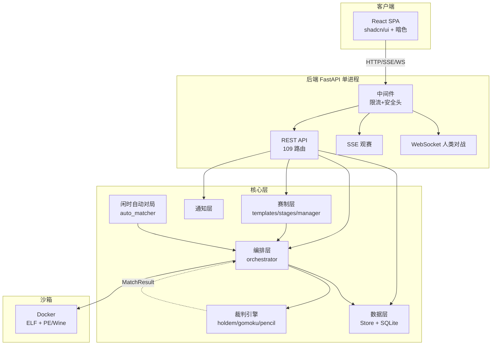
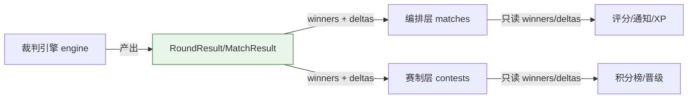

# 设计文档

> 本文档描述 botbattle 平台的系统架构、模块设计、数据库设计、接口设计与安全设计。

## 1. 系统架构

### 1.1 总体架构

平台采用**前后端分离 + 单进程**架构：后端 FastAPI 提供 REST/SSE/WebSocket 接口并托管前端构建产物，前端 React SPA 通过 HTTP 交互。

### 1.2 运行模型
- **单进程 uvicorn factory**（`main:create_app`），默认 `127.0.0.1:50380`。
- **lifespan** 启动后台 asyncio 闲时自动对局任务（AutoMatchScheduler）。
- **并发控制**：`asyncio.Semaphore(max_concurrent)` 限制 bot 对局槽；人类对战独立 `_human_sem`（默认 4）。
- **限流**：内存滑动窗口 IP 限流（单进程；多 worker 部署需换 Redis）。

## 2. 模块设计（12 层）

### 2.1 模块树与职责

| 层 | 模块 | 职责 |
|----|------|------|
| 接口 | `api_routes.py` | 主 REST（95 路由）：bots/matches/users/search/leaderboard/comments/likes/notifications/contests/admin/wiki/matchpacks |
| 接口 | `auth/routes.py` | 认证 REST（13 路由，prefix `/api/auth`）：注册/登录/验证/重置/profile/avatar |
| 接口 | `main.py` | 应用工厂 + 中间件装配 + StaticFiles 挂载（dist/wiki-assets/avatars）+ lifespan |
| 裁判 | `engine/` | 三游戏 Session（game.py/gomoku.py/pencil.py）+ 共享 result.py + registry.py 路由 + tiers.py 段位 + cards.py |
| 协议 | `protocol/` | 行协议编解码：json_protocol.py（holdem 紧凑 JSON）+ board_protocol.py（棋类） |
| 编排 | `matches/` | orchestrator（入队/SSE/评分/人类对战）+ runner（起 Bot 进程,按 game_id 路由协议）+ auto_matcher（闲时自动） |
| 赛制 | `contests/` | templates（7 内置模板）+ stages（对阵生成）+ manager（阶段状态机）+ validation |
| 沙箱 | `runtime/` | BinaryRunner（docker/wine/local 三模式）+ limits（资源硬顶） |
| 数据 | `store/` | Store 类（SQLite，100+ 方法，含 _migrate 自愈）+ schema.py（常量唯一来源） |
| 认证 | `auth/` | routes + auth_manager + captcha + dependencies（require_user/admin/organizer） |
| 通知 | `notifications/` | NotificationManager（站内通知 + 按 prefs 复用 Mailer 发邮件） |
| 支撑 | `bots/ rating/ mail/ security.py logging_config.py crypto.py cli.py` | Bot 上传分类 / Glicko-2 / SMTP / 安全头+限流 / 日志 / 密码 hash / CLI |

### 2.2 核心解耦契约

**`engine/result.py` 的 `RoundResult`/`MatchResult`** 是核心解耦点：
- `RoundResult`：`winners`(座位号列表，空=平局) + `deltas`(长 2 零和数组)。
- `MatchResult`：`rounds_played` + `rounds` + `events` + `winner`。

**编排层与赛制层只依赖这两个字段，绝不触碰扑克的 pot/board/holes 或棋类的棋盘**——这是赛制代码能通用于三款游戏的根本。

### 2.3 新增一款游戏的成本

赛制/编排层**零改动**，仅需：
1. 实现一个 `XxxSession.run_async(decide) → MatchResult`。
2. 实现一套协议（`_dumps`/`_loads`/`_fail_response`，在 runner.py 按 game_id 分流）。
3. 在 `registry.run_session` 加分支 + `schema.REGISTERED_ENGINES` / `VALID_GAME_IDS` 各加一项。

## 3. 数据库设计

SQLite 单文件（默认 `botzone.db`），**25 张表**，约 23 个索引。所有常量（状态码/类型/段位阈值/配置键名）集中在 `store/schema.py`。

### 3.1 核心表（选录）

| 表 | 用途 | 关键列 |
|----|------|--------|
| `users` | 用户 | id/username/email/password_hash/role/display_name/bio/avatar/xp/level/last_active_at |
| `bots` | Bot | owner_id/name/display_name/game_id/os/arch/format/binary_path/current_version/is_public/is_active |
| `matches` | 对局 | id/bot_a_id/bot_b_id/match_type(challenge/table/contest/ladder/human)/status/game_id/winner/n_dots/human_user_id/likes_count/views_count |
| `ratings` | 评分 | bot_id/rating(1500)/rd(350)/vol/wins/losses/draws/last_played_at |
| `contests` | 赛事 | title/organizer_id/status(draft/open/running/rest/finished/cancelled)/game_id/stages_json/current_stage_idx |
| `contest_pairings` | 对阵 | contest_id/round_num/bot_a_id/bot_b_id/match_id/stage_idx/bracket_slot/match_winner |
| `contest_stage_results` | 积分 | contest_id/stage_idx/bot_id/points/wins/draws/losses/rank_in_group |

### 3.2 社交/互动表

| 表 | 用途 |
|----|------|
| `rating_history` | 评分变化时序（段位趋势曲线，每 bot 截断保留） |
| `follows` | 关注关系（follower_id, followee_id） |
| `favorites` | 收藏 Bot（user_id, bot_id） |
| `comments` | 评论（target_type=match/bot, target_id, user_id, body） |
| `likes` | 点赞（user_id, target_type, target_id） |
| `notifications` | 通知（user_id, type, title, body, link, is_read） |
| `notification_prefs` | 通知邮件偏好（email_match_done/email_followed/email_contest/email_comment） |

### 3.3 支撑表（选录）

| 表 | 用途 |
|----|------|
| `bot_versions` | Bot 版本管理（多版本 + 切换激活） |
| `match_replays` | 对局回放事件存储（events_json） |
| `sessions` | 会话（token, user_id, expires_at，认证核心） |
| `platform_settings` | 所有热配置 KV（运行时/站点/裁判/auto-match） |
| `contest_entries` | 赛事报名（user_id, bot_id, group_id, seed） |
| `pair_stats` | 对手战绩统计（a_wins/a_losses/draws） |

### 3.4 迁移机制
`Store._migrate()` 在每次建连时自愈：为旧库补新增列（game_id/xp/level/bio/avatar/likes_count 等），必要时重建表放宽 CHECK 约束（纳入 rest/ladder/human 等新状态）。**向后兼容，不破坏现有数据**。

## 4. 接口设计

**共 109 个路由装饰器**：api_routes.py 95（含 1 WebSocket + 1 SSE）+ auth/routes.py 13 + main.py 1 健康端点。按权限分四类：

### 4.1 公开端点（无需登录，访客可用）
- 健康：`GET /api/health`
- Bot 浏览：`GET /api/bots/public`、`/api/bots/{id}`、`/profile`、`/matches`、`/opponents`、`/rating-history`
- 用户浏览：`GET /api/users`、`/api/users/{name}/profile`、`/bots`、`/followers`、`/following`
- 对局浏览：`GET /api/matches`、`/matches/liked-top`、`/matches/{id}`
- 排行与元数据：`GET /api/leaderboard`、`/api/tiers`、`/api/levels/info`、`/api/site/info`
- 搜索：`GET /api/search`
- 赛事浏览：`GET /api/contests`、`/api/contests/{id}`、`/bracket`、`/templates`
- Wiki：`GET /api/wiki`
- 数据集列表：`GET /api/matchpacks`

### 4.2 鉴权端点（require_user，登录玩家）
- Bot 管理：`POST /api/bots`（上传）、`/versions`、`/active`、`PATCH/DELETE /api/bots/{id}`
- 对局：`POST /api/matches/challenge`、`/api/matches/human`
- 社交：`POST/DELETE /api/users/{id}/follow`、`/api/bots/{id}/favorite`
- 互动：`POST/DELETE /api/comments`、`/api/likes`、`POST /api/matches/{id}/view`
- 通知：`GET /api/notifications`、`POST /read`、`/read-all`、`GET/PUT /api/notification-prefs`
- 赛事：`POST /api/contests/{id}/register`
- 数据下载：`GET /api/matchpacks/download`（level ≥1 gating）
- 认证：`GET /api/auth/me`、`POST /logout`、`/change-password`、`PUT /profile`、`POST /avatar`

### 4.3 组织者端点（require_organizer 或 admin）
- `POST /api/contests`（创建赛事）
- `POST /api/contests/{id}/{open,start,resume,advance}`（赛事推进，require_organizer）
- 注：`register`/`dispatch` 为 require_user（报名/换 Bot 由登录用户发起）

### 4.4 管理员端点（require_admin）
- 用户管理：`GET /api/admin/users`、`POST /role`、`PATCH/DELETE /api/admin/users/{id}`、`/sessions`
- Bot/对局/赛事管理：`GET /api/admin/{bots,matches,contests}`、`PATCH/DELETE`、`GET /api/admin/contests/{id}/entries`
- 配置：`GET /api/admin/settings/runtime`、`PATCH /api/admin/settings/{runtime,site}`
- 裁判：`GET /api/admin/judges`、`PATCH /api/admin/judges/params`
- 模板：`GET/POST /api/admin/templates`、`PUT/DELETE /{tid}`、`POST /preview`
- 邮件：`GET /api/admin/email/{templates,outbox}`、`PUT /templates/{key}`
- 日志：`GET /api/admin/logs`
- 认证辅助：`POST /api/auth/admin/create-reset-token`（生成密码重置 token）

### 4.5 实时端点
- **SSE** `GET /api/matches/{id}/events`：观赛事件流（先推 snapshot 再增量）。
- **WebSocket** `WS /api/matches/{id}/play`：人类对战落子回传（接收 `{move}`）。

## 5. 前端架构

### 5.1 技术栈与设计系统
- React 19 + Vite 8 + Tailwind CSS v4（CSS-first）+ shadcn/ui（new-york）+ Radix UI + lucide-react（图标，无 emoji）+ recharts（图表）+ next-themes（暗色）。
- **设计 token**：shadcn v4 OKLCH 双主题（`:root` 浅 / `.dark` 暗），emerald 品牌色系，`@theme inline` 桥接到 Tailwind utility。**刻意无紫色无米色**（规避 AI 默认审美）。
- **暗色模式**：next-themes class 策略，浅色默认 + 跟随系统，顶栏一键切换。
- **响应式**：sm/md/lg/xl 断点；移动端 Sheet 汉堡抽屉；表格窄屏隐藏次要列。
- **代码分割**：React.lazy + Suspense，22 个顶层路由各自独立 chunk；主包 gzip ~115KB，recharts 隔离到 BotDetail chunk。
- **路径别名 `@/` → src/**，禁相对路径。

### 5.2 组件库与页面
- **26 个 shadcn 共享原语**（`src/components/ui/`）：Button/Input/Card/Table/Tabs/Badge/Dialog/Command/Chart/Sheet/Slider 等，是全项目唯一组件抽象层。
- **项目封装**：status.tsx（EmptyState/Loading/ErrorMsg/StatusBadge）、metric-card.tsx、tier-badge.tsx。
- **全局 Shell**：app-shell.tsx（顶栏 + lucide 图标导航 + Cmd+K 全局搜索 + 主题切换）+ nav-config.ts。
- **页面**：21 个独立页面 + admin/ 10 Tab，覆盖首页/排行榜/Bot 详情/用户主页/搜索/通知/设置/赛事/对局回放/人类对战/数据下载/账号 等。
- **三棋盘可视化**：poker（PokerTable 深绿毡面）/ gomoku（GomokuBoard 木色）/ pencil（PencilBoard），统一经 MatchBoard 分发。

## 6. 安全设计

| 威胁 | 防护措施 |
|------|---------|
| **恶意 Bot** | Docker 硬隔离：`--network=none --memory=512m --cpus=1 --read-only --tmpfs /tmp --cap-drop=ALL --security-opt no-new-privileges --user 65534:65534`；资源硬顶（admin 不可抬高） |
| **接口滥用** | 分级 IP 限流（auth 20/60s、challenge 8/60s、upload 6/60s、captcha 60/60s、其他 120/60s），`BZ_RATE_LIMIT` 可关 |
| **暴力破解** | 图形验证码（注册/登录）；登录失败不区分用户名/密码错误 |
| **密码泄露** | 密码 hash 存储（非明文）；重置链接防枚举 |
| **XSS / 点击劫持** | 安全头：X-Content-Type-Options / X-Frame-Options:DENY / Referrer-Policy / Permissions-Policy（可选 HSTS） |
| **会话劫持** | session token，cookie `bz_session`，改密码清会话 |

> 返回 [doc/INDEX.md](./INDEX.md)
