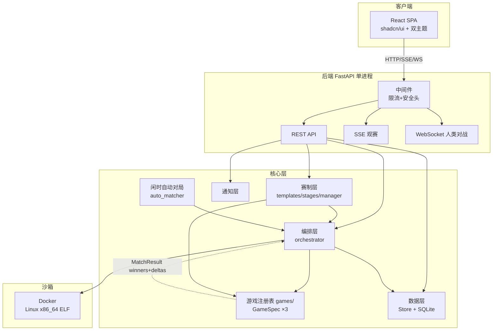
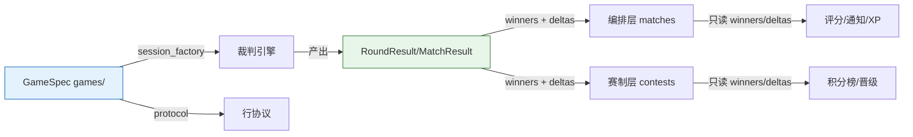

# 设计文档

> 本文档描述 botbattle 平台的系统架构、模块设计、数据库设计、接口设计与安全设计。

## 1. 系统架构

### 1.1 总体架构

平台采用**前后端分离 + 单进程**架构：后端 FastAPI 提供 REST/SSE/WebSocket 接口并托管前端构建产物，前端 React SPA 通过 HTTP 交互。

### 1.2 运行模型
- **单进程 uvicorn factory**（`main:create_app`），默认 `127.0.0.1:50380`。
- **lifespan** 启动顺序：① `recover_orphan_matches`（把上一进程遗留的 `running` 与非赛事 `pending` 对局标为 `aborted`；活跃赛事 pending 留给精确对账）→ ② `recover_unsettled_match_ratings`（按 `match_rating_settlements` 补算 completed、非赛事、非 Human 的未结算评分；启动恢复与运行时后处理共用全局异步结算锁，严格按 `(created_at,id)` 补齐早场后才允许后场结算，任一早场失败即阻断后续；marker 与双方 ratings/history/pair_stats 同事务，重复启动无副作用，不重复通知/XP）→ ③ `contest_manager.reconcile_running_contests`（覆盖 `published/running/rest` 及 `finished + official_results_ready=0`：清理未绑定 prepared match、复位死 pairing、恢复未启动的残缺 published 批次、按排期重派并调用 `maybe_finish` 收敛；终态缺榜时幂等补算完整正式榜）→ ④ 启动 `ContestScheduler` 与 `AutoMatchScheduler`。停服时先取消并等待两个调度任务，再调用 `MatchOrchestrator.shutdown()` 取消并收敛所属对局任务；子进程清理发生在仍存活的事件循环内，避免 uvicorn 退出卡在 asyncio subprocess pipe 建连窗口。
- **并发控制**：bot 对局统一经 orchestrator 的全局 admission 占位后才可创建/启动，执行层再由 `asyncio.Semaphore(max_concurrent)` 限制；已接纳但尚未开始的赛事/挑战同样消耗可用槽。`AutoMatchScheduler` 只读取 `available_bot_slots()` 再扣用户预留槽，不能仅看 `_bot_running` 后继续堆积任务。人类对战使用独立 `_human_sem`。
- **限流**：内存滑动窗口 IP 限流（单进程；多 worker 部署需换 Redis）。

## 2. 模块设计（12 层）

### 2.1 模块树与职责

| 层 | 模块 | 职责 |
|----|------|------|
| 接口 | `api_routes.py` | 主 REST（含 SSE/WS）：bots/matches/users/search/leaderboard/comments/likes/notifications/contests/admin/wiki |
| 接口 | `auth/routes.py` | 认证 REST（13 路由，prefix `/api/auth`）：注册/登录/验证/重置/profile/avatar |
| 接口 | `main.py` | 应用工厂 + 中间件装配 + StaticFiles 挂载（dist/wiki-assets/avatars）+ lifespan |
| 游戏注册 | `games/` | **赛制/编排契约解耦入口（裁判/协议分离）**：base.py（GameSpec / GameRegistry）+ 共享 Traditional / LongRunning 信封实现 + `_board_protocol.py`（棋类共享 payload 工具）+ 各 `games/<game>/` 子包。`<game>_judge.py` 是 0 平台依赖的纯规则；engine 是平台适配层；protocol 的 `validate_response_payload` 只校验 response 值，游戏内合法性仍归裁判。赛制/编排主流程经 registry/spec 调用，不按游戏名分支；这不表示整个前后端对新增游戏零接入工作。 |
| 编排 | `matches/` | orchestrator（入队/SSE/评分/人类对战；赛事两阶段创建；先持久化终态结果，再单次广播权威 `match_end {winner,reason,deltas}`；崩溃与启动失败按明确技术结果处理；Bot 协议错误/超时分别为 `completed + protocol_error/timeout + technical_loss`，Bot-vs-Bot 计分、人机局不评分；平台故障 `aborted + platform_error`）+ runner（按 runtime_mode 传 Traditional 完整历史或 LongRunning 增量请求；顶层响应必须包含 `response`，额外顶层字段在解析边界丢弃；LongRunning 严格握手且不回退；首个故障写有界 `technical_incident` 后终止；Bot-vs-Bot 与人类对战双方统一消费累计棋钟）+ `result_contract`（所有持久化完成结果的唯一 builder）+ auto_matcher（闲时自动；每日上限按 Asia/Shanghai 自然日读取 DB claim） |
| 赛制 | `contests/` | templates/stages/manager/scheduler/ranking/validation。状态机 `draft→open→published→running→rest→finished`；已填写时间统一满足 `registration_opens_at <= registration_closes_at <= starts_at`，`starts_at=NULL` 是发布后等待手动开始的明确闸门；手动推进按实际时刻盖戳；终态不可互转；报名、派发、完整阶段/轮次、正式榜均以锁和事务守护，aborted 无裁决对局不积分/不晋级。 |
| 沙箱/运行配置 | `runtime/` | `config.py` 是运行参数的不可变代码唯一来源；Linux x86_64 ELF BinaryRunner（docker/local）+ limits（资源硬顶）。其他可执行格式在上传时拒绝。Docker 镜像检查/拉取是独立平台准备阶段，在上传首响应与游戏累计棋钟开始前完成；容器固定 `--pull=never --entrypoint /app/bot`，禁止计时中隐式拉镜像或继承自定义入口 |
| 数据 | `store/` | Store 类（SQLite，100+ 方法，含 _migrate 自愈；赛事时间候选在 create/update 安全写入口统一校验；系统 auto-match 在取得 `BEGIN IMMEDIATE` 写锁后才计算 Asia/Shanghai 日期，并把 match/index/每日 claim 原子创建，跨日界/重启/多实例仍不超代码 cap；`set_settings` 批量配置单事务提交）+ schema.py（常量唯一来源） |
| 认证 | `auth/` | routes + auth_manager + captcha + dependencies（require_user/admin/organizer） |
| 通知 | `notifications/` | NotificationManager（站内通知 + 按 prefs 复用 Mailer 发邮件） |
| 支撑 | `bots/ rating/ mail/ security.py logging_config.py crypto.py cli.py` | Bot 上传分类 / Glicko-2 / SMTP / 安全头+限流 / 日志 / 密码 hash / CLI |

邮件层以 `Botbattle` 为默认发件人名称，邮箱验证、密码重置和欢迎信共享同一多游戏品牌口径；
欢迎信明确覆盖德州扑克、五子棋与点格棋，且只在邮箱验证完成后发送。三条官方模板仅在 key
缺失时播种，管理后台保存的模板属于持久化配置，服务重启不得静默覆盖。

### 2.2 核心解耦契约

**两层解耦**：

1. **GameSpec 注册表（`games/`，契约入口）**：每款游戏声明 `game_id`/`label`/`session_factory`/`protocol`（含 `validate_response_payload`）/配置校验/`normalize_delta`/`progress_from_events`/ETA/段位/模板/源码元信息/预检/多 leg 计划/累计棋钟等，所有字段均有生产消费者；`normalize_delta` 把座位 0 原始分差换成本游戏单位，`progress_from_events` 在技术终局无引擎结果时统计已完成轮数。`rounds_per_match`、`num_seats` 与 judge 参数描述等无消费者元数据已删除。游戏规则直接由每游戏代码常量定义，不存在 admin 裁判参数或对局级规则覆盖。`run_session` 只接受内部复现参数（Holdem 的 `rng`/`deal_sequence`，棋类的 `rng`），其他键立即报错。通用赛制与编排路径经 `registry.get(game_id)` 取 spec，禁止增加游戏名分支；已存实体缺失/未知 `game_id` 必须失败，产品默认仅在创建边界明确赋值。

   **传输唯一性**：上传预检与正式首回合共用 runner 的信封构造、响应解析和所选 runtime_mode；Holdem 两条路径的首请求都声明固定 `max_hand=70`。Traditional 每次完整历史；LongRunning 首回合完整历史、精确握手后才允许单 request。响应对象必须包含 `response`；平台只提交该字段，忽略 `debug` 等额外顶层字段。顶层整数、裸坐标、缺少 `response` 的 `{a}` 及缺失/错误握手仍直接拒绝；游戏 payload 的类型与形状继续由各 GameSpec 严格校验。

2. **结果契约**：裁判鸭子类型（各游戏 `RoundResult`/`MatchResult` 独立定义）产出 `winners`、零和 `deltas`、`rounds_played`、`rounds`、`events` 与 `winner`；赛制代码不读取扑克 pot/board/holes。平台持久化与 REST 的公共结果只有 `rounds_played`、`deltas`、`normalized_delta`，统一由 `matches/result_contract.py` 校验和构造；正常完成、零轮技术判负、人机和赛事 Bot 缺失都走同一 builder。复式可追加 `legs`，但公共轮数必须累加所有 leg（Holdem 两条 70 手为 140）。Holdem 的 `normalized_delta` 仅是整场筹码分差换算成大盲注，并非每 100 手指标。Holdem 权威胜者是 `result.winner`（按累计 `final_chips`），原始 engine `match_end.winner=null` 不得覆盖它。`tests/test_result_contract.py` 与 runtime/迁移回归覆盖此约束。

   **实时终态屏障**：游戏 engine 的 `match_end` / `error` 发生在 `run_binaries` / `run_bot_vs_human` 返回或抛错之前，只是编排器内部信号，不是第二套公开事件。运行中的 SSE/WS 不广播它们，运行中 replay snapshot 也不持久化它们；复式赛每个 leg 的 engine `match_end` 同样保持内部，逐 leg 结果只落 `result.legs`。编排器先提交 match 的终态，再移除全部 engine 终态并向公开 replay 追加唯一终局，最后广播同一对象。正常完成唯一使用 `match_end {winner, reason, deltas}`，原因只允许 `schema.PUBLIC_MATCH_COMPLETED_REASONS`；中止唯一使用 `error {reason}`，原因只允许 `schema.PUBLIC_MATCH_ERROR_REASONS`。两者都不含自由文本、路径或异常详情，未知完成原因归一为 `completed`，未知中止原因归一为 `platform_error`，诊断详情只进日志。故 replay/live 的终态数量与 schema 完全一致；SSE/WS 收到它后关闭，此时同一时刻的 `GET /api/matches/{id}` 已返回终态。管理员只能请求中止，后端固定写 `admin_aborted`，客户端不能注入自由原因。

   **事件投影与真人可见性**：所有非终态事件也必须经过 `store.public_contract` 的事件类型与字段白名单；未知诊断事件整条丢弃，已知事件附加的 `message/path/stderr/debug` 不进入 REST/SSE/WS。运行中对局由 orchestrator 保存一份追加式内存事件前缀，SSE 重连 snapshot 从该前缀生成，不能退回到每 5 条节流落库的旧画面；内存前缀与持久化 replay 共用 `sanitize_public_event_prefix`，因此字段白名单、技术故障样本上限与真人可见性不会形成两套实现。活跃真人德扑的公开详情与 SSE 隐藏双方底牌并移除决策请求；本人鉴权 `/play` WebSocket 只获得自己座位的底牌和请求，对局结束后才公开完整回放。终态 match 行一旦提交，即使 runner 尚未释放内存前缀，snapshot 也必须改从 Store 合成唯一权威终局。订阅先完整构造快照与可见性元数据，成功后才注册队列；构造失败不留孤儿订阅，元数据缺失时必须 fail-closed 隐藏底牌和决策请求。管理员中止一旦提交 aborted，即使 replay 瞬时读取失败也保留既有历史，并保证完成 SSE 与赛事回调 handoff。

3. **对局配置/结果双 JSON 通路（matches 表收敛）**：对局结果详情走 `result` JSON 列（`{"rounds_played":N,"deltas":[ea,eb],"normalized_delta":float}`）；`match_config` JSON 列只承载版本快照、duplicate 等内部编排键。**全部游戏规则已钉死代码常量**：Holdem=70 手/20000 筹码/50-100 盲注，Gomoku=15×15，Pencil=N=6/每方 900 秒。规则不走 match_config、platform_settings 或 runner 参数；`session_factory` 直接使用模块常量构造 Session。普通挑战、天梯和人类对局即使未显式选择版本，也会在创建时把各实际 Bot 的当前激活 `bot_versions.id` 冻结进 `_bot_a/b_version_id`；排队期间上传或回滚不改变 runner 路径/runtime_mode。冻结 ID 是权威引用：版本行缺失、跨 Bot、路径为空、元数据/运行模式不符合现行契约，或版本记录中的非空 SHA-256/正 `size_bytes` 与磁盘文件不一致时，统一抛出 `version_unavailable`。同一完整性校验在挑战/人机建局和赛事 pairing 快照写入前执行，已知损坏不产生 match/task；即使是 checksum/size 尚未落库的旧版本，也必须先确认文件存在且为普通文件。对局排队后文件再变化时，运行边界复核会把已有对局以无胜者 `aborted` 收敛，runner、评分和技术判负流程均不执行。完整性缓存的 key 含 device/inode/size/mtime/ctime，文件变化（包括同尺寸覆盖后恢复 mtime）会强制重算 SHA-256。赛事运行时失效仍触发统一完成回调，将 pairing 安全复位并退避等待人工修复。仅当 Bot 的 `current_version=0` 且完全没有版本行时，才视为真正的 pre-version legacy Bot，且 `bots` 镜像通过同一 Linux x86_64 ELF/runtime 校验后方可执行；checksum/size 尚未落库的旧版本不会仅因字段为空而被阻断。赛事排名经 `store.db.match_deltas(m)` 从 `result.deltas` 取原始分差。`test_pinned_game_config.py` 守护所有规则入口不可覆盖。

   Holdem 的 `hand_start.chips` 是扣除盲注后的余额，前端据固定 20000 筹码恢复本街下注与初始底池；`action.amount` 对 raise/all-in 统一表示本街累计投入（raise-to），避免把剩余筹码误当累计下注。

4. **累计棋钟契约**：Pencil 在 spec 中固定 `time_budget_per_side=900.0`，Holdem/Gomoku 为 `None`。orchestrator 对 Bot-vs-Bot 和人类对局都把该值传给 runner；runner 分座位累计 Bot subprocess 或人类 Future 的决策耗时，每次成功决策发 `time_used {seat,used,remaining,budget}`，耗尽时发 `time_out {seat,used,budget}`。Bot 耗尽转为 `BotDecisionTimeoutError` 统一技术判负；人类 Future 耗尽仍交裁判判负，不会伪装成 Bot 故障。事件随 SSE/回放持久化，Pencil reducer 用首条事件的 `budget` 初始化未行动方，MatchViewer 玩家卡显示双方剩余时间和超时徽章。人类 `/play` 页仍显示 `human_action_timeout` 默认 120s 的逐回合倒计时；后端同时累计 900s 总棋钟，两层限制中较早触发者生效。

**DRY 边界**：游戏规则（engine/result/tiers 数据/templates）各游戏独立；平台工具（`_board_protocol.py` 行协议序列化、`base.tier_for_in` 段位查表算法）共享——避免字节级重复的维护隐患。Gomoku/Pencil 的 `protocol.py` 只导出本游戏 builder；共享 `_board_protocol.py` 通过 `GameSpec.shared_source_files` 随两款游戏的公开源码返回，公开入口不存在不可见的 import shim。

### 2.3 新增一款游戏的成本

赛制/编排主流程不增加游戏名分支，但仍需完成以下接入：
1. 建 `games/<game>/` 子包：`<game>_judge.py`（纯规则、零平台依赖）+ `engine.py`（裁判与平台协议的适配层，可依赖 runtime 的统一故障类型）+ `protocol.py`（只导出本游戏行协议 API）+ `result.py`（独立结果，满足鸭子契约）+ `tiers.py`（段位曲线，调 `base.tier_for_in`）+ `templates.py`（赛事模板）+ `spec.py`（装配 GameSpec，明确 `time_budget_per_side`）。`GameSpec.source_files` 默认公开前四个文件；显式覆写时仍必须包含 `<game>_judge.py`。统一 Botzone 信封可引用 schema 的运行模式常量；若协议调用 games 包共享实现，必须通过 `shared_source_files` 一并公开。零平台依赖保证只适用于权威纯裁判，不扩张到整个游戏适配包。
2. `schema.py` 的 `REGISTERED_ENGINES`/`VALID_GAME_IDS` 各加该项；`Store._migrate()` 根据注册 ID 用模板自动创建同构 `matches_<game>` 表与索引。
3. `games/__init__.py`：`registry.register(SPEC)` 一行（启动断言 schema 与注册表一致）。
4. 前端 `src/games/<game>/`：`index.ts`（GameViewSpec）+ `canvas.ts`（CanvasRenderer）+ `reducer.ts`（事件归约，对标后端 engine.py，自包含不依赖 components/）+ `src/games/index.ts` 注册一行。`RawEvent` 公共类型在 `src/games/base.ts`（对标后端 `_board_protocol.py`）。
5. **约束**：`games/<game>/` 不得反向 import 已删的 `engine`/`_compat`/`protocol` shim 或通用层（matches/contests/store/api_routes）——`test_import_cycles.py` 源码扫描守护（forbidden 含已删 shim 作"防回退"哨兵 + 通用层全列）。通用层不得 import 具体游戏模块（经注册表）。
6. **验证**：运行完整 `pytest`（至少覆盖 registry/result/import/通用层无游戏分支、预检与 runner 行为）+ `npm run build` + Playwright。若 `time_budget_per_side` 为正数，还须覆盖 Bot-vs-Bot 与人类双方累计/耗尽事件，并让前端 reducer 与 UI 回归验证 `time_used/time_out`；不需要累计棋钟时显式使用 `None`。

**不再需要**在 `registry.run_session`/`runner._dumps`/`_loads`/`_fail_response`/orchestrator 加 `if game_id==` 分支；这些调用点已收敛到注册表契约。

## 3. 数据库设计

SQLite 单文件（默认 `botzone.db`），当前全新初始化为 **31 张表**、**38** 个具名索引；per-game 表与索引由 `_migrate` 按注册表模板补齐。状态码、类型、`REGISTERED_ENGINES` 与历史配置键名集中在 `store/schema.py`，生产运行参数及时区集中在 `runtime/config.py`。

### 3.1 核心表（选录）

| 表 | 用途 | 关键列 |
|----|------|--------|
| `users` | 用户 | id/username/email/password_hash/role/display_name/bio/avatar/xp/level/last_active_at + **实名信息**（real_name/phone/school/student_id，可选，不公开） |
| `bots` | Bot | owner_id/name/display_name/game_id/os/arch/format/binary_path/current_version/is_active |
| `matches_holdem` / `matches_gomoku` / `matches_pencil` | 对局（**每游戏一张表**） | id/bot_a_id/bot_b_id/owner_id/contest_id/winner/reason/match_type/status/game_id/**`match_config`(JSON 配置)**/**`result`(JSON 结果)**/human_user_id/human_seat/match_seed/technical_loss/likes_count/views_count；三表结构一致，配置/结果走游戏无关的双 JSON 列，不保留游戏专属结果列 |
| `matches_index` | 对局定位 | id(PK)/game_id——get_match(id) 先查此表定位到哪张 matches_<game> |
| `ratings` | 评分（**per-game**，PK=bot_id+game_id） | bot_id/game_id/rating(1500)/rd(350)/vol/wins/losses/draws/delta_total/matches_played/last_played_at |
| `contests` | 赛事 | title/organizer_id/status(draft/open/published/running/rest/finished/cancelled)/game_id/stages_json/current_stage_idx/registration_opens_at/closes_at/starts_at/rest_ends_at；fresh schema 不含 `hands_per_match`/`match_config_json`，旧库同名列仅忽略不返回 |
| `contest_pairings` | 对阵 | contest_id/round_num/bot_a_id/bot_b_id/match_id（逻辑外键、非空时全局唯一，无 DB FK）/stage_idx/bracket_slot/status；状态逐场跟随绑定 Match 终态 |
| `contest_stage_results` | 积分 | contest_id/stage_idx/entry_id/bot_id/points/wins/draws/losses/delta_total/rank_in_group |

所有 fresh schema 的实体 `game_id` 均为 `NOT NULL` 且无数据库默认值；产品入口需要默认游戏时由创建函数显式选择，运行时和持久化读取不得把缺失/未知值猜成 Holdem。

### 3.2 社交/互动表

| 表 | 用途 |
|----|------|
| `rating_history` | 评分变化时序（**per-game**，bot_id+game_id；段位趋势曲线，每 bot×game 截断保留） |
| `follows` | 关注关系（follower_id, followee_id）；写入/删除在同一 `BEGIN IMMEDIATE` 事务内复核 actor 与 target，竞态删除统一 404 |
| `favorites` | 收藏 Bot（user_id, bot_id）；写入/删除在同一 `BEGIN IMMEDIATE` 事务内复核用户与 Bot，竞态删除统一 404 |
| `comments` | 评论（target_type=match/bot, target_id, user_id, body）；`BEGIN IMMEDIATE` 后同时验证 actor 与多态 target，删目标级联清理 |
| `likes` | 点赞（user_id, target_type=match/bot/comment, target_id）；点赞/取消点赞均在 `BEGIN IMMEDIATE` 后验证 actor 与多态 target，删目标/评论级联清理并同步缓存 |
| `notifications` | 通知（user_id, type, title, body, link, is_read） |
| `notification_prefs` | 通知邮件偏好（email_match_done/email_followed/email_contest/email_comment）；DB 保持 0/1，公开 GET/PUT 请求与响应只使用 boolean |

### 3.3 支撑表（选录）

| 表 | 用途 |
|----|------|
| `bot_versions` | Bot 版本管理（多版本 + 切换激活 + runtime_mode per-version；单进程 per-Bot 锁覆盖版本号分配、隐藏临时文件严格预检、原子替换与 DB 写入；预检按所选模式复用正式首回合信封/响应/握手规则，只有成功才发布/激活新版本，故障时旧版本始终未改；新 Bot 预检期间为 inactive。上传管理与专用 BinaryRunner 在 worker thread 执行，不阻塞 REST/SSE/WS 事件循环；赛事快照读取当前激活版，历史 `MAX(version)` 仅用于分配下一个版本号。旧库中的 PE 等历史版本仅向 owner/admin 返回 `runnable=false` 供审计，公开对手/搜索/报名候选会过滤，owner 与 admin 均不能重新激活） |
| `match_replays` | 对局回放事件存储（events_json） |
| `sessions` | 会话（token, user_id, expires_at，认证核心） |
| `platform_settings` | 站点文案等仍允许网页维护的 KV；历史 runtime/auto-match/模板键可保留，但运行路径不读取也不回写 |
| `contest_templates` | 历史只读表；不再 seed/对账，现行模板只从 `games/<game>/templates.py` 经注册表聚合 |
| `contest_entries` | 赛事报名（user_id, bot_id SET NULL, group_id, seed）—— **P0：排名/积分键为 entry.id（换 Bot 不丢分）**；bot FK = SET NULL（删 Bot 留报名） |
| `contest_pairings` | 赛事对阵（entry_a_id/entry_b_id 身份键 + bot_a_id/bot_b_id SET NULL）—— P0：pairing 快照 entry 身份 |
| `contest_stage_results` | 阶段成绩（entry_id 唯一键 + bot_id SET NULL + 原始分差累计 `delta_total`）——唯一键 (contest_id, stage_idx, entry_id) |
| `pair_stats` | 对手战绩统计（a_wins/a_losses/draws/samples）；`samples` 的权威值恒等于胜+负+平 |

### 3.4 迁移机制
`Store._migrate()` 在每次建连时自愈：为旧库补新增列（game_id/xp/level/bio/avatar/likes_count 等），必要时重建表放宽 CHECK 约束（纳入 rest/ladder/human 等新状态）。**向后兼容，不破坏现有数据**（除对局数据——见下）。
迁移还会删除多态社交表中已失去用户或目标的孤儿行、按真实 likes 重算每场对局的
`likes_count` 缓存，并把历史 `pair_stats.samples` 修正为胜负平之和。新建
pending/running 对局的 `reason` 固定为空；迁移清空活跃旧行的任何非空 reason，并把
aborted 的自由文本/旧管理员码归一到稳定原因码，避免运行中页面预称“正常结束”或公开内部异常。

**本次主库数据影响不是零**：2026-08-09 首次只读审计显示该修复会更新 147 条
`pair_stats`，`samples` 合计从 0 回填为 918；线上继续产生对局后，23:39 再次只读复核为
152 条、合计 0→933。发布前必须再次以主库只读查询复核并在 PR/发布记录写入最终数字，迁移
只更新 `samples != a_wins+a_losses+draws` 的行，不应宣称“无数据库影响”。

**matches 拆 per-game 表 + ratings 加 game_id 维度的迁移**：
- **对局数据不保留**（用户决策）：检测旧单表 `matches` → 先清 `contest_pairings.match_id`（置 NULL），再 DROP `matches`+`match_replays`；新三表（`matches_holdem/gomoku/pencil`）+ `matches_index` 由 SCHEMA `IF NOT EXISTS` 建。对局可后续跑种子脚本（`scripts/seed_test_accounts.py`）重建。
- **用户/Bot/赛事/评论/评分保留**：`ratings`/`rating_history` 加 `game_id` 列、PK 改 `(bot_id, game_id)`、按 `bots.game_id` 回填（CREATE new→INSERT SELECT JOIN bots→DROP→RENAME）。

**中性结果契约迁移**：三张 `matches_<game>.result` 在同一 Store 启动事务内收敛为三个公共字段，并由各 GameSpec 重新计算 `normalized_delta`；正式榜只替换破同分字段名，不重算既有 `rank`。`ratings` 与阶段成绩使用 `delta_total`，`pair_stats` 只保留胜负平/场次，`match_replays` 只保留事件 JSON。涉及删列的 SQLite 表均采用新表全量复制后换名；任一步失败时 schema 与 JSON 更新整体回滚。迁移测试覆盖新旧键冲突、新键优先、二次打开幂等、行数/PK/FK/UNIQUE/索引/正式名次不变与强制故障回滚。

**第 4 游戏扩展性**：`schema.py` 的字面 DDL 只覆盖 holdem/gomoku/pencil 三表；新增注册游戏（如 reversi）后 SCHEMA 不会自动建 `matches_<new>` 表。`_migrate()` 末尾对 `registry.all_ids()` 里**每个**已注册游戏幂等执行 `CREATE TABLE IF NOT EXISTS matches_<game>`（用 `_CREATE_MATCHES_TABLE_SQL` 模板）+ 6 条统一索引（bot_a_id/bot_b_id/owner_id/contest_id/status/created_at）。`Store.__init__` 在建库后断言"每个注册游戏的物理表都存在"——注册了但表没建出来的 drift 在启动即报（而非 create_match 时才崩 `no such table`）。跨游戏 `UNION ALL` 聚合的 WHERE 参数数 = 子查询数（= 已注册游戏数），不得硬编码 `* 3`（否则第 4 游戏触发 `Incorrect number of bindings`）。**结论：新增一款游戏的 DB 成本 = `schema.py` 两个 frozenset 各加 id（仅做启动一致性断言）+ `games/__init__.py` 注册；无需手写 DDL。**

## 4. 接口设计

API 按权限分为以下四类；具体路由数以目标提交的代码与自动化盘点为准，SPA 静态路由另计。

### 4.1 公开端点（无需登录，访客可用）
- 健康：`GET /api/health`
- **API 404 兜底**：`@app.api_route("/api/{rest:path}")`（main.py，catch-all 之前注册）——未匹配的 `/api/*` 一律 `raise HTTPException(404)` 返 JSON，**绝不走下方 SPA catch-all 返 HTML**（否则前端 `api.ts` 把 HTML 当返回值解析成静默错误数据）。非 `/api` 的未知路径仍走 SPA fallback 返 `index.html`。
- Bot 浏览：`GET /api/bots/public`、`/api/bots/{id}`、`/profile`、`/matches`、`/opponents`、`/rating-history`
- 用户浏览：`GET /api/users`、`/api/users/{name}/profile`、`/bots`、`/followers`、`/following`
- 对局浏览：`GET /api/matches`（`status` / `game_id` / `has_technical_incidents` 过滤；默认全状态）、`/matches/liked-top`、`/matches/{id}`。新写回放、实时 SSE 与历史公开回放的唯一故障事件名为 `technical_incident`；列表、详情只暴露 `technical_incident_count`、`technical_incidents_by_seat` 与最多 3 条脱敏 `technical_incident_samples`。历史库中的 `bot_decide_error` / `bot_technical_error` 仅在 Store 读取边界归一化，不形成第二套对外字段或新写入。中止终局唯一为 `error {reason}` 两字段；REST replay、SSE 与人类 WS 共用同一公共投影，任意 message/路径/未知码都不会越过边界
- 排行与元数据：`GET /api/leaderboard`、`/api/tiers`、`/api/levels/info`、`/api/site/info`。定级阈值唯一读取 `runtime/config.py`，tiers 返回 `placement_required`；排行榜与 Bot profile 返回 `is_placement/placement_required/placement_remaining`，并把已定级 Bot 排在定级 Bot 之前
- 搜索：`GET /api/search`
- 赛事浏览：`GET /api/contests`、`/api/contests/{id}`、`/bracket`、`/templates`
- Wiki：`GET /api/wiki`
- **裁判公开**：`GET /api/judges`（裁判列表）、`GET /api/judges/{game_id}/source`（裁判源码全文）——裁判是公开可审计的规则定义（区别于 Bot 私有黑盒），源码对全体玩家透明

### 4.2 鉴权端点（require_user，登录玩家）
- Bot 管理：`POST /api/bots`（上传）、`/versions`、`/active`、`PATCH/DELETE /api/bots/{id}`
- 对局：`POST /api/matches/challenge`（两座位各选 bot + 可选版本快照，**自博弈允许**——同 bot 同/不同版本）、`/api/matches/human`（公开契约固定 `human_seat=1`，即展示座位 2/白方）
- 社交：`POST/DELETE /api/users/{id}/follow`、`/api/bots/{id}/favorite`；API 预检用于友好提示，Store 的关注、收藏、评论、点赞与取消点赞仍在 `BEGIN IMMEDIATE` 写事务内复核 actor/target，竞态删除或不存在统一 404；删除实体使用同级写锁清理多态关系与缓存，避免检查后删除造成孤儿或 500
- 互动：`POST/DELETE /api/comments`、`/api/likes`、`POST /api/matches/{id}/view`；评论/点赞请求使用严格 target 枚举且必须引用当前存在的实体，通知排除行为发起者本人
- 通知：`GET /api/notifications`、`POST /read`、`/read-all`、`GET/PUT /api/notification-prefs`；偏好 REST 四字段唯一类型为 boolean，PUT 可只提交一个变化字段，SQLite 0/1 不穿透到前端
- 赛事：`POST /api/contests/{id}/register`
- 认证：`GET /api/auth/me`、`POST /logout`、`/change-password`、`PUT /profile`、`POST /avatar`

### 4.3 组织者端点（require_organizer 或 admin）
- `POST /api/contests`（创建赛事）
- `POST /api/contests/{id}/{open,start,resume,advance}`（赛事推进，require_organizer）
- 注：`register`/`dispatch` 为 require_user（报名/换 Bot 由登录用户发起）

### 4.4 管理员端点（require_admin）
- 用户管理：`GET /api/admin/users`、`POST /role`、`PATCH/DELETE /api/admin/users/{id}`、`/sessions`
- Bot/赛事管理：`GET /api/admin/{bots,contests}`、`PATCH/DELETE`、`GET /api/admin/contests/{id}/entries`；对局列表走公开 `GET /api/matches`，管理操作为 `PATCH/DELETE /api/admin/matches/{id}`
- **一致性闸门**：活跃对局的状态只能经 orchestrator 安全中止为 `aborted`，后台不能手工伪造 `pending/running/completed`；赛事 match 中止后保留 aborted 历史，原 pairing 原子复位 pending 供安全重派，无 winner 不得推进阶段。管理员赛事时间按状态收口：`draft` 可改开放/截止/开赛时间，`open` 只能改未来的截止/开赛时间，`published` 只能改开赛时间，其余状态只读；所有 PATCH 与旧值合并后整体验证，非法请求零部分写。`published` 改开赛时间时，只有尚未有任何 `match_id` 才可在同一事务中按发布时的轮次错峰规则重排当前阶段 pending pairing；显式 `starts_at:null` 同步清空逐场排期，一旦有对局绑定即拒绝整次修改。管理端排期表不为缺失字段生成当前时间等假默认值，空报名时间显式保存为 `NULL`；“按时间自动开赛”关闭时必须提交 `starts_at: null`，与未提交该字段（保留旧值）严格区分。删除用户/Bot/赛事前检查活跃对局与赛事引用，`published` 删除表示先取消尚未开打排期再删除，`running/rest`、`finished`、已有正式榜或仍有 active match 时拒绝删除。
- 配置：`GET /api/admin/settings/runtime` 仅返回 `source=code, mutable=false` 的只读诊断；站点文案仍由 `PATCH /api/admin/settings/site` 管理。不存在 runtime PATCH。
- 模板：只保留公开 `GET /api/contests/templates`，响应来自游戏注册表并标记 `source=code, mutable=false`；不存在 `/api/admin/templates*` CRUD/预览路由。
- 邮件：`GET /api/admin/email/{templates,outbox}`、`PUT /templates/{key}`
- 日志：`GET /api/admin/logs`
- 认证辅助：`POST /api/auth/admin/create-reset-token`（生成密码重置 token）

### 4.5 实时端点
- **SSE** `GET /api/matches/{id}/events`：观赛事件流（先推 snapshot 再增量）。snapshot 已是 `completed/aborted` 或收到 `match_end/error` 时由服务端结束生成器并退订；前端同步切换到终态回放且不重连。
- **WebSocket** `WS /api/matches/{id}/play`：人类对战落子回传。发送与接收为两个受控任务；终态 snapshot、`match_end` 或 `error` 会由服务端主动关闭连接，finally 取消另一侧任务并退订，不能依赖浏览器自觉 close。

## 5. 前端架构

### 5.1 技术栈与设计系统
- React 19 + Vite 8 + Tailwind CSS v4（CSS-first）+ shadcn/ui（new-york）+ Radix UI + lucide-react（图标，无 emoji）+ recharts（图表）+ next-themes（暗色）。
- **设计 token**：shadcn v4 OKLCH 双主题（`:root` 浅 / `.dark` 暗），emerald 品牌色系，`@theme inline` 桥接到 Tailwind utility。**刻意无紫色无米色**（规避 AI 默认审美）。
- **暗色模式**：next-themes class 策略，浅色默认 + 跟随系统，侧栏底部一键切换。
- **响应式**：sm/md/lg/xl 断点；**lg(1024)+ 桌面侧边栏，<lg 移动端顶栏 + Sheet 汉堡抽屉**；表格窄屏隐藏次要列。
- **代码分割**：React.lazy + Suspense，顶层业务路由各自独立 chunk；recharts 隔离到 BotDetail chunk。
- **路径别名 `@/` → src/**，禁相对路径。

### 5.2 组件库与页面
- **26 个 shadcn 共享原语**（`src/components/ui/`）：Button/Input/Card/Table/Tabs/Badge/Dialog/Command/Chart/Sheet/Slider 等，是全项目唯一组件抽象层。
- **项目封装**：status.tsx（EmptyState/Loading/ErrorMsg/StatusBadge）、metric-card.tsx、tier-badge.tsx、BrandMark.tsx（平台品牌标识）、AuthShell.tsx（登录/注册/重置/验证的居中壳：品牌头部 + 居中 Card，解决空旷）、use-playback.ts（仅导出 SPEEDS 速度档常量；MatchViewer 内联实现事件 buffer/数值 cursor/playing/speed/稳定 interval 节拍的回放与直播 DVR 逻辑；节拍只依赖播放态和速度，通过 ref 读取最新事件长度，持续高频 SSE 不会反复重置 timer 而饿死游标）。
- **段位请求缓存**：`lib/tiers.ts` 按 `game_id` 同时缓存已解析曲线与 in-flight Promise；排行榜同页数十个 `TierBadge` 与 React StrictMode effect 重放只发一次 `/api/tiers`。请求失败会清除 singleflight 但不伪造其他游戏曲线，下次进入可正常重试；成功后同一 SPA 再访直接命中已解析缓存。
- **全局 Shell**：app-shell.tsx 按登录态分两套 chrome：
  - **已登录**：**lg+ 桌面左侧边栏**（Logo + compact 搜索 + 垂直导航 + 底部用户区/主题/通知）；**<lg 移动端顶栏 + Sheet 抽屉**。
  - **访客（未登录）**：**全断点顶栏**（BrandMark + 公开导航 + 主题切换 + **登录/注册**；窄屏用 Sheet 抽屉放导航与 CTA）。侧栏仅登录后出现，避免访客桌面无入口。
  - **auth 页**（登录/注册/重置/验证）：不显示侧栏，内容占满居中；顶栏保留精简条（品牌 + 主题 + 登录/注册）。
  - nav-config.ts（**7** 项主导航 + 条件显示的 Admin）。GlobalSearch 支持 `compact` 变体适配窄侧栏（铺满宽、截断、无快捷键徽章）。首页 Hero 对访客额外展示注册/登录 CTA。
  - **统一对局页** `/match/:id`（MatchViewer）：实时 SSE + 回放 DVR；座位身份经 `matches.seat_info.with_seat_info`（人类座真人用户名）；canvas 绘 BOT 名/累计/胜者（旧 `/watch` 与 `/arena?id=` 路径已删，无重定向，请用 `/match/:id` 或从 `/history` 进入）。人类 `/play` 复用 seats + revealMode=showdown。直播与已结束回放都从事件 1 自动顺播，游标始终是具体数值；新批次先扩大事件总数，再由稳定节拍逐条推进。重连 snapshot 保留完整前缀，不做后缀裁剪；本地较长时拒绝旧短快照，服务端前缀增长时整体替换，因此超过 4000 条也不会丢事件 1 或新增尾部。终局到达只追加权威事件并关闭 SSE，不改变暂停/播放态、不强制跳到最后一手；页面另提供“跳到最新/跳到结局”。德州在实际出现 `hand_start` 后才由当前可见 reducer 状态显示“第 X/70 手”，动作时序同时显示“已展示/总事件”；开局前被管理员中止或平台故障不伪报第 1 手。0 完成手/步的技术判负直接定位终局，展示脱敏 `technical_incident_samples` 的座位、code、turn 与 error，并隐藏无意义的进度、分段导航和播放控制。
- **前端游戏契约**：`games/base.ts` 的 `GameViewSpec` 除 canvas/reducer 外，还统一声明 `winner`、`describeEvent`、`terminalReason`、`humanPlay`、`replay` 与可选 `canvasAspectRatio`。`terminalReason(reason,status)` 是单一 `{label,tone}` 展示契约：游戏包声明正常/异常裁判原因，平台协议错误、超时和平台故障在共享层集中；未知 completed 原因中性归纳且不裸显内部码。MatchViewer、HumanPlay、admin 对局表共用它，通用时间线不得覆盖游戏 `describeEvent`。德州牌桌声明 16:9、五子棋沿用 3:2、点格棋声明 1:1；`humanPlay.serializeBoardPick` 把画布坐标封装为该游戏唯一的 WebSocket `response` 信封，`humanPlay.invalidBoardPickMessage` 提供无效画布点击的非阻塞提示，`humanPlay.canPickBoard(request)` 控制协议特殊回合是否允许画布动作，`humanPlay.turnLabelForRequest(request)` 提供对应行动语义，`humanPlay.ActionPanel` 承载非画布动作控件及序列化。Pencil 在 `pass=1` 时据此禁用 canvas，并由游戏包按钮唯一提交 `{"response":{"x":-1,"y":-1}}`；通用页面不判断游戏名。`replay.Hud/Summary/progress/navigation` 承载比分、棋钟、筹码摘要和逐段导航。`HumanPlay`/`MatchViewer` 只挂载这些能力，不 import 或断言具体游戏 ViewModel。依赖方向固定为“页面/通用组件 → 注册表契约 → 游戏包”；游戏动作/HUD 组件仅依赖 `games/base.ts` 类型与共享 UI，不反向 import 页面，避免循环依赖。
- **未知游戏 fail-closed**：`normalizeGameId` 只做字符串规整；`findGame` 对未注册 id 返回 `undefined`，`getGame` 明确抛错。详情、回放、人类对战与列表展示统一显示“不支持的游戏/规则不可用”，不得把缺失或未来 `game_id` 静默渲染成德州扑克。
- **页面壳统一**：PageStub.tsx 作为内容页标题区壳——紧凑标题 + `subtitle`（一行说明）+ `actions`（右侧操作槽：筛选/按钮）；水平与垂直 gutter 都只由全局 `<main>` 提供，PageStub 不再叠加第二层 `px-*`，内容宽度封顶 1536px 并居中，避免窄屏空间浪费及 2K/4K 视口无限拉伸；auth 页改用 AuthShell（不套 PageStub）。表格统一视觉：表头 `bg-muted/40` + 小写弱化字色，行 hover 高亮。
- **观赛/对战页左右分栏**：MatchViewer 在 `xl` 使用 `minmax(0,1fr) + 17–19rem` 紧凑时序栏，时序栏随页面滚动保持 sticky；较窄断点自动折叠并让棋盘占满宽度。HumanPlay 延续 `xl:grid-cols-[minmax(0,1fr)_22rem]`。MatchViewer 合并旧 MatchDetail（回放）逻辑，直播 DVR 模型按 match.status 选入口，但两种模式都从事件 1 顺播；座位身份从 `get_match_detailed`（LEFT JOIN bots+users，孤儿对局容错 NULL）取 BOT 名/@用户名。牌桌维持 16:9、扩大绿色桌面在画布中的占比并把状态文字收回桌内；MatchBoard（canvas 棋盘渲染）经 GSAP timeline 驱动动画。
- **页面**：**21** 个 `React.lazy` 页面模块（含 admin 壳）+ admin 内多 Tab，覆盖首页/排行榜/Bot 详情/用户主页/搜索/通知/设置/锦标赛/统一对局页(MatchViewer)/人类对战/账号 等。
- **三棋盘可视化**：holdem / gomoku / pencil 均**canvas + GSAP 动画渲染**（见 5.3），统一经 MatchBoard 分发（DOM 棋盘组件已删，全部走 canvas）。

### 5.3 Canvas 渲染层（canvas + GSAP 视觉重写）

平台新增一层**可选的 canvas 动画渲染层**，现已三游戏全部迁移：

- **`GameViewSpec.CanvasRenderer`**（`games/base.ts` 可选字段）：每款游戏提供一个 `GameCanvasRenderer<S>`（`games/canvas-types.ts` 定义：`toScene` events→归一化场景（复用现有 reducer）/ `diff` 两帧差分定动画 / `draw` 按 t 在 prev↔next 间逐帧绘制 / `pick` 可选 canvas 坐标→落子坐标（棋类人类对战））。`pick` 返回 `null` 表示该位置不产生动作；需要键盘等价操作的 renderer 可用 `keyboardPicks(scene)` 暴露同一批合法动作供方向键/读屏选择；`DrawOpts.hoverPick` 只供合法 hover/键盘预览，不能修改权威场景。`MatchBoard` 用 CanvasRenderer 绘制；DOM Board 字段保留为 stub。
- **`<GameCanvas>`**（`components/GameCanvas.tsx`）：通用 canvas 宿主组件，用 **GSAP timeline** 驱动插值动画（发牌翻面、动作浮字、棋子缩放、边连线绘制）；按 `GameViewSpec.canvasAspectRatio` 计算响应式位图尺寸并适配 DPR（窗口跨 DPR 显示器时重新采样），尺寸与绘制拆为两个 effect（避免无关重渲染清空位图）；同一 SPA 实例切换 `game_id` 时先清空旧 renderer 的 Scene/timeline，禁止把不同游戏场景交叉传给新 renderer；同长度权威 snapshot 通过逐项事件对象身份识别任意位置的替换，父级座位/倒计时重渲染只按当前进度重绘、不 cleanup 动画。支持 `onMove`/`interactive`（经 `pick` 转换为游戏坐标，再由 `GameViewSpec.humanPlay.serializeBoardPick` 生成唯一 WS 信封）服务人类对战；若 renderer 提供 `keyboardPicks`，canvas 切为可聚焦 button 语义，方向键循环合法动作、Enter/空格提交并播报当前坐标。pointer move 只静态重绘当前帧，不重启 GSAP；合法目标使用 crosshair 与 hover 预览，无效目标使用 not-allowed 并经去重 Sonner 提示，绝不调用 `onMove`。
- **per-game 实现**：`games/<game>/canvas.ts` —— holdem `PokerCanvasRenderer`（牌面矢量走 vendor **Poker.JS** `lib/pokerjs/`，来源 Tairraos/Poker.JS；发牌翻面/动作浮字/筹码插值）/ gomoku `GomokuCanvasRenderer`（棋子缩放进入、最后一手标记）/ pencil `PencilCanvasRenderer`（1:1 方形点阵；奇 x/偶 y 水平、偶 x/奇 y 垂直，线段连接相邻两点；格填充为 `2×cell`；未占边/红蓝归属/最近边/合法 hover 分层绘制，格内固定标座位 1/2）。Pencil 的 draw 与 pick 共用 `pencilCanvasLayout`/`pencilEdgeSegment`，hit test 只遍历 reducer 中仍为 `GRID_EDGE` 的边，并为点、格心、已占边、歧义交点及棋盘外 fail-closed；紧凑比分卡只保留座位/颜色/分数，Bot/真人完整身份由上方座位结果卡唯一展示，避免移动端截断与重复。
- **座位身份**：`get_match_detailed`（`store/db.py`）JOIN bots+users 返回 bot_a/bot_b 名+owner 名，`_with_seat_info`（`api_routes.py`）整理成嵌套 + 标 is_human；match_detail + SSE/WS snapshot 均用之。
- **迁移进度**：三游戏 DOM 棋盘组件（PokerTable/PlayingCard/GomokuBoard/PencilBoard）已全部删除，统一走 canvas。点数 10 正确显示（修复了原 `牌 T` bug）。

### 5.4 页面宽度约定（桌面密度治理）

根因：`app-shell.tsx` 的 `<main>` 与 `PageStub` 外层 div 原本都**无 max-width**，宽屏（≥1536px）下主内容区横向拉满，单列堆叠页面右侧大片留白、内容密度过低（如旧 MyBots 上传表单 `max-w-lg` 右侧 ~844px 留白；旧 ContestDetail 全 `mt-8` 单列长流，全页高达 ~5900px）。

- **全站收口**：`PageStub` 外层 div 加 `mx-auto max-w-screen-2xl`（Tailwind v4 = 1536px 上限）。超宽屏（2K/4K）收口居中，避免内容横向拉稀；普通屏无感（侧栏后主内容区约 1300-1400px < 1536px）。移动端 `<lg` 无影响。
- **桌面双栏（按需）**：内容密集页在 children 内自行 `lg:grid lg:grid-cols-[...]` 双栏，吃满宽度提升密度；`<lg` 自动堆叠为单列（响应式不破坏）：
  - **MyBots**：`lg:grid-cols-[20rem_minmax(0,1fr)]` —— 左栏上传表单 `lg:sticky lg:top-20` 常驻，右栏筛选 + Bot 列表主区；行内编辑字段用可收缩 flex basis + `w-full max-w-full`，320px 视口也不会被固定 16rem 简介输入框撑出横向滚动。
  - **ContestDetail**：头部信息全宽；下方 `lg:grid-cols-[minmax(0,1fr)_22rem]` —— 左主区对阵（BracketTree/PairingFoldedList 吃满宽），右边栏报名 + 积分榜（`lg:sticky` 常驻）。
- **长列表分页（统一约定）**：行数可能很大的列表页一律用**服务端分页**而非一次全量渲染。统一契约：
  - 后端：`store/db.py` 的 `_paginate(c, base_query, params, page, per_page)` helper（返回 `(rows, total)`，page 从 1 起，per_page clamp `max(1,min(200))`）。列表 store 方法加 `page: int | None = None, per_page: int = 50`——`page is None` 时返回旧的全量 list（向后兼容，内部调用如赛事 manager 需全量）；`page` 传入时返回分页。
  - 端点：加 `page: int | None = None, per_page: int = 50` 查询参数，分页时返回 `{<key>:[...], page, per_page, total}`。已分页端点：`/api/contests`、`/api/leaderboard`、`/api/bots/public`、`/api/bots/{id}/matches`、`/api/contests/{id}`(entries)、`/api/users/{name}/bots`、`/api/bots/mine`、`/api/comments`、`/api/notifications`、`/api/admin/{users,bots,contests,matches}`。
  - 前端：`@/components/Pagination`（页码 + 上一页/下一页 + 共 N 条），各列表页加 `page`/`total` state + fetch 带 `page`/`per_page`，筛选切换重置到第 1 页。默认每页 20-50 条。
  - **避免**：OpponentPickerModal 等搜索弹窗不再前端全量过滤——走服务端 `q` 搜索 + debounce。
- **约定**：新增内容密集页默认复用 PageStub 收口；需要双栏时用 `lg:grid` + 语义 token（`bg-card/text-foreground/bg-muted`），不裸 hex、不硬编码宽度，移动端务必回落单列；长列表用服务端分页 + 客户端分页器。

### 5.5 Worktree 隔离开发（物理隔离）

为避免开发分支污染主目录正在服务的线上环境（:50380 + 主 db），所有特性开发在 **git worktree** 内进行（见 AGENTS.md「worktree 隔离工作流」）。

- **`.worktrees/`** 目录（已 `.gitignore`）存放各特性分支的工作树，共享主仓库 `.git`（`git worktree add` 秒建零拷贝）。
- **完全独立运行时栈**：先用 `cp`（不得软链接）把主库复制到 linked worktree，再从 worktree CWD 用 `BZ_DB_PATH=$PWD/botzone.db BZ_QA_INSTANCE=1 python -m bzplat.backend.cli serve --port <非50380>` 启动。QA 启动门会在日志、SQLite 或产物目录被创建前，拒绝主库同路径/同 inode、主 checkout 写目标及 50380。`bot_uploads/avatars/logs` 在 QA 模式下默认从隔离 DB 父目录派生，不仅依赖 CWD。隔离 QA 由代码选择 `QA_AUTO_MATCH_CONFIG(enabled=False)`，避免后台 ladder 抢占浏览器用例的临时实体；生产仍固定使用 `AUTO_MATCH_CONFIG(enabled=True)`，两者都不能由环境变量或数据库覆盖。
- **前端预览**：worktree 内 `BZ_API_TARGET=http://127.0.0.1:<worktree端口> npm run dev`（`vite.config.ts` 默认指向安全的 50381，并对 REST/SSE/WebSocket 开启代理）；配置或运行时指向 50380 会立即失败。Playwright 还要求 `/api/health` 明确返回 `qa_instance=true`。
- **硬约束**：主目录只跑 `main`；worktree 跑独立后端 + 前端，互不干扰；合并走 PR，合并后 `git worktree remove` 清理。

### 5.6 下拉框统一（shadcn Select）

全站下拉框统一用 `@/components/ui/select`（shadcn/ui Radix Select，new-york style），**禁止裸用原生 `<select>`**——原生 select 的展开层（option 列表）由 OS/浏览器渲染，跨设备/跨浏览器外观不一致，且无法自定义样式/搜索/分组；各页面若再各自定义 className（`selectCls`/`selCls`/内联）会进一步割裂。

- **统一实现**：`<Select value onValueChange>` + `<SelectTrigger><SelectValue/></SelectTrigger>` + `<SelectContent><SelectItem/></SelectContent>`。Trigger 已含语义 token（`border-input`/`bg-transparent`/聚焦环/暗色 `dark:bg-input/30`），与 Dialog/DropdownMenu 视觉一致；展开层有边框/阴影/圆角/滑入动画/滚动按钮，跨设备完全一致。
- **迁移要点**（4 个坑）：
  1. **受控 API**：`onValueChange(value: string)`，非 `onChange(e)`。
  2. **空值哨兵**：表"全部/不过滤"的原空 value `''` 不能直传（Radix `value=""` 当未选/placeholder）——用哨兵 `'all'`：`value={x || 'all'}` + `onValueChange={(v) => setX(v === 'all' ? '' : v)}`。
  3. **number value 转 string**：Radix value 只接受 string——`speedIdx`/座位号等用 `value={String(n)}` + `Number(v)`；动态实体 id（number）的 `<SelectItem value={String(id)}>`。
  4. **label 包裹**：SelectTrigger 是 `<button>` 不支持 `htmlFor`——表单内改 `
<Label>…</Label><Select>…</Select>
`；inline 行内改 `
…<Select>…</Select>
`。
- **管理端复用**：admin 页面经 `pages/admin/ui.tsx` re-export Select，保持 `from './ui'` 的统一 import 风格。
- **覆盖范围**：游戏筛选 / 状态·角色·级别筛选 / 播放速度 / 动态实体选择；管理端不再含运行时或赛制模板编辑表单。

### 5.7 表单控件统一（消除跨设备原生渲染不一致）

延续 §5.6 下拉框统一的思路——审计发现还有 4 类「依赖浏览器原生渲染、跨设备外观不一致、且已有现成 shadcn 组件却闲置」的控件，全部替换为统一组件。

| 控件 | 原生问题 | 统一方案 | 替换处 |
|---|---|---|---|
| **确认对话框** | `confirm()` 阻塞主线程 + 样式由 OS 决定 + 移动端体验差 | `hooks/use-confirm.tsx`（Radix Dialog + Promise 异步封装）：`const [confirm, dialog] = useConfirm()` → `if (!await confirm({title,desc,danger})) return` → 渲染 `{dialog}`。danger 操作用红色按钮 | MyBots 与 admin Bot/对局/赛事删除·中止·移除 |
| **操作提示** | `alert()` 同上 | `toast.success()`（sonner，Toaster 已挂 App.tsx）——非阻塞、自动消失、带图标 | 2 处（UsersTab 强制下线 / EmailTab 保存） |
| **滑块** | `<input type="range">` 轨道/滑块外观跨浏览器各异 | `ui/slider`（Radix Slider，MatchViewer 同款）：单值 `value={[n]}` + `onValueChange={(v)=>...v[0]}` | 1 处（MatchViewer 进度条） |
| **开关** | `<input type="checkbox">` 勾选样式跨浏览器不一 | `ui/switch`（Radix Switch）：`checked` + `onCheckedChange`——比 checkbox 更贴合布尔语义 | 业务布尔表单（不用于运行配置/模板编辑） |
| **tooltip** | 原生 `title=` 触屏/移动端不可用 | `ui/tooltip`（Radix Tooltip，TooltipProvider 已挂 App.tsx 顶层）：`TooltipTrigger asChild` 包裹触发元素 | 5 处（CaptchaField 刷新 / app-shell 折叠导航+用户名截断 / BotsTab checksum / ContestDetail 刷新） |
| **number spinner** | number input 上下箭头跨浏览器不一 | `ui/input` 统一隐藏 spinner（`appearance-none` + webkit spin button 隐藏）；admin 裸 input 用 `pages/admin/ui.tsx` 共享 `inp` 常量（含隐藏） | 仍存在的业务数字表单 |

**关键设计**：`useConfirm` hook 把 Radix Dialog（异步声明式）包装成接近原生 `confirm()` 的同步用法——调用点仅需把 `if(!confirm(x))return` 改成 `if(!await confirm({title,desc,danger}))return`，业务流程零改动、不阻塞主线程。每个使用 confirm 的组件各自调用一次 `useConfirm()` 并在 JSX 末尾渲染返回的 `dialog`。

**规范**（AGENTS.md 硬约束）：confirm/alert/range/checkbox/title 全部禁裸用原生，指定对应组件 + hook；number input 经统一组件/共享常量隐藏 spinner。

## 6. 安全设计

| 威胁 | 防护措施 |
|------|---------|
| **恶意 Bot** | Docker 硬隔离：`--network=none --memory=512m --cpus=1 --read-only --tmpfs /tmp --cap-drop=ALL --security-opt no-new-privileges --user 65534:65534 --pull=never --entrypoint /app/bot`；镜像须先验为 `linux/amd64`；资源硬顶（admin 不可抬高） |
| **接口滥用** | 分级 IP 限流（auth 20/60s、challenge 8/60s、upload 6/60s、captcha 60/60s、其他 120/60s），`BZ_RATE_LIMIT` 可关；按真实公网 IP 分桶（`BZ_TRUST_PROXY=1` 解析 XFF） |
| **暴力破解** | 图形验证码（注册/登录）；登录失败不区分用户名/密码错误 |
| **密码泄露** | 密码 hash 存储（非明文）；重置链接防枚举；邮箱重置码/管理员重置 token 均以单事务 CAS 消费，并在同一事务更新密码、撤销该用户全部 session，竞争请求仅一方成功且任一步失败整体回滚 |
| **XSS / 点击劫持** | 安全头：X-Content-Type-Options / X-Frame-Options:DENY / Referrer-Policy / Permissions-Policy（可选 HSTS） |
| **会话劫持** | session token，cookie `bz_session`，改密码清会话 |
| **公网暴露** | nginx HTTPS + frp 反代；`BZ_TRUST_PROXY=1` 信任 XFF 取真实 IP（否则限流失效、登录 IP 错误） |
| **QA 污染线上** | `qa_safety.py` 的纯解析护栏在 Store、日志 handler 和静态目录创建之前拒绝 QA 实例绑定 50380、写入主 checkout 内任意 DB/运行时路径，或复用主 uploads/avatars/logs（含同 inode/子目录）；默认 QA 运行时随 DB 父目录隔离，Vite 同样拒绝代理到 50380；`/api/health` 只返回 QA marker，不泄漏绝对 DB 路径。 |

### 6.1 日志与审计（公网加固）

三套独立日志文件（详见 [SECURITY.md](./SECURITY.md)）：
- **`logs/app.log`**：业务/系统日志。
- **`logs/access.log`**：HTTP 访问日志（`AccessLogMiddleware`，含真实 IP + 方法 + 路径 + 状态 + 耗时）。
- **`logs/audit.log`**：安全审计日志（`audit_log()` 辅助，敏感操作含 actor+IP+action+result；`result=fail` 升 WARNING）。

埋点：登录成功/失败、注册、验证邮箱、改密、重置密码、登出、Bot 上传/版本、对局创建、人类对战、赛事创建、admin 删用户/bot/赛事/赛事报名、赛事状态/时间修改、改角色、建重置令牌。运行参数和赛制模板无管理写入口，因此不产生对应写审计。管理员可在前端 admin「日志」Tab 切换三文件查看（`/api/admin/logs?file={app|access|audit}`，文件参数白名单防路径穿越）；后端按结构化首行聚合多行记录后再筛选，确保 ERROR/关键字筛选仍包含 traceback 和对局上下文，响应只返回安全文件名而不泄漏服务器绝对路径。验证码日志脱敏（SMTP 未配置时不打明文）。

> 返回 [doc/INDEX.md](./INDEX.md)
